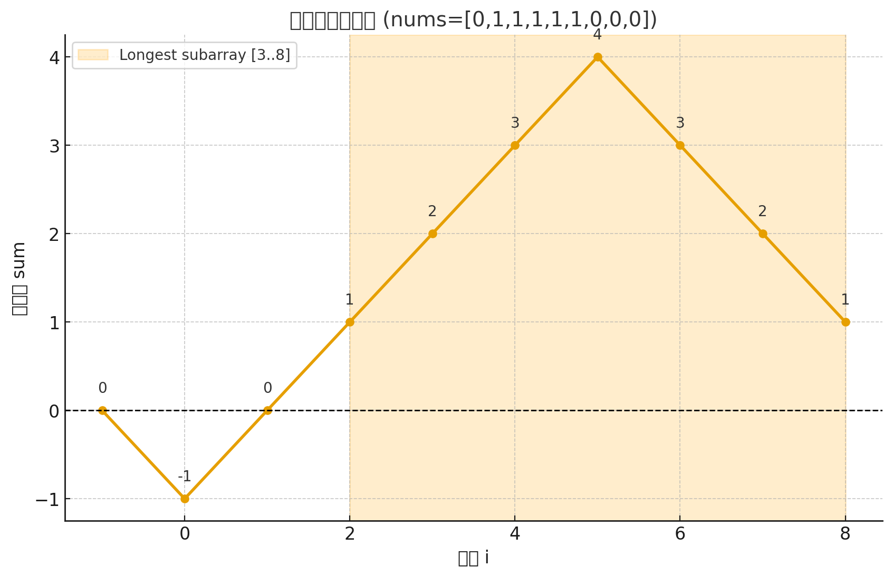

# Leetcode 525
## 题目回顾
给定一个二进制数组 nums , 找到含有相同数量的 0 和 1 的最长连续子数组，并返回该子数组的长度。
## 题意理解

给定一个二进制数组（只包含 0 和 1）。

需要找出一个最长的连续子数组，其中 0 和 1 的数量相等。

返回这个子数组的长度

---
## 转化方法

把数组中的 0 替换为 -1，保留 1 为 1。

这样，0 和 1 的数量相等 ⇔ 子数组的元素和为 0。

例如：
nums = [0,1,0]
转换后：[-1,1,-1]
其中子数组 [1,-1] 和为 0，说明 0 和 1 个数相等。

求前缀和：

如果两个前缀和相同，说明这两点之间的子数组和为 0。
所以我们只需要找到 相同前缀和之间的最大距离。

---

## 公式推导
如果有两个位置 i 和 j (i < j)，且 `sum[i] == sum[j]`，说明：
```bash
nums[i+1] + nums[i+2] + ... + nums[j] = sum[j] - sum[i] = 0
```
换句话说，这中间的**子数组和为 0。**


### 例子

```
nums = [0,1,1,1,1,1,0,0,0]
```

先做转化（0 → -1，1 → +1）：

```
[-1, +1, +1, +1, +1, +1, -1, -1, -1]
```

---

#### 1. 计算前缀和

从索引 `-1` 开始（初始 sum=0）：

| i  | nums\[i] | 转换值 | 前缀和 sum |
| -- | -------- | --- | ------- |
| -1 | -        | -   | 0       |
| 0  | 0        | -1  | -1      |
| 1  | 1        | +1  | 0       |
| 2  | 1        | +1  | 1       |
| 3  | 1        | +1  | 2       |
| 4  | 1        | +1  | 3       |
| 5  | 1        | +1  | 4       |
| 6  | 0        | -1  | 3       |
| 7  | 0        | -1  | 2       |
| 8  | 0        | -1  | 1       |

---

#### 2. 用数轴直观表示（sum 曲线）

画成高度变化（sum 是纵轴，i 是横轴）：

```
i:   -1   0   1   2   3   4   5   6   7   8
sum:  0  -1   0   1   2   3   4   3   2   1
```

---

## 3. 为什么相同 sum 代表和为 0 的子数组？

比如：

* sum 在 i=2 时为 1
* sum 在 i=8 时也为 1

👉 说明区间 `(2,8]` 的和为 0，也就是子数组 **\[1,1,1,0,0,0]**。

再看：

* sum 在 i=3 时为 2
* sum 在 i=7 时也为 2

👉 区间 `(3,7]` 和为 0，也就是子数组 **\[1,1,0,0]**。

再看：

* sum 在 i=-1 时为 0
* sum 在 i=1 时为 0

👉 区间 `( -1,1 ]` 和为 0，也就是子数组 **\[0,1]**。

---

## 4. 找到最长子数组

在这个例子里，最长的是：

* sum=1 在 i=2 和 i=8 两次出现
* 区间长度 = 8 - 2 = 6
* 子数组是 **\[1,1,1,0,0,0]**

---

✅ 直观解释就是：
在前缀和曲线上，**“相同高度的两个点之间”** 的区间，表示这段子数组的和为 0 ⇒ 0 和 1 个数相等。

---


## java解法
```java
class Solution {
    public int findMaxLength(int[] nums) {
        //  [0,1,0]
        // 0 -1 0 -1
        Map<Integer, Integer> map = new HashMap<>();
        map.put(0, -1);
        int max = 0;
        int sum = 0;
        for (int i = 0; i < nums.length; i++) {
            sum += nums[i] == 1 ? 1 : -1;
            if (map.containsKey(sum)) {
                max = Math.max(max, i - map.get(sum));
            } else {
                map.put(sum, i);
            }
        }
        return max;
    }
}
```

# Leetcode 523


---

## 题目回顾

给你一个整数数组 `nums` 和一个整数 `k`。
请判断是否存在一个 **长度至少为 2** 的连续子数组，使得该子数组的和是 `k` 的倍数。

也就是说：
找到 `sum(nums[i..j]) % k == 0`，并且 `j - i >= 1`。

---

## 思路解析

### **前缀和 + 取模优化**

设前缀和为：

```
prefix[i] = nums[0] + nums[1] + ... + nums[i]
```

如果存在两个下标 `i < j`，满足：

```
(prefix[j] - prefix[i]) % k == 0
```

等价于：

```
prefix[j] % k == prefix[i] % k
```

**关键 insight：**

* 如果两个前缀和除以 `k` 的余数相同，则它们之间的子数组和就是 `k` 的倍数。

---

## 公式推导

如果有两个前缀和：

```
prefix[j] 和 prefix[i]   (i < j)
```

并且满足：

```
prefix[j] % k == prefix[i] % k
```

那么一定有：

```
(prefix[j] - prefix[i]) % k == 0
```

也就是 `nums[i+1..j]` 的和是 `k` 的倍数。

---

### 举个例子

假设数组：

```
nums = [23, 2, 4, 6, 7], k = 6
```

#### 步骤 1：计算前缀和

```
prefix[0] = 23
prefix[1] = 23 + 2 = 25
prefix[2] = 25 + 4 = 29
prefix[3] = 29 + 6 = 35
prefix[4] = 35 + 7 = 42
```

#### 步骤 2：取模

```
prefix[0] % 6 = 23 % 6 = 5
prefix[1] % 6 = 25 % 6 = 1
prefix[2] % 6 = 29 % 6 = 5
prefix[3] % 6 = 35 % 6 = 5
prefix[4] % 6 = 42 % 6 = 0
```

#### 步骤 3：找相同余数

* `prefix[0] % 6 = 5`
* `prefix[2] % 6 = 5`

说明 `prefix[2] - prefix[0]` 是 6 的倍数：

```
29 - 23 = 6
```

而这正好对应子数组 `[2, 4]`，它的和是 6，确实是 6 的倍数。

再看：

* `prefix[3] % 6 = 5`
* `prefix[0] % 6 = 5`

```
35 - 23 = 12
```

对应子数组 `[2, 4, 6]`，和为 12，也是 6 的倍数。

---

### 为什么成立（数学解释）

1. 假设

   ```
   prefix[j] % k = r
   prefix[i] % k = r
   ```

   （它们余数相同，都是 `r`）

2. 根据模的定义

   ```
   prefix[j] = a * k + r
   prefix[i] = b * k + r
   ```

   （a、b 是整数）

3. 两者相减：

   ```
   prefix[j] - prefix[i] = (a - b) * k
   ```

   一定是 k 的倍数 ✅

---

## java解法

```java
class Solution {
    public boolean checkSubarraySum(int[] nums, int k) {
        Map<Integer, Integer> map = new HashMap<>();
        map.put(0,-1);

        int prefix = 0;
        for (int i = 0; i < nums.length; i++) {
            prefix += nums[i];
            int mod = prefix % k;
            if (map.containsKey(mod)) {
                if (i - map.get(mod) >= 2) {
                    return true;
                }
            } else {
                map.put(mod, i);
            }
        }
        return false;
    }
}
```

# Leetcode 560/930

## 题目简述

给定一个整数数组 `nums` 和一个整数 `k`，要求计算：**连续子数组的和等于 `k` 的个数**。

---

## 思路分析

### 前缀和 + 哈希表（O(n)）

核心思想：

* 定义 `prefixSum[i]` 表示数组前 `i` 个元素的和。
* 任意子数组和 `nums[i..j] = prefixSum[j] - prefixSum[i-1]`。
* 如果某一段前缀和为 `prefixSum[j]`，我们想要找一段和为 `k` 的子数组，那么需要：

  ```
  prefixSum[j] - prefixSum[i-1] = k
  → prefixSum[i-1] = prefixSum[j] - k
  ```
* 也就是说，只要之前出现过 `prefixSum[j] - k`，那么就存在一个子数组的和为 `k`。


## 例子解析
用一个具体例子 `[1, 2, 3]`，`k = 3`，画一张 **前缀和 + 哈希表变化表** 来直观展示整个过程。

| i (索引) | num\[i] | 当前前缀和 sum | sum - k | map 状态 (前缀和 -> 次数)   | count |
| ------ | ------- | --------- | ------- | -------------------- | ----- |
| -      | -       | 0         | -       | {0:1}                | 0     |
| 0      | 1       | 1         | -2      | {0:1, 1:1}           | 0     |
| 1      | 2       | 3         | 0       | {0:1, 1:1, 3:1}      | 1     |
| 2      | 3       | 6         | 3       | {0:1, 1:1, 3:1, 6:1} | 2     |

**解释：**

1. 初始时，map里有 `{0:1}` 表示前缀和为0出现过一次（保证从数组开头就能形成子数组）。
2. 遍历到 `i=0`，sum=1，map里没有 `1-3=-2`，所以 count 不变，更新 map 为 `{0:1, 1:1}`。
3. 遍历到 `i=1`，sum=3，map里有 `3-3=0`，说明有一个子数组 `[1,2]` 的和为3，count+=1，更新 map 为 `{0:1,1:1,3:1}`。
4. 遍历到 `i=2`，sum=6，map里有 `6-3=3`，说明有一个子数组 `[3]` 的和为3，count+=1，更新 map 为 `{0:1,1:1,3:1,6:1}`。

最终结果 `count=2`，与前面分析一致。

---


## 公式推导

前缀和 + 哈希表的核心公式是：

$$
prefix[j] - prefix[i] = k \implies prefix[i] = prefix[j] - k
$$

也就是说：

```java
int target = prefix - k;
```

然后检查 `map.containsKey(target)`，如果存在，说明有子数组和为 k。

更新 map 时 **不应该放在 else**，每次都要更新当前前缀和的次数。

---

## java解法

```java
class Solution {
    public int subarraySum(int[] nums, int k) {
        // prefix[j] - prefix[i] = k
        // prefix[i] = prefix[j] - k
        Map<Integer, Integer> map = new HashMap<>();
        map.put(0, 1);
        int prefix = 0;
        int res = 0;
        for (int i = 0; i < nums.length; i++) {
            prefix += nums[i];
            int target = prefix - k;
            if (map.containsKey(target)) {
                res += map.get(target);
            }
            map.put(prefix, map.getOrDefault(prefix, 0) + 1);
        }
        return res;
    }
}

```


# leetcode 974

## 题目回顾

给定一个整数数组 nums 和一个整数 k ，返回其中元素之和可被 k 整除的非空 子数组 的数目。

## 公式推导 类似 Leetcode 523

要找到其中子数组的和 能被k整除
(sum[j] - sum[i]) % k == 0
则 =>
sum[j] % k == sum[i] % k
=>
找到相同的余数即可

## 注意
`-104 <= nums[i] <= 104`

其中子数组和为可能为负数

好问题 👍
这个公式 **`(mod + k) % k`** 的本质是：把可能为负数的余数“搬回”到 `[0, k-1]` 区间。

---

### 1️⃣ Java `%` 运算的问题

在 Java 里：

```java
-1 % 5 == -1   // 结果和被除数符号一致
```

但在数学里，我们希望取余结果永远是 **非负数**，落在 `[0, k-1]`。
比如：

```
-1 ≡ 4 (mod 5)
```

数学上说 `-1` 和 `4` 在同一个余数类里。

---

### 2️⃣ 为什么 `(mod + k) % k` 可以修正？

假设：

```java
mod = prefix % k
```

可能是负数。

我们想要把它转换成 **等价的正余数**。

* 如果 `mod >= 0`：

  ```
  (mod + k) % k = mod
  ```

  没变化。

* 如果 `mod < 0`：

  ```
  mod + k   → 把它“抬高”到 >= 0
  (mod + k) % k   → 保证最后结果仍然落在 [0, k-1]
  ```

举例：

```java
prefix = -1, k = 5
mod = -1 % 5 = -1

(mod + k) % k = (-1 + 5) % 5 = 4   ✅
```

这就把 `-1` 修正成了正确的数学余数 `4`。

---

### 3️⃣ 总结成公式

我们要的不是 Java `%` 的结果，而是**数学定义的余数**：

```
r = a - ⌊a/k⌋ * k   (保证 0 ≤ r < k)
```

在代码里最简单的写法就是：

```java
int mod = ((prefix % k) + k) % k;
```

---

## java解法

```JAVA
class Solution {
    public int subarraysDivByK(int[] nums, int k) {
        // (sum[j] - sum[i]) % k == 0;
        // sum[j] % k == sum[i] % k
        // key = mod | value = 当前这个余数=mod的个数
        Map<Integer, Integer> map = new HashMap<>();
        map.put(0, 1);
        int prefix = 0;
        int res = 0;
        for (int i = 0; i < nums.length; i++) {
            prefix += nums[i];
            int mod = ((prefix % k) + k) % k;
            if (map.containsKey(mod)) {
                res += map.get(mod);
            }
            map.put(mod, map.getOrDefault(mod, 0) + 1);
        }
        return res;
    }
}
```


# leetcode 1590

## 题目回顾
给你一个正整数数组 nums，请你移除 最短 子数组（可以为 空），使得剩余元素的 和 能被 p 整除。 不允许 将整个数组都移除。

请你返回你需要移除的最短子数组的长度，如果无法满足题目要求，返回 -1 。

子数组 定义为原数组中连续的一组元素。

示例 1：

输入：nums = [3,1,4,2], p = 6
输出：1
解释：nums 中元素和为 10，不能被 p 整除。我们可以移除子数组 [4] ，剩余元素的和为 6 。

## java暴力解法
```java
class Solution {
    public int minSubarray(int[] nums, int p) {
        // sum[i] - (prefix[i] - prefix[j]) % p == 0
        long sum = 0;
        for (int i = 0; i < nums.length; i++) {
            sum += nums[i];
        }
        if (sum % p == 0) {
            return 0;
        }
        int ans = Integer.MAX_VALUE;
        for (int i = 0; i < nums.length; i++) {
            long t = sum - nums[i];
            if (t % p == 0 && t != 0) {
                return 1;
            }
            for (int j = i + 1; j < nums.length; j++) {
                t -= nums[j];
                if (t % p == 0 && t != 0) {
                    ans = Math.min(ans, j - i + 1);
                }
            }
        }
        return ans == Integer.MAX_VALUE ? -1 : ans;
    }
}
```

## 前缀和优化思路

### 公式推导

需要得到``(sum[i] - (prefix[i] - prefix[j])) % p == 0``
```shell
(sum[i] - (prefix[r] - prefix[l - 1])) % p == 0
sum % p = (prefix[r] - prefix[l - 1]) % p
设 mod = sum % p
mod = (prefix[r] - prefix[l - 1]) % p
mod = prefix[r] % p - prefix[l - 1] % p
prefix[l - 1] % p = prefix[r] % p - mod
prefix[l - 1] % p = prefix[r] % p - (sum % p)
根据欧几里得除法可得 sum = q*p + mod
prefix[l - 1] % p = prefix[r] % p - (q*p + mod) % p
prefix[l - 1] % p = prefix[r] % p - (mod) % p
```

### 要转换成什么问题？

这一步其实很关键：

### 原问题

要删除一个子数组 `[l..r]`，使得**删除后总和能被 p 整除**。

### 转换后问题

找到一对下标 `(i, r)` （其中 `i = l-1`），满足：

$$
prefix[i] \equiv prefix[r] - target \pmod p
$$

这意味着：

* 我们遍历到位置 `r` 时，只要能找到一个之前的 `prefix[i]`，它模 p 以后等于 `(prefix[r] - target + p) % p`，那么 `[i+1..r]` 就是可删子数组。

换句话说：
👉 **问题转化成「在前缀和的模数组中找一对下标，满足特定的同余关系」。**

---

### 为什么是(curMod - mod + p) % p; 而不是和公式一致的 (curMod - mod) % p

#### 1. 问题来源

假设：

```java
cur = prefix[r] % p
t   = totalSum % p
```

我们要计算：

$$
need = (prefix[r] - t) \bmod p
$$

直接写 `(cur - t) % p` 有个问题：

* 在 Java 中，`%` 运算符对 **负数**不会返回 `[0, p-1]`，而是返回负数。
* 例如：

```java
(-3) % 7 == -3   // 不是 4
```

但是我们希望余数在 `[0, p-1]` 之间。

---

#### 2. 解决方法

**加上 p 再取模**：

$$
(cur - t + p) \% p
$$

为什么可行？

* 如果 `cur - t >= 0`：`cur - t + p >= p`，`% p` 会自动得到 `cur - t`（原本非负没影响）
* 如果 `cur - t < 0`：`cur - t + p >= 0`，再 `% p` 就得到正确的非负余数

---

#### 3. 数学解释

模运算中：

$$
a \bmod p \in [0, p-1]
$$

但在 Java 中：

$$
(-3) \% 7 = -3
$$

所以为了让结果始终落在 `[0, p-1]`，做了如下处理：

$$
need = (cur - t + p) \% p
$$

* 如果 `cur - t >= 0` → `(cur - t + p) % p = cur - t` ✅
* 如果 `cur - t < 0` → `(cur - t + p) % p = cur - t + p` ✅

保证了 `need` **非负**，可以直接查 `map`。

---

#### 4. 总结一句话

**`+p` 是为了处理负数情况，保证余数在 `[0, p-1]` 范围内**，这是写模运算时常用的技巧。

---

## 优化后代码

```java
class Solution {
    public int minSubarray(int[] nums, int p) {
        long sum = 0;
        for (int i = 0; i < nums.length; i++) {
            sum += nums[i];
        }
        long mod = sum % p;
        if (mod == 0) {
            return 0;
        }
        int ans = nums.length;

        // (sum[i] - (prefix[i] - prefix[j])) % p == 0
        // sum % p = (prefix[i] - prefix[j]) % p
        // 设 mod = sum % p
        // mod = (prefix[r] - prefix[l - 1]) % p
        // mod = prefix[r] % p - prefix[l - 1] % p
        // prefix[l - 1] % p = prefix[r] % p - mod
        // prefix[l - 1] % p = prefix[r] % p - (sum % p)
        // prefix[l - 1] % p = (prefix[r] - sum) % p
        // 根据欧几里得除法可得 sum = q*p + mod
        // prefix[l - 1] % p = (prefix[r] - (q*p + mod)) % p
        // prefix[l - 1] % p = (prefix[r] - mod) % p
        Map<Long, Integer> map = new HashMap<>();
        map.put(0L, -1);
        long prefix = 0;
        for (int i = 0; i < nums.length; i++) {
            prefix += nums[i];
            long curMod = prefix % p;
            long need = (curMod - mod + p) % p;
            if (map.containsKey(need)) {
                ans = Math.min(ans, i - map.get(need));
            }
            map.put(curMod, i);
        }
        return ans == nums.length ? -1 : ans;
    }
}
```

---

# Leetcode 1371

## 题目回顾
给你一个字符串 s ，请你返回满足以下条件的最长子字符串的长度：每个元音字母，即 'a'，'e'，'i'，'o'，'u' ，在子字符串中都恰好出现了偶数次。


示例 1：

输入：s = "eleetminicoworoep"
输出：13
解释：最长子字符串是 "leetminicowor" ，它包含 e，i，o 各 2 个，以及 0 个 a，u 。

## 思路解析

### 位运算

A/E/I/O/U 设每一位字母都占一位, 对1进行异或运算，运算后为0 则认为该字母出现了偶数次

hash表存好每一次上次出现时的索引取最大值
prefix[j] ^ prefix[i] 实际上就是区间 (i+1, j] 内元音出现次数的奇偶性。
既然结果为 00000，说明：

在 (i+1, j] 这个区间里，5 个元音的出现次数都变回了偶数。

所以这个区间是一个合法的子串。
## 例子

字符串 "eleetminicoworoep"

遍历到第 1 个字符 'e' → state = 00010

遍历到第 4 个字符 't' → state 又变回 00010

说明在区间 (1, 4] = "leet" 里：

e 出现了 2 次（偶数次）

其他元音出现了 0 次（偶数次）

所以 "leet" 是合法子串。

## java解法
```java
class Solution {
    public int findTheLongestSubstring(String s) {
        // (sum[j] - sum[i]) % 2 == 0;
        // sum[i] % 2 == sum[j] % 2
        Map<Integer, Integer> map = new HashMap<>();
        map.put(0, -1);
        int ans = 0;
        int state = 0;
        for (int i = 0; i < s.length(); i++) {
            char c = s.charAt(i);
            if (c == 'a') state ^= 1 << 0;
            if (c == 'e') state ^= 1 << 1;
            if (c == 'i') state ^= 1 << 2;
            if (c == 'o') state ^= 1 << 3;
            if (c == 'u') state ^= 1 << 4;

            if (map.containsKey(state)) {
                ans = Math.max(ans, i - map.get(state));
            } else {
                map.put(state, i);
            }
        }
        return ans;

    }
}
```

# leetcode 1124

---

## 题目回顾

* 输入：一个数组 `hours`，其中 `hours[i]` 表示第 i 天的工作时长。
* 定义：如果某一天工作时长 > 8 小时，则算作「疲劳的一天」。
* 目标：找出一个最长的连续时间段，使得其中「疲劳天数」严格多于「非疲劳天数」。

---

## 思路分析

### 1. 转换问题

我们把 `hours` 转换成 `+1` 和 `-1`：

* `hours[i] > 8` → `+1`
* `hours[i] ≤ 8` → `-1`

这样问题就变成：
**找最长的连续子数组，使得子数组的和 > 0。**

---

### 2. 前缀和建模

定义前缀和数组 `prefix`：

* `prefix[0] = 0`
* `prefix[i] = arr[0] + arr[1] + ... + arr[i-1]`

问题转化为：

* 找最大区间 `(i, j)`，使得 `prefix[j] - prefix[i] > 0`，即 `prefix[j] > prefix[i]`。

---


## O(n²)解法

```JAVA
class Solution {
    public int longestWPI(int[] hours) {
        // [9,9,6,0,6,6,9]
        // [1,1,-1,-1,-1,-1,1]
        // [0,1,2,1,0,-1,-2,-1]
        int [] prefix = new int[hours.length + 1];
        for (int i = 0; i < hours.length; i++) {
            int num = hours[i] > 8 ? 1 : -1;
            prefix[i + 1] = prefix[i] + num;
        }
        int ans = 0;
        for (int i = 0; i < prefix.length; i++) {
            for (int j = i + 1; j < prefix.length; j++) {
                int k = prefix[j] - prefix[i];
                if (k > 0) {
                    ans = Math.max(j - i, ans);
                }
            }
        }
        return ans;
    }
}
```

## 优化双重循环

**“为什么只要找到最左边的小前缀，就能得到最长区间”**

---

### 目标

要找最长的区间 `(i, j)`，满足：

```
prefix[j] > prefix[i]  且  j > i
```

区间长度就是 `j - i`。

所以对于每个 `j`，我们想要：

* 找到 **一个最小的 i（越左越好）**，同时满足 `prefix[i] < prefix[j]`。

这样一来，区间长度 `j - i` 就最大。

---

### 为什么是“最左边的小前缀”

假设你有两个前缀：

```
i1 < i2
prefix[i1] < prefix[i2] < prefix[j]
```

那么：

* 区间 (i1, j) 长度 = j - i1
* 区间 (i2, j) 长度 = j - i2

显然 **i1 更靠左，得到的区间更长**。
所以对于每个 j，我们只需要最左边那个比 prefix\[j] 小的前缀。

---

### 单调栈保证“最左边的小前缀”

当我们从左往右构建栈时：

* 只把 **更小的 prefix 值** 入栈；
* 如果 prefix 变大，就不入栈（因为它不会是任何 j 的最优左端点）。

这样栈里存的下标 i 是 **严格递减的 prefix\[i]**，而且越靠栈底，i 越靠左。
所以当我们从右往左扫描 j 时：

* 第一个被满足 `prefix[j] > prefix[i]` 的 i 一定是最左的候选；
* 因此 j - i 最大。


## 为什么要从右往左检查

我们要找：

```
最大化 j - i
满足 prefix[j] > prefix[i]
```

显然：

* 如果 j 越大，区间长度 j - i 越可能大。
* 所以我们想优先检查“右边的 j”，这样一旦找到合法区间，长度就已经是尽可能大的了。

---

### 单调栈的结构

回忆单调栈构建过程：

* 从左往右扫描 prefix，栈中保留 **严格递减的 prefix 值对应的下标**。
* 这些下标是「潜在的最优 i」。

当我们在右边拿一个 j 来检查时：

* 如果 `prefix[j] > prefix[stack.peek()]`，就能形成区间；
* 而且因为 **j 是尽量靠右的**，所以 `j - i` 已经很大了；
* 我们可以不断弹栈，拿到更左边的 i，形成更长的区间。

---

### 如果从左往右会怎样？

假设我们从左往右扫描 j：

* 当遇到一个 prefix\[j] 时，你只能和栈里当前的 i 配对；
* 但此时 j 可能还比较靠左，得到的区间长度并不是最大；
* 后面出现更右边的 j 时，你需要重新考虑之前的 i，但栈的状态已经改变了，容易漏掉答案。

所以从左往右不好保证“最长”。

---

## 优化单调栈解法

```java
class Solution {
    public int longestWPI(int[] hours) {
        int n = hours.length;
        int [] prefix = new int[n + 1];
        for (int i = 1; i <= n; i++) {
            int num = hours[i - 1] > 8 ? 1 : -1;
            prefix[i] = prefix[i - 1] + num;
        }

        // prefix[j] - prefix[i] > 0
        // prefix[j] > prefix[i] && j < i
        // i 越小则区间越大
        Deque<Integer> deque = new ArrayDeque<>();
        for (int i = 0; i <= n; i++) {
            if (deque.isEmpty() || prefix[i] < prefix[deque.peek()]) {
                deque.push(i);
            }
        }

        int ans = 0;
        for (int j = n; j >= 0; j--) {
            while (!deque.isEmpty() && prefix[j] > prefix[deque.peek()]) {
                ans = Math.max(ans, j - deque.pop());
            }
        }
        return ans;
    }
}
```
