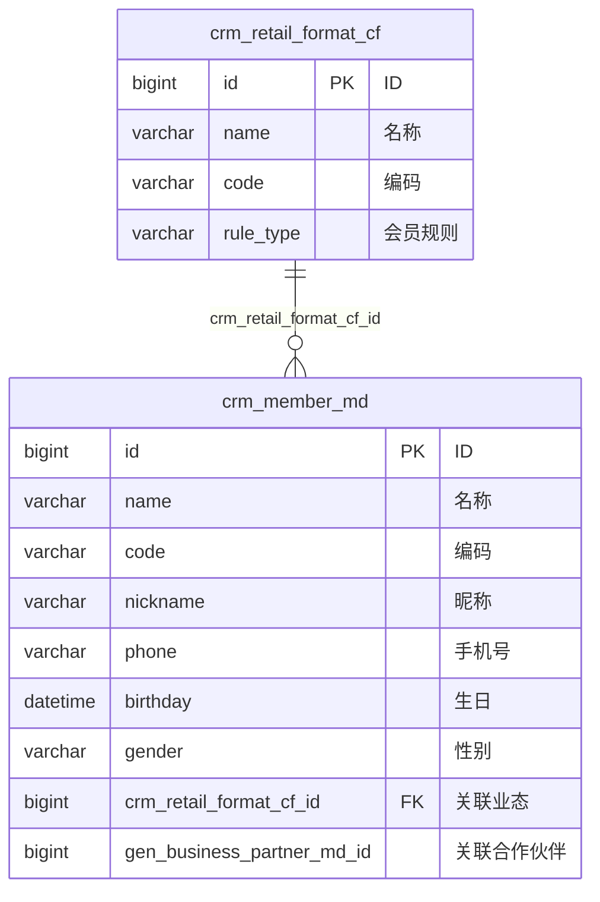
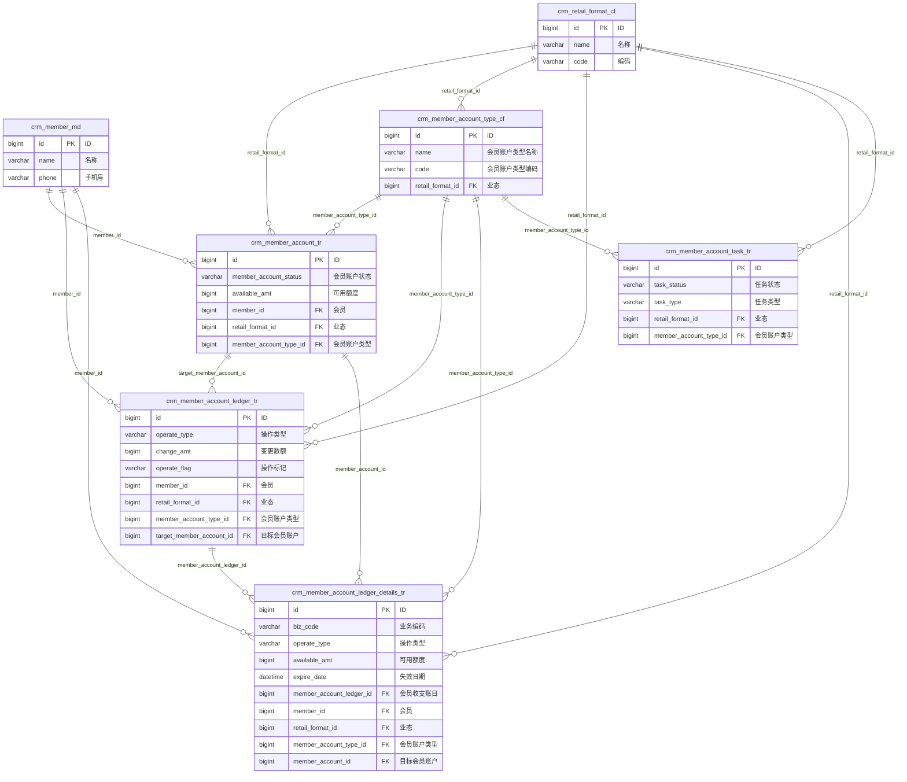
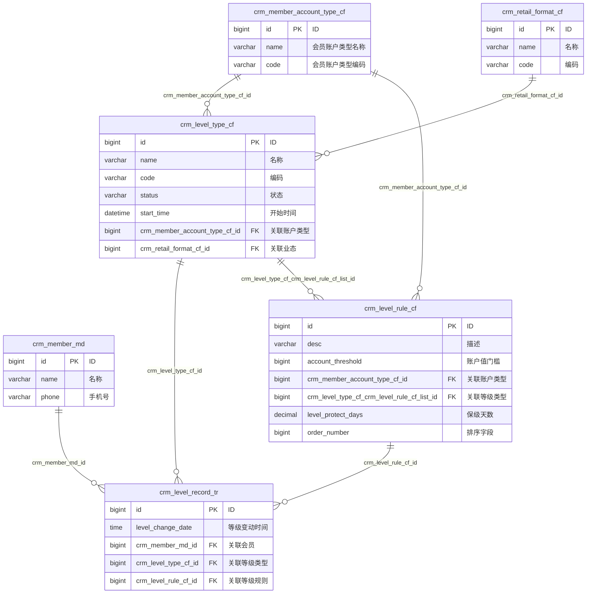

# 主数据
## 会员主数据crm_member_md

|名称|类型|长度|允许为空|默认值|备注|
|---|---|---|---|---|---|
|name|varchar|256||-|名称|
|code|varchar|256||-|编码|
|nickname|varchar|256||-|昵称|
|id_number|varchar|256||-|证件号|
|phone|varchar|256||-|手机号|
|birthday|datetime|-||-|生日|
|gender|varchar|256||-|性别|
|crm_retail_format_cf_id|bigint|20||-|关联业态|
|gen_business_partner_md_id|bigint|20||-|关联合作伙伴|
|id|bigint|20||-|ID|
|created_by|bigint|20||-|创建人|
|updated_by|bigint|20||-|更新人|
|created_at|datetime|-||-|创建时间|
|updated_at|datetime|-||-|更新时间|
|version|bigint|20||0|版本号|
|deleted|bigint|20||0|逻辑删除标识|
|request_id|varchar|256||-|requestId|
|origin_org_id|bigint|20||0|所属组织|
|tenant_id|bigint|20||0|所属租户|
## 业态 crm_retail_format_cf
|名称|类型|长度|允许为空|默认值|备注|
|---|---|---|---|---|---|
|name|varchar|256||-|名称|
|code|varchar|256||-|编码|
|rule_type|varchar|256||-|会员规则|
|id|bigint|20||-|ID|
|created_by|bigint|20||-|创建人|
|updated_by|bigint|20||-|更新人|
|created_at|datetime|-||-|创建时间|
|updated_at|datetime|-||-|更新时间|
|version|bigint|20||0|版本号|
|deleted|bigint|20||0|逻辑删除标识|
|request_id|varchar|256||-|requestId|
|origin_org_id|bigint|20||0|所属组织|
|tenant_id|bigint|20||0|所属租户|

# ER图

## 会员主数据 ER 图

说明：

- `crm_member_md` 通过 `crm_retail_format_cf_id` 关联业态，一个业态下可以有多个会员主数据。
- `gen_business_partner_md_id` 指向合作伙伴主数据，但当前文档没有展开该表结构，所以没有在 ER 图里继续画出实体。

## 会员账户 ER 图

说明：

- 账户域核心是 `crm_member_account_tr`，它由 `会员 + 业态 + 账户类型` 共同约束。
- `crm_member_account_ledger_tr` 是账户流水主表，记录一次账户收支动作。
- `crm_member_account_ledger_details_tr` 是流水明细表，适合承载过期、拆分、来源追踪等更细粒度信息。
- `crm_member_account_task_tr` 更偏异步任务或补偿任务，不直接存账户余额，但会依赖业态和账户类型执行。

## 会员等级 ER 图

说明：

- `crm_level_type_cf` 是等级类型定义，通常描述某个业态下的等级体系。
- `crm_level_rule_cf` 是等级规则配置，按账户值门槛、保级天数等条件约束等级判定。
- `crm_level_record_tr` 是会员实际等级结果，关联会员、等级类型和命中的等级规则。
# 账户
## 会员账户crm_member_account_tr
| 名称                     | 类型       | 长度  | 允许为空 | 默认值 | 备注        |
| ---------------------- | -------- | --- | ---- | --- | --------- |
| member_account_status  | varchar  | 256 |      | -   | 会员账户状态    |
| available_amt          | bigint   | 20  |      | -   | 可用额度      |
| member_account_type_id | bigint   | 20  |      | -   | 会员账户类型    |
| id                     | bigint   | 20  |      | -   | ID        |
| created_by             | bigint   | 20  |      | -   | 创建人       |
| updated_by             | bigint   | 20  |      | -   | 更新人       |
| created_at             | datetime | -   |      | -   | 创建时间      |
| updated_at             | datetime | -   |      | -   | 更新时间      |
| version                | bigint   | 20  |      | 0   | 版本号       |
| deleted                | bigint   | 20  |      | 0   | 逻辑删除标识    |
| request_id             | varchar  | 256 |      | -   | requestId |
| origin_org_id          | bigint   | 20  |      | 0   | 所属组织      |
| tenant_id              | bigint   | 20  |      | 0   | 所属租户      |
| member_id              | bigint   | 20  |      | -   | 会员        |
| retail_format_id       | bigint   | 20  |      | -   | 业态        |
## 会员账户类型crm_member_account_type_cf
|名称|类型|长度|允许为空|默认值|备注|
|---|---|---|---|---|---|
|name|varchar|256||-|会员账户类型名称|
|code|varchar|256||-|会员账户类型编码|
|desc|varchar|256||-|会员账户类型描述|
|retail_format_id|bigint|20||-|业态|
|id|bigint|20||-|ID|
|created_by|bigint|20||-|创建人|
|updated_by|bigint|20||-|更新人|
|created_at|datetime|-||-|创建时间|
|updated_at|datetime|-||-|更新时间|
|version|bigint|20||0|版本号|
|deleted|bigint|20||0|逻辑删除标识|
|request_id|varchar|256||-|requestId|
|origin_org_id|bigint|20||0|所属组织|
|tenant_id|bigint|20||0|所属租户|
|default_locale|varchar|256||-|默认语言|
## 会员账户收支账目crm_member_account_ledger_tr
| 名称                       | 类型       | 长度  | 允许为空 | 默认值 | 备注        |
| ------------------------ | -------- | --- | ---- | --- | --------- |
| operate_type             | varchar  | 256 |      | -   | 操作类型      |
| change_amt               | bigint   | 20  |      | -   | 变更数额      |
| operate_flag             | varchar  | 256 |      | -   | 操作标记      |
| remark                   | varchar  | 256 |      | -   | 备注        |
| id                       | bigint   | 20  |      | -   | ID        |
| created_by               | bigint   | 20  |      | -   | 创建人       |
| updated_by               | bigint   | 20  |      | -   | 更新人       |
| created_at               | datetime | -   |      | -   | 创建时间      |
| updated_at               | datetime | -   |      | -   | 更新时间      |
| version                  | bigint   | 20  |      | 0   | 版本号       |
| deleted                  | bigint   | 20  |      | 0   | 逻辑删除标识    |
| request_id               | varchar  | 256 |      | -   | requestId |
| origin_org_id            | bigint   | 20  |      | 0   | 所属组织      |
| tenant_id                | bigint   | 20  |      | 0   | 所属租户      |
| member_id                | bigint   | 20  |      | -   | 会员        |
| retail_format_id         | bigint   | 20  |      | -   | 业态        |
| member_account_type_id   | bigint   | 20  |      | -   | 会员账户类型    |
| target_member_account_id | bigint   | 20  |      | -   | 目标会员账户    |
## 会员账户收支账目明细crm_member_account_ledger_details_tr
| 名称                       | 类型       | 长度  | 允许为空 | 默认值 | 备注        |
| ------------------------ | -------- | --- | ---- | --- | --------- |
| biz_code                 | varchar  | 256 |      | -   | 业务编码      |
| operate_type             | varchar  | 256 |      | -   | 操作类型      |
| available_amt            | bigint   | 20  |      | -   | 可用额度      |
| source_ledger_detail_id  | bigint   | 20  |      | -   | 来源收支账目明细  |
| expire_date              | datetime | -   |      | -   | 失效日期      |
| remark                   | varchar  | 256 |      | -   | 备注        |
| ledger_detail_status     | varchar  | 256 |      | -   | 账目详情状态    |
| member_account_ledger_id | bigint   | 20  |      | -   | 会员收支账目    |
| id                       | bigint   | 20  |      | -   | ID        |
| created_by               | bigint   | 20  |      | -   | 创建人       |
| updated_by               | bigint   | 20  |      | -   | 更新人       |
| created_at               | datetime | -   |      | -   | 创建时间      |
| updated_at               | datetime | -   |      | -   | 更新时间      |
| version                  | bigint   | 20  |      | 0   | 版本号       |
| deleted                  | bigint   | 20  |      | 0   | 逻辑删除标识    |
| request_id               | varchar  | 256 |      | -   | requestId |
| origin_org_id            | bigint   | 20  |      | 0   | 所属组织      |
| tenant_id                | bigint   | 20  |      | 0   | 所属租户      |
| member_id                | bigint   | 20  |      | -   | 会员        |
| retail_format_id         | bigint   | 20  |      | -   | 业态        |
| member_account_type_id   | bigint   | 20  |      | -   | 会员账户类型    |
| member_account_id        | bigint   | 20  |      | -   | 目标会员账户    |
## 会员账户任务crm_member_account_task_tr
| 名称                     | 类型         | 长度  | 允许为空 | 默认值 | 备注        |
| ---------------------- | ---------- | --- | ---- | --- | --------- |
| task_status            | varchar    | 256 |      | -   | 任务状态      |
| task_type              | varchar    | 256 |      | -   | 任务类型      |
| runtime_context        | mediumtext | -   |      | -   | 运行时上下文    |
| id                     | bigint     | 20  |      | -   | ID        |
| created_by             | bigint     | 20  |      | -   | 创建人       |
| updated_by             | bigint     | 20  |      | -   | 更新人       |
| created_at             | datetime   | -   |      | -   | 创建时间      |
| updated_at             | datetime   | -   |      | -   | 更新时间      |
| version                | bigint     | 20  |      | 0   | 版本号       |
| deleted                | bigint     | 20  |      | 0   | 逻辑删除标识    |
| request_id             | varchar    | 256 |      | -   | requestId |
| origin_org_id          | bigint     | 20  |      | 0   | 所属组织      |
| tenant_id              | bigint     | 20  |      | 0   | 所属租户      |
| retail_format_id       | bigint     | 20  |      | -   | 业态        |
| member_account_type_id | bigint     | 20  |      | -   | 会员账户类型    |
# 等级

## 等级记录crm_level_record_tr

| 名称                   | 类型       | 长度  | 允许为空 | 默认值 | 备注        |
| -------------------- | -------- | --- | ---- | --- | --------- |
| level_change_date    | time     | 3   |      | -   | 等级变动时间    |
| id                   | bigint   | 20  |      | -   | ID        |
| created_by           | bigint   | 20  |      | -   | 创建人       |
| updated_by           | bigint   | 20  |      | -   | 更新人       |
| created_at           | datetime | -   |      | -   | 创建时间      |
| updated_at           | datetime | -   |      | -   | 更新时间      |
| version              | bigint   | 20  |      | 0   | 版本号       |
| deleted              | bigint   | 20  |      | 0   | 逻辑删除标识    |
| request_id           | varchar  | 256 |      | -   | requestId |
| origin_org_id        | bigint   | 20  |      | 0   | 所属组织      |
| tenant_id            | bigint   | 20  |      | 0   | 所属租户      |
| crm_member_md_id     | bigint   | 20  |      | -   | 关联会员      |
| crm_level_type_cf_id | bigint   | 20  |      | -   | 关联等级类型    |
| crm_level_rule_cf_id | bigint   | 20  |      | -   | 关联等级规则    |
## 等级规则 crm_level_rule_cf

|名称|类型|长度|允许为空|默认值|备注|
|---|---|---|---|---|---|
|desc|varchar|256||-|描述|
|account_threshold|bigint|20||-|账户值门槛|
|crm_member_account_type_cf_id|bigint|20||-|关联账户类型|
|crm_level_type_cf_crm_level_rule_cf_list_id|bigint|20||-|crmLevelTypeCfCrmLevelRuleCfListId|
|level_protect_days|decimal|20||0|保级天数|
|id|bigint|20||-|ID|
|created_by|bigint|20||-|创建人|
|updated_by|bigint|20||-|更新人|
|created_at|datetime|-||-|创建时间|
|updated_at|datetime|-||-|更新时间|
|version|bigint|20||0|版本号|
|deleted|bigint|20||0|逻辑删除标识|
|request_id|varchar|256||-|requestId|
|origin_org_id|bigint|20||0|所属组织|
|tenant_id|bigint|20||0|所属租户|
|order_number|bigint|20||0|排序字段|

## 等级类型crm_level_type_cf

|名称|类型|长度|允许为空|默认值|备注|
|---|---|---|---|---|---|
|name|varchar|256||-|名称|
|code|varchar|256||-|编码|
|status|varchar|256||-|状态|
|start_time|datetime|-||-|开始时间|
|crm_member_account_type_cf_id|bigint|20||-|关联账户类型|
|crm_retail_format_cf_id|bigint|20||-|关联业态|
|id|bigint|20||-|ID|
|created_by|bigint|20||-|创建人|
|updated_by|bigint|20||-|更新人|
|created_at|datetime|-||-|创建时间|
|updated_at|datetime|-||-|更新时间|
|version|bigint|20||0|版本号|
|deleted|bigint|20||0|逻辑删除标识|
|request_id|varchar|256||-|requestId|
|origin_org_id|bigint|20||0|所属组织|
|tenant_id|bigint|20||0|所属租户|
