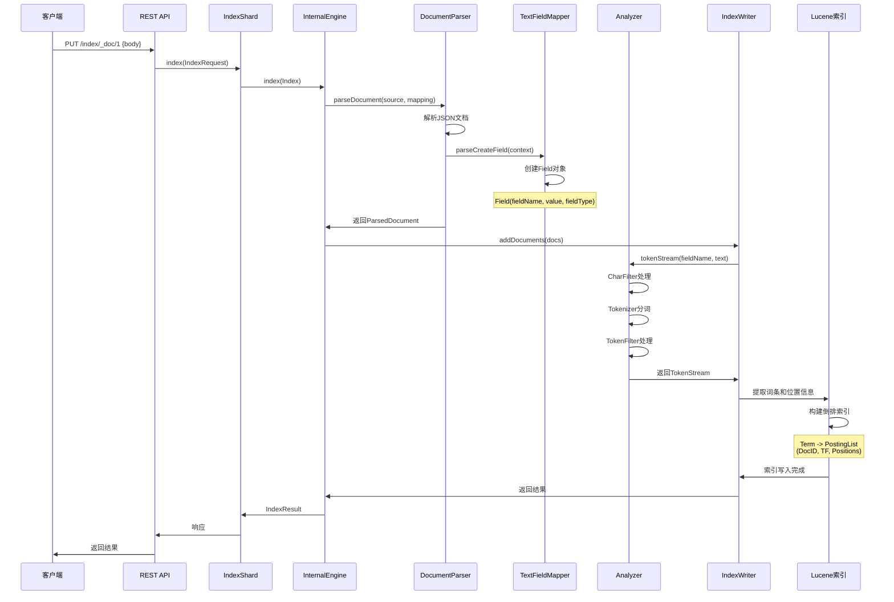
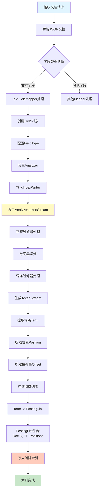

# Elasticsearch 分词与倒排索引过程详解

  

## 概述

  

本文档详细描述了 Elasticsearch 中文档索引时，分词（Analysis）和倒排索引（Inverted Index）构建的完整过程。

  

## 核心组件

  

### 1. 分析器（Analyzer）

- **位置**：`server/src/main/java/org/elasticsearch/index/analysis/`

- **核心类**：

- `AnalysisRegistry`：分析器注册表，管理所有分析器组件

- `IndexAnalyzers`：索引级别的分析器集合

- `NamedAnalyzer`：命名的分析器包装

  

### 2. 字段映射器（Field Mapper）

- **位置**：`server/src/main/java/org/elasticsearch/index/mapper/`

- **核心类**：

- `TextFieldMapper`：文本字段映射器，负责文本字段的分词处理

- `DocumentParser`：文档解析器，解析 JSON 文档并创建 Lucene 文档

  

### 3. 索引引擎（Engine）

- **位置**：`server/src/main/java/org/elasticsearch/index/engine/`

- **核心类**：

- `InternalEngine`：内部引擎，负责文档的索引操作

- `IndexWriter`：Lucene 的索引写入器

  

## 完整流程

  

### 阶段一：文档接收与解析

  

```

1. 客户端请求 → REST API

2. IndexRequest → IndexShard

3. IndexShard → Engine.index()

4. Engine → DocumentParser.parseDocument()

```

  

**关键代码**：

```82:134:server/src/main/java/org/elasticsearch/index/mapper/DocumentParser.java

/**

* 解析文档的核心方法

* @param source 待解析的文档源数据（包含JSON内容）

* @param mappingLookup 字段映射查找器，用于获取字段的映射配置

* @return ParsedDocument 解析后的文档对象，包含所有字段的Lucene Document

*/

public ParsedDocument parseDocument(SourceToParse source, MappingLookup mappingLookup) throws DocumentParsingException {

// 检查文档是否为空，空文档直接抛出异常

if (source.source() != null && source.source().length() == 0) {

throw new DocumentParsingException(new XContentLocation(0, 0), "failed to parse, document is empty");

}

final RootDocumentParserContext context;

  

// 使用try-with-resources确保解析器正确关闭

// 上下文需要在解析后关闭，以确保实际的解析器被正确关闭

// 关闭操作不会影响上下文的其他状态

try (

RootDocumentParserContext ctx = new RootDocumentParserContext(

mappingLookup, // 字段映射配置

mappingParserContext, // 映射解析上下文

source, // 文档源数据

XContentHelper.createParser( // 创建JSON解析器

parserConfiguration.withIncludeSourceOnError(source.getIncludeSourceOnError()),

source.source(), // 文档的原始JSON内容

source.getXContentType() // JSON格式类型（JSON、YAML等）

)

)

) {

context = ctx;

// 验证JSON文档的开始标记（如 {）

validateStart(context.parser());

// 获取所有元数据字段映射器（如_id, _source, _routing等）

MetadataFieldMapper[] metadataFieldsMappers = mappingLookup.getMapping().getSortedMetadataMappers();

// 核心解析逻辑：解析文档内容，为每个字段创建对应的Field对象

internalParseDocument(metadataFieldsMappers, context);

// 验证JSON文档的结束标记

validateEnd(context.parser());

} catch (XContentParseException e) {

// JSON解析异常，包含位置信息

throw new DocumentParsingException(e.getLocation(), e.getMessage(), e);

} catch (IOException e) {

// IO异常（来自jackson），这里没有有用的位置信息

throw new DocumentParsingException(XContentLocation.UNKNOWN, "Error parsing document", e);

}

// 断言：确保所有路径元素都已处理完毕，没有遗留

assert context.path.pathAsText("").isEmpty() : "found leftover path elements: " + context.path.pathAsText("");

  

// 创建动态字段映射更新（如果文档中有新字段）

Mapping dynamicUpdate = createDynamicUpdate(context);

  

// 构建并返回解析后的文档对象

return new ParsedDocument(

context.version(), // 文档版本号

context.seqID(), // 序列号ID

context.id(), // 文档ID

context.routing(), // 路由值

context.reorderParentAndGetDocs(), // 重新排序父文档和子文档，返回Lucene Document列表

context.sourceToParse().source(), // 原始JSON源数据

context.sourceToParse().getXContentType(), // 内容类型

dynamicUpdate, // 动态映射更新

source.getMeteringParserDecorator().meteredDocumentSize() // 文档大小统计

) {

@Override

public String documentDescription() {

// 获取ID字段映射器，用于生成文档描述信息

IdFieldMapper idMapper = (IdFieldMapper) mappingLookup.getMapping().getMetadataMapperByName(IdFieldMapper.NAME);

return idMapper.documentDescription(this);

}

};

}

```

  

### 阶段二：字段解析与分词

  

当解析到文本字段时，`TextFieldMapper.parseCreateField()` 方法会被调用：

  

**关键代码**：

```1510:1556:server/src/main/java/org/elasticsearch/index/mapper/TextFieldMapper.java

/**

* 解析文本字段并创建Lucene Field对象

* 这是文本字段处理的核心方法，负责将原始文本值转换为可索引的Field

* @param context 文档解析上下文，包含解析器和文档对象

*/

@Override

protected void parseCreateField(DocumentParserContext context) throws IOException {

// 从JSON解析器中获取文本字段的原始值

final String value = context.parser().textOrNull();

  

// 如果值为null，直接返回，不创建字段

if (value == null) {

return;

}

  

// 如果字段需要被索引或存储，则创建Field对象

// isIndexed(): 字段是否需要被索引（用于搜索）

// fieldType.stored(): 字段是否需要被存储（用于返回原始值）

if (isIndexed() || fieldType.stored()) {

// 创建主要的文本字段

// Field构造参数：字段名、字段值、字段类型（包含Analyzer配置）

// 注意：此时只是创建Field对象，实际的分词操作会在IndexWriter写入时进行

Field field = new Field(fieldType().name(), value, fieldType);

context.doc().add(field);

// 如果字段省略了norms（归一化因子），记录字段名

// norms用于评分计算，某些字段可能不需要

if (fieldType.omitNorms()) {

context.addToFieldNames(fieldType().name());

}

// 如果配置了前缀字段（用于前缀查询优化），创建前缀字段

// 前缀字段使用EdgeNGramTokenFilter生成前缀词条

if (prefixFieldInfo != null) {

context.doc().add(new Field(prefixFieldInfo.field, value, prefixFieldInfo.fieldType));

}

// 如果配置了短语字段（用于短语查询优化），创建短语字段

// 短语字段使用FixedShingleFilter生成固定长度的短语

if (phraseFieldInfo != null) {

context.doc().add(new Field(phraseFieldInfo.field, value, phraseFieldInfo.fieldType));

}

}

  

// 如果需要支持synthetic source（合成源），但字段未被存储，需要其他方式加载字段值

// synthetic source是ES的新特性，可以动态生成_source而不存储原始JSON

if (fieldType().storeFieldForSyntheticSource(indexCreatedVersion) && fieldType.stored() == false) {

// 如果可以依赖委托字段（如keyword类型的multi-field），直接返回

if (fieldType().canUseSyntheticSourceDelegateForSyntheticSource(value)) {

return;

}

  

// 否则，需要自己存储字段值

// 获取fallback字段名（用于存储原始值）

final String fallbackFieldName = fieldType().syntheticSourceFallbackFieldName();

final BytesRef bytesRef = new BytesRef(value);

  

// 根据索引版本决定存储方式

if (storeFallbackFieldsInBinaryDocValues()) {

// 新版本：将值存储在二进制DocValues字段中

// DocValues是列式存储，适合聚合和排序

// 如果字段不存在，创建一个新的MultiValuedBinaryDocValuesField

MultiValuedBinaryDocValuesField field = (MultiValuedBinaryDocValuesField) context.doc().getByKey(fallbackFieldName);

if (field == null) {

field = new MultiValuedBinaryDocValuesField.IntegratedCount(fallbackFieldName, new ArrayList<>());

context.doc().addWithKey(fallbackFieldName, field);

}

// 将值添加到DocValues字段中

field.add(bytesRef);

} else {

// 旧版本兼容：将值存储在StoredField中（传统存储方式）

// StoredField是行式存储，用于返回原始值

context.doc().add(new StoredField(fallbackFieldName, value));

}

}

}

```

  

**分词过程**：

1. 创建 `Field` 对象时，传入原始文本值和 `FieldType`

2. `FieldType` 中配置了 `Analyzer`（通过 `IndexWriterConfig` 设置）

3. Lucene 的 `Field` 在索引时会自动调用 `Analyzer.tokenStream()` 进行分词

  

### 阶段三：分析器处理流程

  

分析器由三个组件组成：

  

1. **字符过滤器（CharFilter）**：预处理文本（如 HTML 标签移除）

2. **分词器（Tokenizer）**：将文本切分为词条（Token）

3. **词条过滤器（TokenFilter）**：对词条进行转换（如小写化、停用词移除）

  

**分析器结构**：

```44:92:server/src/main/java/org/elasticsearch/index/analysis/AnalysisRegistry.java

/**

* 分析器注册表

* 这是ES中管理所有分析器组件的核心类，负责注册和创建字符过滤器、分词器、词条过滤器和分析器

* 每个节点有一个AnalysisRegistry实例，可以为每个索引创建IndexAnalyzers

*/

public final class AnalysisRegistry implements Closeable {

// 索引设置中的字符过滤器配置键

public static final String INDEX_ANALYSIS_CHAR_FILTER = "index.analysis.char_filter";

// 索引设置中的词条过滤器配置键

public static final String INDEX_ANALYSIS_FILTER = "index.analysis.filter";

// 索引设置中的分析器配置键

public static final String INDEX_ANALYSIS_ANALYZER = "index.analysis.analyzer";

// 索引设置中的分词器配置键

public static final String INDEX_ANALYSIS_TOKENIZER = "index.analysis.tokenizer";

  

// 默认索引分析器名称（用于索引时）

public static final String DEFAULT_ANALYZER_NAME = "default";

// 默认搜索分析器名称（用于搜索时）

public static final String DEFAULT_SEARCH_ANALYZER_NAME = "default_search";

// 默认搜索引号分析器名称（用于短语查询）

public static final String DEFAULT_SEARCH_QUOTED_ANALYZER_NAME = "default_search_quoted";

  

// 预构建的分析器组件（内置的分析器、分词器等）

private final PrebuiltAnalysis prebuiltAnalysis;

// 分析器缓存，避免重复创建

private final Map<String, Analyzer> cachedAnalyzer = new ConcurrentHashMap<>();

  

// 环境配置（包含配置文件路径等）

private final Environment environment;

// 字符过滤器工厂提供者映射（名称 -> 工厂提供者）

// CharFilter用于预处理文本，如移除HTML标签

private final Map<String, AnalysisProvider<CharFilterFactory>> charFilters;

// 词条过滤器工厂提供者映射（名称 -> 工厂提供者）

// TokenFilter用于转换词条，如小写化、停用词移除

private final Map<String, AnalysisProvider<TokenFilterFactory>> tokenFilters;

// 分词器工厂提供者映射（名称 -> 工厂提供者）

// Tokenizer用于将文本切分为词条

private final Map<String, AnalysisProvider<TokenizerFactory>> tokenizers;

// 分析器提供者映射（名称 -> 提供者）

// Analyzer是完整的分析器，由CharFilter、Tokenizer和TokenFilter组成

private final Map<String, AnalysisProvider<AnalyzerProvider<?>>> analyzers;

// 规范化器提供者映射（名称 -> 提供者）

// Normalizer用于keyword字段的规范化处理（不进行分词）

private final Map<String, AnalysisProvider<AnalyzerProvider<?>>> normalizers;

  

/**

* 构造函数：初始化分析器注册表

* @param environment ES环境配置

* @param charFilters 字符过滤器提供者映射

* @param tokenFilters 词条过滤器提供者映射

* @param tokenizers 分词器提供者映射

* @param analyzers 分析器提供者映射

* @param normalizers 规范化器提供者映射

* @param preConfiguredCharFilters 预配置的字符过滤器

* @param preConfiguredTokenFilters 预配置的词条过滤器

* @param preConfiguredTokenizers 预配置的分词器

* @param preConfiguredAnalyzers 预配置的分析器

*/

public AnalysisRegistry(

Environment environment,

Map<String, AnalysisProvider<CharFilterFactory>> charFilters,

Map<String, AnalysisProvider<TokenFilterFactory>> tokenFilters,

Map<String, AnalysisProvider<TokenizerFactory>> tokenizers,

Map<String, AnalysisProvider<AnalyzerProvider<?>>> analyzers,

Map<String, AnalysisProvider<AnalyzerProvider<?>> normalizers,

Map<String, PreConfiguredCharFilter> preConfiguredCharFilters,

Map<String, PreConfiguredTokenFilter> preConfiguredTokenFilters,

Map<String, PreConfiguredTokenizer> preConfiguredTokenizers,

Map<String, PreBuiltAnalyzerProviderFactory> preConfiguredAnalyzers

) {

this.environment = environment;

// 使用不可变Map确保线程安全

this.charFilters = unmodifiableMap(charFilters);

this.tokenFilters = unmodifiableMap(tokenFilters);

this.tokenizers = unmodifiableMap(tokenizers);

this.analyzers = unmodifiableMap(analyzers);

this.normalizers = unmodifiableMap(normalizers);

// 初始化预构建的分析器组件

prebuiltAnalysis = new PrebuiltAnalysis(

preConfiguredCharFilters,

preConfiguredTokenFilters,

preConfiguredTokenizers,

preConfiguredAnalyzers

);

}

```

  

### 阶段四：写入 Lucene 索引

  

**关键代码**：

```1440:1485:server/src/main/java/org/elasticsearch/index/engine/InternalEngine.java

/**

* 将文档索引到Lucene的核心方法

* 这是文档索引流程的最后一步，将解析后的文档写入Lucene索引

* @param index 索引操作对象，包含解析后的文档

* @param plan 索引策略，决定是新增、更新还是跳过

* @return IndexResult 索引操作的结果

*/

private IndexResult indexIntoLucene(Index index, IndexingStrategy plan) throws IOException {

// 断言：确保序列号已分配（序列号用于保证操作顺序）

assert index.seqNo() >= 0 : "ops should have an assigned seq no.; origin: " + index.origin();

// 断言：确保版本号已设置

assert plan.versionForIndexing >= 0 : "version must be set. got " + plan.versionForIndexing;

// 断言：确保需要索引到Lucene或添加为过期操作

assert plan.indexIntoLucene || plan.addStaleOpToLucene;

/* 更新文档的序列号和主分片任期

* 序列号：如果这是主分片，从序列号服务获取；如果是副本，使用现有文档的序列号

* 主分片任期：已在IndexShard#prepareIndex中设置，用于区分不同的主分片任期

*/

index.parsedDoc().updateSeqID(index.seqNo(), index.primaryTerm());

// 设置文档版本号（用于乐观并发控制）

index.parsedDoc().version().setLongValue(plan.versionForIndexing);

try {

// 记录文档详细信息（用于调试和追踪）

logDocumentsDetails(index.docs(), index.id(), index.uid());

// 根据索引策略执行不同的操作

if (plan.addStaleOpToLucene) {

// 策略：添加过期操作（软删除的文档）

addStaleDocs(index.docs(), indexWriter);

} else if (plan.useLuceneUpdateDocument) {

// 策略：更新现有文档（文档已存在）

// 断言：确保更新的序列号是递增的

assert assertMaxSeqNoOfUpdatesIsAdvanced(index.uid(), index.seqNo(), true, true);

updateDocs(index.uid(), index.docs(), indexWriter);

} else {

// 策略：新增文档（文档不存在，可以优化为创建操作）

// 断言：在断言模式下，双重检查文档确实不存在

assert assertDocDoesNotExist(index, canOptimizeAddDocument(index) == false);

// 调用addDocs，最终会调用IndexWriter.addDocuments()

// 此时会触发Analyzer进行分词，并构建倒排索引

addDocs(index.docs(), indexWriter);

}

// 返回成功的索引结果

return new IndexResult(plan.versionForIndexing, index.primaryTerm(), index.seqNo(), plan.currentNotFoundOrDeleted, index.id());

} catch (Exception ex) {

// 异常处理：区分文档级错误和引擎级错误

if (ex instanceof AlreadyClosedException == false

&& indexWriter.getTragicException() == null

&& treatDocumentFailureAsTragicError(index) == false) {

/* 这是文档级错误（非致命错误）

*

* IndexWriter内部的异常处理不保证一个tragic/aborting异常

* 会被用作唯一的tragicEventException，因为如果有多个异常导致IW中止，

* 只有一个会胜出。然而，只有胜出的异常会关闭IW并进而使引擎失败，

* 这样我们可以在引擎失败之前处理异常。

*

* 关键点：如果是文档错误，`indexWriter.getTragicException()`将为null，

* 否则我们需要重新抛出并视为致命错误或非文档错误

*

* 返回`MATCH_ANY`版本号表示没有文档被索引，这个值不会被使用

*/

return new IndexResult(ex, Versions.MATCH_ANY, index.primaryTerm(), index.seqNo(), index.id());

} else {

// 这是引擎级错误（致命错误），重新抛出

throw ex;

}

}

}

```

  

```1528:1531:server/src/main/java/org/elasticsearch/index/engine/InternalEngine.java

/**

* 添加文档到Lucene索引

* 这是实际调用Lucene IndexWriter的地方，会触发分词和倒排索引构建

* @param docs Lucene文档列表（已包含所有Field对象）

* @param indexWriter Lucene的索引写入器

*/

private void addDocs(final List<LuceneDocument> docs, final IndexWriter indexWriter) throws IOException {

// 调用Lucene的IndexWriter.addDocuments()方法

// 内部会：

// 1. 对每个Field调用Analyzer.tokenStream()进行分词

// 2. 从TokenStream提取词条、位置、偏移等信息

// 3. 构建倒排索引（Term -> PostingList）

// 4. 将文档添加到内存缓冲区

indexWriter.addDocuments(docs);

// 更新文档追加计数器（用于监控和统计）

numDocAppends.inc(docs.size());

}

```

  

### 阶段五：倒排索引构建（Lucene 内部）

  

当 `IndexWriter.addDocument()` 被调用时，Lucene 内部会：

  

1. **分词处理**：

- 对每个 `Field` 调用 `Analyzer.tokenStream()`

- 生成 `TokenStream`，包含词条、位置、偏移等信息

  

2. **词条提取**：

- 从 `TokenStream` 中提取词条（Term）

- 记录词条在文档中的位置（Position）

- 记录词条的偏移量（Offset）

  

3. **倒排索引构建**：

- 为每个词条创建倒排列表（Posting List）

- 倒排列表包含：文档 ID、词频（TF）、位置信息

- 将词条和倒排列表写入倒排索引

  

4. **索引选项（IndexOptions）**：

- `DOCS`：仅存储文档 ID

- `DOCS_AND_FREQS`：文档 ID + 词频

- `DOCS_AND_FREQS_AND_POSITIONS`：文档 ID + 词频 + 位置

- `DOCS_AND_FREQS_AND_POSITIONS_AND_OFFSETS`：完整信息

  

**默认配置**：

```109:119:server/src/main/java/org/elasticsearch/index/mapper/TextFieldMapper.java

// 静态初始化块：设置文本字段的默认FieldType配置

static {

FieldType ft = new FieldType();

// setTokenized(true): 字段需要被分词

// 只有tokenized=true的字段才会调用Analyzer进行分词处理

ft.setTokenized(true);

// setStored(false): 字段值不存储在索引中

// 如果需要返回原始值，需要设置为true或使用_source字段

ft.setStored(false);

// setStoreTermVectors(false): 不存储词向量

// 词向量包含每个词条在文档中的详细信息，主要用于高亮等功能

ft.setStoreTermVectors(false);

// setOmitNorms(false): 不省略归一化因子

// norms用于评分计算，存储字段长度信息

ft.setOmitNorms(false);

// setIndexOptions(): 设置索引选项，决定存储哪些信息

// DOCS_AND_FREQS_AND_POSITIONS: 存储文档ID、词频和位置信息

// 这是默认配置，支持短语查询和位置相关查询

// 可选值：

// - DOCS: 仅文档ID

// - DOCS_AND_FREQS: 文档ID + 词频

// - DOCS_AND_FREQS_AND_POSITIONS: 文档ID + 词频 + 位置（默认）

// - DOCS_AND_FREQS_AND_POSITIONS_AND_OFFSETS: 完整信息（包含偏移量）

ft.setIndexOptions(IndexOptions.DOCS_AND_FREQS_AND_POSITIONS);

// 冻结并去重FieldType，优化内存使用

// 相同配置的FieldType会共享同一个实例

FIELD_TYPE = freezeAndDeduplicateFieldType(ft);

}

```

  

## 时序图

  



  

## 流程图

  



  

## 详细步骤说明

  

### 1. 文档接收阶段

  

- **入口**：REST API 接收索引请求

- **处理**：`IndexShard.index()` 方法处理请求

- **输出**：创建 `IndexRequest` 对象

  

### 2. 文档解析阶段

  

- **组件**：`DocumentParser`

- **功能**：

- 解析 JSON 文档

- 根据 Mapping 配置识别字段类型

- 为每个字段调用对应的 Mapper

  

### 3. 字段处理阶段

  

- **文本字段**：`TextFieldMapper.parseCreateField()`

- 获取字段原始值

- 创建 Lucene `Field` 对象

- 配置 `FieldType`（包含 Analyzer 信息）

  

### 4. 分词处理阶段

  

- **触发时机**：`IndexWriter` 写入文档时

- **处理流程**：

1. 字符过滤器（CharFilter）：预处理文本

2. 分词器（Tokenizer）：切分为词条

3. 词条过滤器（TokenFilter）：转换词条

  

- **输出**：`TokenStream`，包含：

- 词条（Term）

- 位置（Position）

- 偏移量（Offset）

- 词频（Term Frequency）

  

### 5. 倒排索引构建阶段

  

- **Lucene 内部处理**：

1. 从 `TokenStream` 提取词条

2. 为每个词条创建倒排列表

3. 倒排列表包含：

- 文档 ID（DocID）

- 词频（Term Frequency）

- 位置信息（Positions）

- 偏移量（Offsets，可选）

  

- **索引结构**：

```

Term -> PostingList

PostingList = [DocID1: (TF, [Pos1, Pos2, ...]),

DocID2: (TF, [Pos1, Pos2, ...]),

...]

```

  

### 6. 索引写入阶段

  

- **内存缓冲**：文档先写入内存缓冲区

- **刷新（Refresh）**：定期将内存数据刷新到磁盘，形成可搜索的段（Segment）

- **提交（Commit）**：将数据持久化到磁盘

  

## 关键配置

  

### 分析器配置

  

```json

{

"settings": {

"analysis": {

"analyzer": {

"my_analyzer": {

"type": "custom",

"char_filter": ["html_strip"],

"tokenizer": "standard",

"filter": ["lowercase", "stop"]

}

}

}

}

}

```

  

### 字段映射配置

  

```json

{

"mappings": {

"properties": {

"title": {

"type": "text",

"analyzer": "my_analyzer",

"index_options": "docs_and_freqs_and_positions"

}

}

}

}

```

  

## 性能优化要点

  

1. **分析器选择**：根据语言和场景选择合适的分词器

2. **索引选项**：根据查询需求选择最小必要的索引选项

3. **批量写入**：使用批量 API 提高写入效率

4. **刷新策略**：合理配置 `refresh_interval` 平衡实时性和性能

  

## 总结

  

Elasticsearch 的分词和倒排索引构建是一个多阶段的过程：

  

1. **文档解析**：将 JSON 文档解析为结构化数据

2. **字段映射**：根据 Mapping 配置处理每个字段

3. **分词处理**：使用 Analyzer 对文本进行分词

4. **索引构建**：Lucene 内部构建倒排索引

5. **持久化**：将索引数据写入磁盘

  

整个过程充分利用了 Lucene 的强大功能，同时通过 ES 的封装提供了灵活的配置和扩展能力。