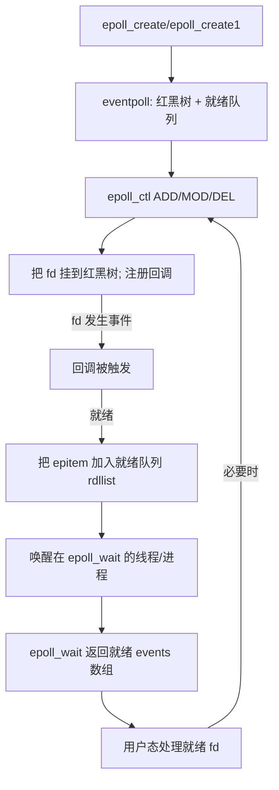

# 什么是多路复用？Linux中IO多路复用是如何实现的？

## 📋 目录
- [一、什么是多路复用](#一什么是多路复用)
  - [1.1 什么是文件描述符（fd）](#11-什么是文件描述符fd)
  - [1.2 多路复用的基本概念](#12-多路复用的基本概念)
  - [1.3 生活中的类比](#13-生活中的类比)
  - [1.4 核心优势](#14-核心优势)
- [二、为什么需要IO多路复用](#二为什么需要io多路复用)
- [三、Linux中的IO模型](#三linux中的io模型)
- [四、select：最古老的多路复用机制](#四select最古老的多路复用机制)
- [五、poll：改进的select](#五poll改进的select)
- [六、epoll：Linux的高性能方案](#六epolllinux的高性能方案)
- [七、三种机制对比](#七三种机制对比)
- [八、底层实现原理深入](#八底层实现原理深入)
- [九、实际应用场景](#九实际应用场景)
- [十、常见问题与解答](#十常见问题与解答)

---

## 一、什么是多路复用

### 1.1 什么是文件描述符（fd）

在深入理解多路复用之前，我们需要先理解**文件描述符（File Descriptor，简称fd）**这个核心概念。

#### 基本定义

**文件描述符（fd）** 是Linux/Unix系统中用于标识**已打开的文件、socket、管道等IO资源**的一个**非负整数**。它是进程与内核之间进行IO操作的桥梁。

#### 本质理解

1. **fd是一个索引**：
   - 每个进程都有一个**文件描述符表**（fd table）
   - fd就是这个表中的索引（下标）
   - 通过fd可以找到对应的**文件对象**（file object）

2. **fd的分配规则**：
   - 0、1、2是标准输入、输出、错误输出（stdin、stdout、stderr）
   - 新打开的fd从3开始递增分配
   - 关闭fd后，该fd可以被重新使用

3. **fd可以指向什么**：
   - 普通文件（file）
   - 目录（directory）
   - 网络socket（socket）
   - 管道（pipe）
   - 设备文件（device）
   - 等等

#### 代码示例

```c
#include <stdio.h>
#include <unistd.h>
#include <fcntl.h>
#include <sys/socket.h>

int main() {
    // 标准输入输出错误（自动打开）
    printf("stdin fd: %d\n", STDIN_FILENO);   // 0
    printf("stdout fd: %d\n", STDOUT_FILENO); // 1
    printf("stderr fd: %d\n", STDERR_FILENO); // 2
    
    // 打开文件，返回fd
    int file_fd = open("test.txt", O_RDONLY);
    printf("文件fd: %d\n", file_fd);  // 通常是3
    
    // 创建socket，返回fd
    int socket_fd = socket(AF_INET, SOCK_STREAM, 0);
    printf("socket fd: %d\n", socket_fd);  // 通常是4
    
    // 关闭fd
    close(file_fd);
    close(socket_fd);
    
    return 0;
}
```

#### 内核视角

```
进程A的fd表：
┌─────┬──────────────────┐
│ fd  │ 指向的文件对象    │
├─────┼──────────────────┤
│  0  │ stdin            │
│  1  │ stdout           │
│  2  │ stderr           │
│  3  │ /etc/passwd      │
│  4  │ socket(192.168...)│
│  5  │ pipe[0]          │
└─────┴──────────────────┘
```

#### 为什么fd重要？

在IO多路复用中：
- **每个网络连接对应一个socket fd**
- **监听多个连接 = 监听多个fd**
- **fd就绪 = 对应的连接有数据可读/可写**
- **通过fd可以操作对应的连接**

例如，一个Web服务器可能同时处理1000个客户端连接，就有1000个socket fd需要监控。

### 1.2 多路复用的基本概念

**多路复用（Multiplexing）** 是一种通信技术，它允许**单个资源同时处理多个数据流**。在IO编程中，多路复用指的是**一个进程/线程可以同时监听多个文件描述符（fd）**，当其中任何一个fd就绪（可读、可写或异常）时，程序就能立即感知并处理。

### 1.3 生活中的类比

想象一下：
- **传统方式**：一个服务员（线程）只能服务一张桌子（fd），需要多个服务员才能服务多张桌子
- **多路复用**：一个服务员可以同时照看多张桌子，当某张桌子需要服务时，服务员立即过去处理

### 1.4 核心优势

1. **资源高效**：一个线程处理多个连接，减少线程/进程创建开销
2. **响应及时**：不需要轮询，事件驱动，有数据时立即处理
3. **扩展性强**：可以轻松处理成千上万的并发连接

---

## 二、为什么需要IO多路复用

### 2.1 传统IO模型的问题

#### 阻塞IO（Blocking IO）
```c
// 伪代码示例
while (true) {
    fd = accept(socket);  // 阻塞等待连接
    read(fd, buffer);     // 阻塞等待数据
    process(buffer);      // 处理数据
}
```

**问题**：
- 一个线程只能处理一个连接
- 处理1000个连接需要1000个线程
- 线程切换开销巨大，内存占用高

#### 非阻塞IO（Non-blocking IO）
```c
// 伪代码示例
while (true) {
    for (fd in fds) {
        if (has_data(fd)) {  // 非阻塞检查
            read(fd, buffer);
            process(buffer);
        }
    }
}
```

**问题**：
- 需要不断轮询所有fd，CPU空转浪费资源
- 轮询间隔难以把握：太短浪费CPU，太长响应延迟

### 2.2 IO多路复用的解决方案

IO多路复用让**操作系统内核**来帮我们监控多个fd，当有fd就绪时，内核通知我们，我们再去处理。这样：
- **不需要多线程**：单线程就能处理大量连接
- **不需要轮询**：内核事件通知，高效且及时
- **资源占用少**：内存和CPU都更高效

---

## 三、Linux中的IO模型

在深入多路复用之前，先理解Linux的IO模型：

### 3.1 五种IO模型

1. **阻塞IO（Blocking IO）**：进程阻塞直到数据就绪
2. **非阻塞IO（Non-blocking IO）**：立即返回，需要轮询
3. **IO多路复用（IO Multiplexing）**：select/poll/epoll
4. **信号驱动IO（Signal-driven IO）**：SIGIO信号通知
5. **异步IO（Asynchronous IO）**：aio_read/aio_write

### 3.2 IO多路复用的位置

IO多路复用是**同步IO**的一种，因为：
- 数据从内核空间拷贝到用户空间的过程，进程仍然是阻塞的
- 但相比阻塞IO，它可以在等待多个fd时阻塞，而不是只等待一个

---

## 四、select：最古老的多路复用机制

### 4.1 select函数原型

```c
#include <sys/select.h>

int select(int nfds, 
           fd_set *readfds, 
           fd_set *writefds, 
           fd_set *exceptfds, 
           struct timeval *timeout);
```

**参数说明**：
- `nfds`：需要检查的最大文件描述符值 + 1
- `readfds`：监听可读事件的fd集合
- `writefds`：监听可写事件的fd集合
- `exceptfds`：监听异常事件的fd集合
- `timeout`：超时时间，NULL表示永久阻塞

**返回值**：
- 成功：返回就绪的fd数量
- 超时：返回0
- 错误：返回-1

### 4.1.1 什么是fd_set？

`fd_set` 是 select 用来表示“要监听/检查的一组文件描述符”的**位图集合**。可以把它理解成一个定长的布尔数组，每个 bit 对应一个 fd（文件描述符）：

- **容量限制**：大小固定为 `FD_SETSIZE`（通常是 1024），因此 select 最多只能同时监听 1024 个 fd
- **内部结构**：本质是一个长整型数组，按 bit 标记某个 fd 是否在集合里
- **配套宏**：
  - `FD_ZERO(&set)`：清空集合
  - `FD_SET(fd, &set)`：把 fd 加入集合
  - `FD_CLR(fd, &set)`：从集合删除 fd
  - `FD_ISSET(fd, &set)`：判断 fd 是否在集合（是否就绪）
- **读写分离**：readfds、writefds、exceptfds 是三个独立的 fd_set，分别用于“可读”“可写”“异常”监听
- **内核会改写**：调用 select 后，传入的 fd_set 会被内核改写，仅保留就绪的 fd，因此**每次调用前必须重置并重新填充**（否则集合会脏）

### 4.2 select使用示例

```c
#include <sys/select.h>
#include <sys/socket.h>
#include <stdio.h>

int main() {
    int server_fd, client_fd;
    fd_set readfds;
    int max_fd;
    struct timeval timeout;
    
    // 创建socket并绑定（省略）
    server_fd = socket(...);
    bind(...);
    listen(server_fd, 10);
    
    max_fd = server_fd;
    
    while (1) {
        FD_ZERO(&readfds);           // 清空集合
        FD_SET(server_fd, &readfds); // 添加server_fd
        
        // 添加所有客户端fd
        for (int i = 0; i < client_count; i++) {
            FD_SET(clients[i], &readfds);
            if (clients[i] > max_fd) max_fd = clients[i];
        }
        
        timeout.tv_sec = 5;
        timeout.tv_usec = 0;
        
        // 等待事件
        int ready = select(max_fd + 1, &readfds, NULL, NULL, &timeout);
        
        if (ready > 0) {
            // 检查server_fd是否有新连接
            if (FD_ISSET(server_fd, &readfds)) {
                client_fd = accept(server_fd, NULL, NULL);
                // 处理新连接
            }
            
            // 检查客户端fd是否有数据
            for (int i = 0; i < client_count; i++) {
                if (FD_ISSET(clients[i], &readfds)) {
                    // 读取并处理数据
                    read(clients[i], buffer, size);
                }
            }
        }
    }
    
    return 0;
}
```

### 4.3 select的工作原理

1. **用户态准备**：程序准备fd_set，设置要监听的fd
2. **系统调用**：调用select，将fd_set拷贝到内核
3. **内核监控**：内核遍历所有fd，检查是否有就绪事件
4. **返回结果**：内核修改fd_set，标记就绪的fd，返回就绪数量
5. **用户态处理**：程序遍历fd_set，找出就绪的fd并处理

### 4.4 select的局限性

1. **fd数量限制**：`FD_SETSIZE`通常为1024，最多监听1024个fd
2. **性能问题**：
   - 每次调用都要将整个fd_set从用户态拷贝到内核态
   - 内核需要遍历所有fd（O(n)复杂度）
   - 返回后用户态需要遍历所有fd找出就绪的
3. **fd_set重用问题**：select会修改传入的fd_set，每次调用前必须重新设置

---

## 五、poll：改进的select

### 5.1 poll函数原型

```c
#include <poll.h>

int poll(struct pollfd *fds, nfds_t nfds, int timeout);
```

**参数说明**：
- `fds`：pollfd结构体数组
- `nfds`：数组元素个数
- `timeout`：超时时间（毫秒），-1表示永久阻塞

**pollfd结构体**：
```c
struct pollfd {
    int fd;         // 文件描述符
    short events;   // 监听的事件（POLLIN、POLLOUT等）
    short revents;  // 返回的事件（由内核填充）
};
```

### 5.2 poll使用示例

```c
#include <poll.h>

int main() {
    struct pollfd fds[100];
    int nfds = 1;
    
    // 初始化server_fd
    fds[0].fd = server_fd;
    fds[0].events = POLLIN;
    
    while (1) {
        int ready = poll(fds, nfds, 5000); // 5秒超时
        
        if (ready > 0) {
            // 检查server_fd
            if (fds[0].revents & POLLIN) {
                int client_fd = accept(server_fd, NULL, NULL);
                // 添加新客户端到fds数组
                fds[nfds].fd = client_fd;
                fds[nfds].events = POLLIN;
                nfds++;
            }
            
            // 检查所有客户端
            for (int i = 1; i < nfds; i++) {
                if (fds[i].revents & POLLIN) {
                    // 读取并处理数据
                    read(fds[i].fd, buffer, size);
                }
            }
        }
    }
    
    return 0;
}
```

### 5.3 poll相比select的改进

1. **无fd数量限制**：理论上可以监听任意数量的fd（受系统资源限制）
2. **更清晰的接口**：使用pollfd结构体，events和revents分离
3. **更灵活的事件类型**：支持更多事件类型

### 5.4 poll仍然存在的问题

1. **性能问题依然存在**：
   - 每次调用都要将整个fds数组拷贝到内核
   - 内核仍然需要遍历所有fd（O(n)）
   - 返回后用户态需要遍历所有fd
2. **大量fd时效率低**：当fd数量很大时，遍历开销显著

---

## 六、epoll：Linux的高性能方案

### 6.x epoll 工作流程图（简化）



**图示要点**：
- **红黑树**：存储已监听 fd，支持 O(log n) 的增删改查
- **就绪队列 rdllist**：只存放已就绪的 fd，获取为 O(1)
- **回调机制**：fd 有事件时，驱动回调把对应 epitem 放入就绪队列并唤醒 epoll_wait
- **epoll_wait**：只返回就绪 fd 列表，用户态遍历成本接近 O(k)，k 为就绪数量
- **反复增删改**：通过 epoll_ctl 调整监听集合，无需每次拷贝整个 fd 集合

### 6.1 epoll的三个核心函数

#### epoll_create
```c
#include <sys/epoll.h>

int epoll_create(int size);  // 创建epoll实例
int epoll_create1(int flags); // 更灵活的创建方式
```

#### epoll_ctl
```c
int epoll_ctl(int epfd, int op, int fd, struct epoll_event *event);
```

**操作类型（op）**：
- `EPOLL_CTL_ADD`：添加fd到epoll
- `EPOLL_CTL_MOD`：修改fd的监听事件
- `EPOLL_CTL_DEL`：从epoll中删除fd

**epoll_event结构体**：
```c
struct epoll_event {
    uint32_t events;      // 事件类型（EPOLLIN、EPOLLOUT等）
    epoll_data_t data;    // 用户数据
};

typedef union epoll_data {
    void *ptr;
    int fd;
    uint32_t u32;
    uint64_t u64;
} epoll_data_t;
```

#### epoll_wait
```c
int epoll_wait(int epfd, 
               struct epoll_event *events, 
               int maxevents, 
               int timeout);
```

### 6.2 epoll使用示例

```c
#include <sys/epoll.h>

int main() {
    int epfd = epoll_create1(0);
    struct epoll_event event, events[100];
    
    // 添加server_fd到epoll
    event.events = EPOLLIN;
    event.data.fd = server_fd;
    epoll_ctl(epfd, EPOLL_CTL_ADD, server_fd, &event);
    
    while (1) {
        int ready = epoll_wait(epfd, events, 100, 5000);
        
        for (int i = 0; i < ready; i++) {
            if (events[i].data.fd == server_fd) {
                // 新连接
                int client_fd = accept(server_fd, NULL, NULL);
                event.events = EPOLLIN;
                event.data.fd = client_fd;
                epoll_ctl(epfd, EPOLL_CTL_ADD, client_fd, &event);
            } else {
                // 客户端数据
                int client_fd = events[i].data.fd;
                read(client_fd, buffer, size);
                // 处理数据
            }
        }
    }
    
    close(epfd);
    return 0;
}
```

### 6.3 epoll的核心优势

#### 1. 事件驱动，无需遍历
- **select/poll**：每次调用都要检查所有fd
- **epoll**：只返回就绪的fd，直接处理即可

#### 2. 内核数据结构优化
- **红黑树**：存储所有监听的fd，查找、插入、删除都是O(log n)
- **就绪队列**：使用双向链表存储就绪的fd，O(1)获取

#### 3. 内存共享
- **select/poll**：每次调用都要拷贝fd集合到内核
- **epoll**：fd集合在内核中维护，通过epoll_ctl增删改，epoll_wait只返回就绪的

#### 4. 边缘触发（ET）模式
- **水平触发（LT）**：fd就绪后，如果不处理，下次epoll_wait还会通知
- **边缘触发（ET）**：fd就绪后，只通知一次，必须一次性处理完所有数据

### 6.4 epoll的两种工作模式

#### 水平触发（Level Triggered，LT）
```c
event.events = EPOLLIN;  // 默认是LT模式
```

**特点**：
- fd就绪后，如果不读取完所有数据，下次epoll_wait还会返回该fd
- 编程简单，不容易遗漏事件
- 性能略低于ET模式

#### 边缘触发（Edge Triggered，ET）
```c
event.events = EPOLLIN | EPOLLET;  // 启用ET模式
```

**特点**：
- fd就绪后，只通知一次，必须一次性处理完
- 需要将fd设置为非阻塞模式
- 性能更高，但编程复杂，容易遗漏事件

**ET模式示例**：
```c
// 设置非阻塞
int flags = fcntl(fd, F_GETFL, 0);
fcntl(fd, F_SETFL, flags | O_NONBLOCK);

// 设置ET模式
event.events = EPOLLIN | EPOLLET;
epoll_ctl(epfd, EPOLL_CTL_ADD, fd, &event);

// 处理时必须读取完所有数据
while (1) {
    ssize_t n = read(fd, buffer, size);
    if (n < 0) {
        if (errno == EAGAIN || errno == EWOULDBLOCK) {
            break;  // 数据读完了
        }
        // 处理错误
    } else if (n == 0) {
        // 连接关闭
        break;
    } else {
        // 处理数据
        process(buffer, n);
    }
}
```

---

## 七、三种机制对比

| 特性 | select | poll | epoll |
|------|--------|------|-------|
| **fd数量限制** | 1024 | 无限制 | 无限制 |
| **时间复杂度** | O(n) | O(n) | O(1) |
| **fd集合拷贝** | 每次调用都拷贝 | 每次调用都拷贝 | 内核维护，不拷贝 |
| **内核遍历** | 遍历所有fd | 遍历所有fd | 只返回就绪的fd |
| **用户态遍历** | 需要遍历所有fd | 需要遍历所有fd | 只遍历就绪的fd |
| **事件模式** | 仅LT | 仅LT | LT和ET |
| **适用场景** | 少量fd | 中等数量fd | 大量fd |

### 性能对比（10000个连接）

- **select**：每次调用遍历10000个fd，效率低
- **poll**：每次调用遍历10000个fd，效率低
- **epoll**：只返回就绪的fd（可能只有几个），效率高

**结论**：epoll在大量并发连接时性能优势明显。

---

## 八、底层实现原理深入

### 8.1 select的实现原理

#### 内核数据结构
```c
// 内核中的fd_set实现（简化）
typedef struct {
    unsigned long fds_bits[__FD_SETSIZE / __NFDBITS];
} fd_set;
```

#### 工作流程
1. **用户态**：准备fd_set，调用select
2. **系统调用**：陷入内核，将fd_set拷贝到内核空间
3. **内核监控**：
   - 遍历所有fd，调用每个fd的poll函数
   - 检查fd是否就绪
   - 将就绪的fd标记在fd_set中
4. **返回**：将修改后的fd_set拷贝回用户态
5. **用户态**：遍历fd_set找出就绪的fd

#### 性能瓶颈
- **两次拷贝**：用户态↔内核态
- **O(n)遍历**：每次都要检查所有fd
- **重复设置**：每次调用前都要重新设置fd_set

### 8.2 poll的实现原理

poll的实现与select类似，但使用pollfd数组：

1. **用户态**：准备pollfd数组
2. **系统调用**：将数组拷贝到内核
3. **内核遍历**：遍历所有pollfd，调用每个fd的poll函数
4. **返回结果**：修改revents字段，拷贝回用户态
5. **用户态遍历**：遍历数组找出就绪的fd

**相比select的改进**：无1024限制，但性能瓶颈依然存在。

### 8.3 epoll的实现原理

#### 核心数据结构

**1. eventpoll结构体**（每个epoll实例）
```c
struct eventpoll {
    struct rb_root rbr;        // 红黑树根节点，存储所有fd
    struct list_head rdllist;  // 就绪队列，双向链表
    wait_queue_head_t wq;      // 等待队列
    // ...
};
```

**2. epitem结构体**（每个被监听的fd）
```c
struct epitem {
    struct rb_node rbn;        // 红黑树节点
    struct list_head rdllink;  // 就绪队列节点
    struct epoll_filefd ffd;   // fd信息
    struct eventpoll *ep;      // 所属的epoll实例
    struct epoll_event event;  // 监听的事件
    // ...
};
```

#### 工作流程

**1. epoll_create**
```c
int epoll_create(int size) {
    // 创建eventpoll结构体
    // 初始化红黑树和就绪队列
    // 返回epfd（文件描述符）
}
```

**2. epoll_ctl（添加fd）**
```c
int epoll_ctl(int epfd, int op, int fd, struct epoll_event *event) {
    // 根据op操作：
    // ADD: 创建epitem，插入红黑树
    // MOD: 修改epitem中的event
    // DEL: 从红黑树删除epitem
    
    // 关键：为fd注册回调函数
    // 当fd就绪时，回调函数会将epitem加入就绪队列
}
```

**3. epoll_wait**
```c
int epoll_wait(int epfd, struct epoll_event *events, int maxevents, int timeout) {
    // 1. 检查就绪队列是否为空
    // 2. 如果为空，将当前进程加入等待队列，阻塞
    // 3. 当fd就绪时，回调函数唤醒进程
    // 4. 从就绪队列取出epitem，填充events数组
    // 5. 返回就绪的fd数量
}
```

#### 回调机制（核心）

当fd就绪时，内核会调用注册的回调函数：

```c
// 伪代码
static int ep_poll_callback(wait_queue_entry_t *wait, unsigned mode, int sync, void *key) {
    struct epitem *epi = ep_item_from_wait(wait);
    struct eventpoll *ep = epi->ep;
    
    // 将epitem加入就绪队列
    if (!ep_is_linked(&epi->rdllink))
        list_add_tail(&epi->rdllink, &ep->rdllist);
    
    // 唤醒等待的进程
    if (waitqueue_active(&ep->wq))
        wake_up(&ep->wq);
    
    return 1;
}
```

**关键点**：
- fd就绪时，**自动**将对应的epitem加入就绪队列
- **无需遍历**，直接知道哪些fd就绪
- 唤醒等待的进程，立即返回

#### 为什么epoll高效？

1. **红黑树**：O(log n)的查找、插入、删除
2. **就绪队列**：O(1)获取就绪的fd
3. **回调机制**：fd就绪时自动加入队列，无需遍历
4. **内存共享**：fd集合在内核维护，epoll_wait只返回结果

### 8.4 ET vs LT的实现差异

#### 水平触发（LT）
```c
// 伪代码
if (epi->event.events & EPOLLIN) {
    if (fd_has_data(fd)) {
        // 将epitem加入就绪队列
        list_add_tail(&epi->rdllink, &ep->rdllist);
    }
}
```

**特点**：只要fd还有数据，就会一直加入就绪队列。

#### 边缘触发（ET）
```c
// 伪代码
if (epi->event.events & EPOLLIN) {
    if (fd_has_data(fd) && !epi->already_in_rdllist) {
        // 只在状态变化时加入一次
        list_add_tail(&epi->rdllink, &ep->rdllist);
        epi->already_in_rdllist = true;
    }
}
```

**特点**：只在fd状态从不可读变为可读时通知一次。

---

## 九、实际应用场景

### 9.1 高并发Web服务器

**Nginx**：使用epoll处理大量并发连接
```c
// Nginx的epoll使用（简化）
ngx_event_t *ev;
struct epoll_event ee;

// 添加监听socket
ee.events = EPOLLIN | EPOLLET;
ee.data.ptr = ev;
epoll_ctl(ep->ep, EPOLL_CTL_ADD, ev->fd, &ee);

// 事件循环
for (;;) {
    nfds = epoll_wait(ep->ep, event_list, nevents, timer);
    for (i = 0; i < nfds; i++) {
        ev = (ngx_event_t *) event_list[i].data.ptr;
        ev->handler(ev);  // 处理事件
    }
}
```

### 9.2 Redis的事件驱动

Redis使用epoll（Linux）或kqueue（BSD）实现事件驱动：

```c
// Redis的ae_epoll.c（简化）
int aeApiCreate(aeEventLoop *eventLoop) {
    aeApiState *state = zmalloc(sizeof(aeApiState));
    state->epfd = epoll_create(1024);
    eventLoop->apidata = state;
    return 0;
}

int aeApiAddEvent(aeEventLoop *eventLoop, int fd, int mask) {
    struct epoll_event ee;
    ee.events = 0;
    if (mask & AE_READABLE) ee.events |= EPOLLIN;
    if (mask & AE_WRITABLE) ee.events |= EPOLLOUT;
    ee.data.fd = fd;
    return epoll_ctl(state->epfd, EPOLL_CTL_ADD, fd, &ee);
}
```

### 9.3 聊天服务器示例

```c
#include <sys/epoll.h>
#include <sys/socket.h>
#include <netinet/in.h>
#include <arpa/inet.h>
#include <unistd.h>
#include <string.h>

#define MAX_EVENTS 100
#define PORT 8080

int main() {
    int server_fd, epfd;
    struct sockaddr_in addr;
    struct epoll_event event, events[MAX_EVENTS];
    
    // 创建socket
    server_fd = socket(AF_INET, SOCK_STREAM, 0);
    
    // 绑定地址
    addr.sin_family = AF_INET;
    addr.sin_addr.s_addr = INADDR_ANY;
    addr.sin_port = htons(PORT);
    bind(server_fd, (struct sockaddr*)&addr, sizeof(addr));
    
    // 监听
    listen(server_fd, 10);
    
    // 创建epoll
    epfd = epoll_create1(0);
    
    // 添加server_fd
    event.events = EPOLLIN;
    event.data.fd = server_fd;
    epoll_ctl(epfd, EPOLL_CTL_ADD, server_fd, &event);
    
    printf("服务器启动，监听端口 %d\n", PORT);
    
    while (1) {
        int nfds = epoll_wait(epfd, events, MAX_EVENTS, -1);
        
        for (int i = 0; i < nfds; i++) {
            if (events[i].data.fd == server_fd) {
                // 新连接
                struct sockaddr_in client_addr;
                socklen_t len = sizeof(client_addr);
                int client_fd = accept(server_fd, 
                                      (struct sockaddr*)&client_addr, 
                                      &len);
                
                // 设置为非阻塞（ET模式需要）
                int flags = fcntl(client_fd, F_GETFL, 0);
                fcntl(client_fd, F_SETFL, flags | O_NONBLOCK);
                
                // 添加到epoll
                event.events = EPOLLIN | EPOLLET;
                event.data.fd = client_fd;
                epoll_ctl(epfd, EPOLL_CTL_ADD, client_fd, &event);
                
                printf("新客户端连接: %s:%d\n", 
                       inet_ntoa(client_addr.sin_addr),
                       ntohs(client_addr.sin_port));
            } else {
                // 客户端数据
                int client_fd = events[i].data.fd;
                char buffer[1024];
                
                // ET模式：必须读取完所有数据
                while (1) {
                    ssize_t n = read(client_fd, buffer, sizeof(buffer));
                    if (n < 0) {
                        if (errno == EAGAIN || errno == EWOULDBLOCK) {
                            break;  // 数据读完了
                        }
                        // 错误处理
                        close(client_fd);
                        epoll_ctl(epfd, EPOLL_CTL_DEL, client_fd, NULL);
                        break;
                    } else if (n == 0) {
                        // 连接关闭
                        printf("客户端断开连接\n");
                        close(client_fd);
                        epoll_ctl(epfd, EPOLL_CTL_DEL, client_fd, NULL);
                        break;
                    } else {
                        // 处理数据（这里简单回显）
                        write(client_fd, buffer, n);
                    }
                }
            }
        }
    }
    
    close(epfd);
    close(server_fd);
    return 0;
}
```

---

## 十、常见问题与解答

### Q1: select的1024限制是怎么来的？

**A**: `FD_SETSIZE`宏定义为1024，这是fd_set结构体中位数组的大小。每个fd占用一个bit，所以最多1024个fd。

**解决方案**：
- 修改内核重新编译（不推荐）
- 使用poll或epoll（推荐）

### Q2: 为什么epoll比select/poll快？

**A**: 
1. **无需遍历**：epoll只返回就绪的fd，select/poll需要遍历所有fd
2. **内核维护**：fd集合在内核中，无需每次拷贝
3. **回调机制**：fd就绪时自动加入队列，O(1)获取

### Q3: ET模式为什么需要非阻塞IO？

**A**: ET模式只通知一次，必须一次性读取完所有数据。如果使用阻塞IO：
- 读取时可能阻塞，无法继续处理其他fd
- 如果数据没读完，下次不会再通知，数据会丢失

非阻塞IO可以循环读取直到EAGAIN，确保数据读完。

### Q4: epoll适合所有场景吗？

**A**: 不是。epoll适合：
- ✅ 大量并发连接（>1000）
- ✅ 连接活跃度不高（长连接、少量数据）

不适合：
- ❌ 少量连接（<100）：select/poll足够，epoll的额外开销不划算
- ❌ 连接非常活跃：每个连接都有大量数据，epoll的优势不明显

### Q5: select/poll/epoll是同步还是异步？

**A**: 都是**同步IO**。因为：
- 数据从内核拷贝到用户空间的过程，进程是阻塞的
- 只是等待多个fd时阻塞，而不是只等待一个

真正的异步IO是`aio_read`/`aio_write`，数据拷贝也是异步的。

### Q6: epoll的LT和ET模式如何选择？

**A**: 
- **LT模式**：编程简单，不容易出错，适合大多数场景
- **ET模式**：性能略高，但编程复杂，需要：
  - 非阻塞IO
  - 一次性读取完所有数据
  - 正确处理EAGAIN

**建议**：除非性能要求极高，否则优先使用LT模式。

### Q7: epoll_wait返回的events数组大小如何设置？

**A**: 
- 太小：一次只能处理少量事件，需要多次调用
- 太大：浪费内存，但通常影响不大

**经验值**：设置为预计的最大并发连接数，或使用动态调整。

### Q8: 多线程环境下如何使用epoll？

**A**: 
- **方案1**：每个线程一个epoll实例，负载均衡分配连接
- **方案2**：主线程accept，工作线程处理数据（需要线程池）
- **方案3**：使用SO_REUSEPORT，多个进程/线程监听同一端口

**推荐**：方案1或方案3，避免锁竞争。

---

## 总结

### 核心要点

1. **多路复用**：一个线程/进程同时监听多个fd，提高资源利用率
2. **select/poll**：传统方案，适合少量fd，性能有瓶颈
3. **epoll**：Linux高性能方案，适合大量并发连接
4. **LT vs ET**：LT简单可靠，ET性能略高但复杂
5. **适用场景**：高并发服务器、事件驱动程序

### 记忆要点

- **select**：1024限制，每次拷贝，O(n)遍历
- **poll**：无限制，每次拷贝，O(n)遍历
- **epoll**：无限制，内核维护，O(1)获取，回调机制

### 面试重点

1. 三种机制的区别和优缺点
2. epoll为什么高效（红黑树、就绪队列、回调）
3. LT和ET模式的区别和使用场景
4. 为什么ET模式需要非阻塞IO
5. 实际应用场景（Nginx、Redis等）

---

*本文档涵盖了IO多路复用的核心概念、实现原理和实际应用，希望对理解Linux网络编程有所帮助。*
