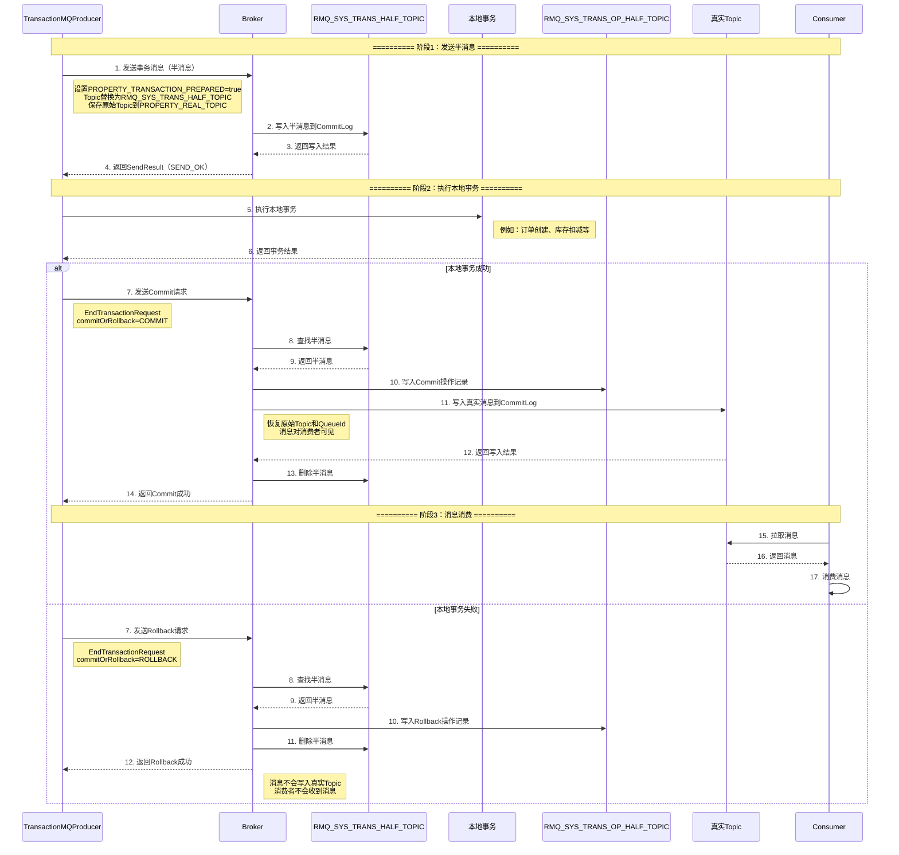
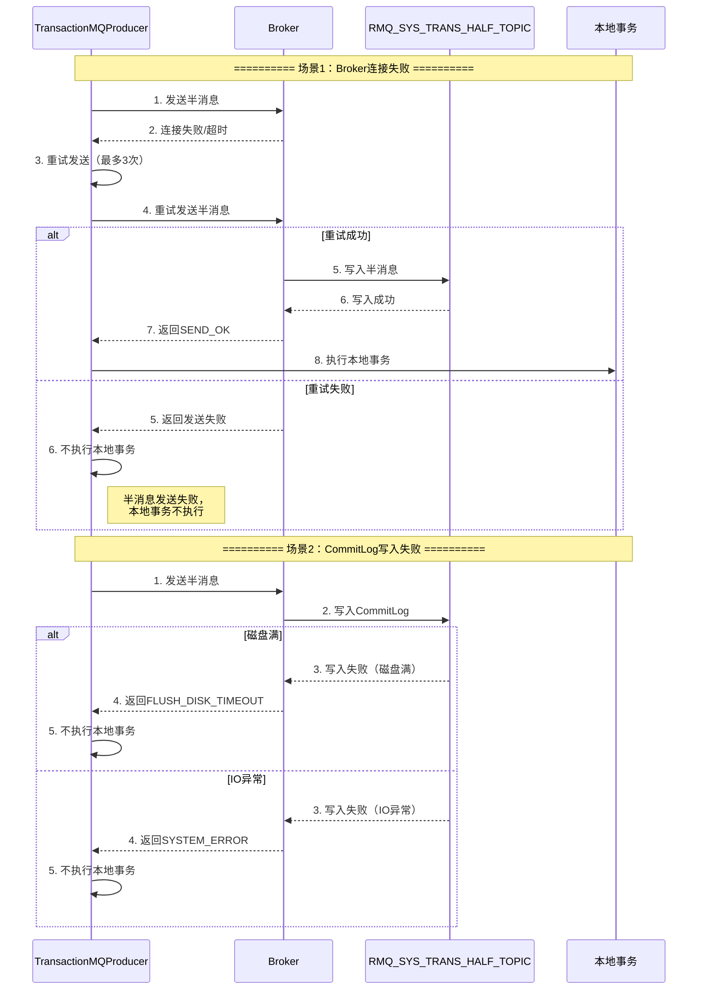
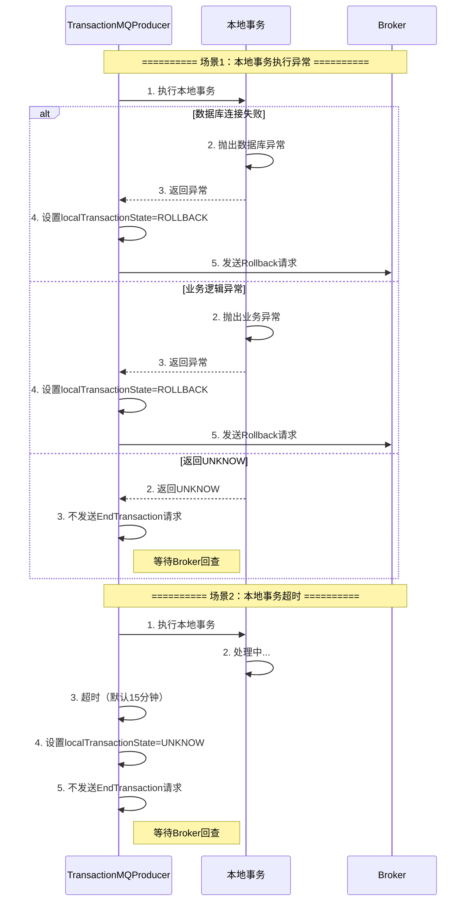
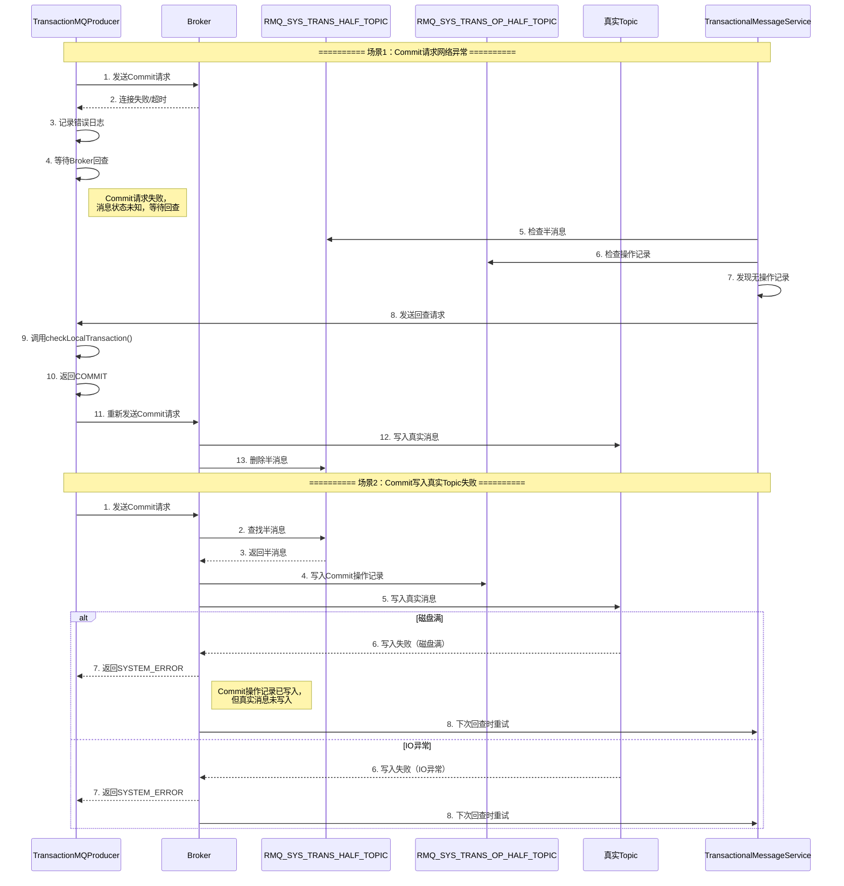
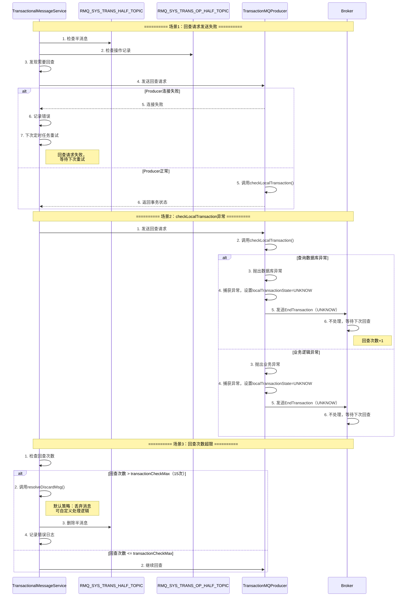
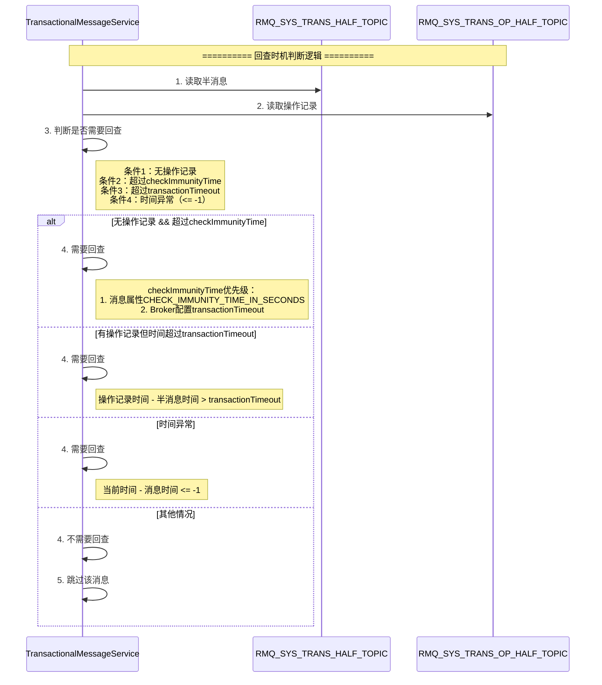

# RocketMQ事务消息与消费流程详解

## 一、事务消息整体架构

```
┌─────────────────────────────────────────────────────────────────────────────────────┐
│                        RocketMQ事务消息架构                                           │
└─────────────────────────────────────────────────────────────────────────────────────┘

┌─────────────────────────────────────────────────────────────────────────────────────┐
│                              Producer端                                              │
│  ┌──────────────────────────────────────────────────────────────────────────────┐  │
│  │  TransactionMQProducer                                                       │  │
│  │  ┌────────────────────────────────────────────────────────────────────────┐  │  │
│  │  │  TransactionListener                                                    │  │  │
│  │  │  - executeLocalTransaction()  // 执行本地事务                           │  │  │
│  │  │  - checkLocalTransaction()    // 回查本地事务状态                       │  │  │
│  │  └────────────────────────────────────────────────────────────────────────┘  │  │
│  └──────────────────────────────────────────────────────────────────────────────┘  │
└─────────────────────────────────────────────────────────────────────────────────────┘
         │
         │ 1. 发送半消息
         ▼
┌─────────────────────────────────────────────────────────────────────────────────────┐
│                              Broker端                                                │
│  ┌──────────────────────────────────────────────────────────────────────────────┐  │
│  │  SendMessageProcessor                                                       │  │
│  │  → 接收半消息 → 写入RMQ_SYS_TRANS_HALF_TOPIC                                │  │
│  └──────────────────────────────────────────────────────────────────────────────┘  │
│                                                                                      │
│  ┌──────────────────────────────────────────────────────────────────────────────┐  │
│  │  EndTransactionProcessor                                                     │  │
│  │  → 处理Commit/Rollback请求                                                  │  │
│  │  → 写入RMQ_SYS_TRANS_OP_HALF_TOPIC                                          │  │
│  └──────────────────────────────────────────────────────────────────────────────┘  │
│                                                                                      │
│  ┌──────────────────────────────────────────────────────────────────────────────┐  │
│  │  TransactionalMessageService                                                 │  │
│  │  → 定时检查半消息状态                                                        │  │
│  │  → 发送回查请求                                                              │  │
│  └──────────────────────────────────────────────────────────────────────────────┘  │
└─────────────────────────────────────────────────────────────────────────────────────┘
         │
         │ 2. 回查请求
         ▼
┌─────────────────────────────────────────────────────────────────────────────────────┐
│                              Producer端                                              │
│  ┌──────────────────────────────────────────────────────────────────────────────┐  │
│  │  DefaultMQProducerImpl.checkTransactionState()                              │  │
│  │  → 调用TransactionListener.checkLocalTransaction()                         │  │
│  │  → 发送Commit/Rollback请求                                                  │  │
│  └──────────────────────────────────────────────────────────────────────────────┘  │
└─────────────────────────────────────────────────────────────────────────────────────┘

┌─────────────────────────────────────────────────────────────────────────────────────┐
│                          存储结构                                                     │
│  ┌──────────────────────────────────────────────────────────────────────────────┐  │
│  │  RMQ_SYS_TRANS_HALF_TOPIC                                                    │  │
│  │  - 存储半消息（Half Message）                                                 │  │
│  │  - Topic被替换为系统Topic，消费者不可见                                      │  │
│  └──────────────────────────────────────────────────────────────────────────────┘  │
│                                                                                      │
│  ┌──────────────────────────────────────────────────────────────────────────────┐  │
│  │  RMQ_SYS_TRANS_OP_HALF_TOPIC                                                │  │
│  │  - 存储事务操作记录（Commit/Rollback）                                       │  │
│  │  - 用于判断半消息是否已处理                                                  │  │
│  └──────────────────────────────────────────────────────────────────────────────┘  │
│                                                                                      │
│  ┌──────────────────────────────────────────────────────────────────────────────┐  │
│  │  真实Topic（如：OrderTopic）                                                 │  │
│  │  - Commit后，消息写入真实Topic                                               │  │
│  │  - 消费者可以正常消费                                                        │  │
│  └──────────────────────────────────────────────────────────────────────────────┘  │
└─────────────────────────────────────────────────────────────────────────────────────┘
```

## 二、事务消息完整流程时序图（正常场景）



## 三、事务消息完整流程时序图（包含异常场景）

```mermaid
sequenceDiagram
    participant Producer as TransactionMQProducer
    participant Broker as Broker
    participant HalfTopic as RMQ_SYS_TRANS_HALF_TOPIC
    participant LocalTx as 本地事务
    participant OpTopic as RMQ_SYS_TRANS_OP_HALF_TOPIC
    participant CheckService as TransactionalMessageService
    participant RealTopic as 真实Topic
    participant Consumer as Consumer

    Note over Producer,Consumer: ========== 阶段1：发送半消息 ==========
    
    Producer->>Broker: 1. 发送事务消息（半消息）
    alt Broker连接失败
        Broker-->>Producer: 连接失败/超时
        Producer->>Producer: 2. 重试发送（最多3次）
        Producer->>Broker: 3. 重试发送半消息
    else Broker正常
        Broker->>HalfTopic: 2. 写入半消息到CommitLog
        alt CommitLog写入失败
            HalfTopic-->>Broker: 写入失败（磁盘满/IO异常）
            Broker-->>Producer: 3. 返回发送失败
            Producer->>Producer: 4. 本地事务不执行
            Note right of Producer: 半消息发送失败，<br/>不执行本地事务
        else CommitLog写入成功
            HalfTopic-->>Broker: 3. 返回写入成功
            Broker-->>Producer: 4. 返回SendResult（SEND_OK）
        end
    end
    
    Note over Producer,Consumer: ========== 阶段2：执行本地事务 ==========
    
    alt 半消息发送成功
        Producer->>LocalTx: 5. 执行本地事务
        alt 本地事务执行异常
            LocalTx->>LocalTx: 抛出异常
            LocalTx-->>Producer: 6. 返回异常
            Producer->>Producer: 7. 设置localTransactionState=ROLLBACK
        else 本地事务执行成功
            LocalTx-->>Producer: 6. 返回事务结果
            Producer->>Producer: 7. 设置localTransactionState=COMMIT
        end
        
        Note over Producer,Consumer: ========== 阶段3：提交/回滚事务 ==========
        
        Producer->>Broker: 8. 发送EndTransaction请求
        alt Broker连接失败
            Broker-->>Producer: 连接失败/超时
            Producer->>Producer: 9. 记录错误日志
            Note right of Producer: 提交/回滚请求失败，<br/>等待Broker回查
        else Broker正常
            Broker->>HalfTopic: 9. 查找半消息
            alt 半消息不存在
                HalfTopic-->>Broker: 消息不存在
                Broker-->>Producer: 10. 返回SYSTEM_ERROR
                Producer->>Producer: 11. 记录错误
            else 半消息存在
                HalfTopic-->>Broker: 10. 返回半消息
                
                alt Commit请求
                    Broker->>OpTopic: 11. 写入Commit操作记录
                    alt OpTopic写入失败
                        OpTopic-->>Broker: 写入失败
                        Broker-->>Producer: 12. 返回失败
                    else OpTopic写入成功
                        Broker->>RealTopic: 12. 写入真实消息
                        alt RealTopic写入失败
                            RealTopic-->>Broker: 写入失败
                            Broker-->>Producer: 13. 返回失败
                            Note right of Broker: Commit失败，<br/>等待回查重试
                        else RealTopic写入成功
                            RealTopic-->>Broker: 13. 返回写入成功
                            Broker->>HalfTopic: 14. 删除半消息
                            Broker-->>Producer: 15. 返回Commit成功
                        end
                    end
                else Rollback请求
                    Broker->>OpTopic: 11. 写入Rollback操作记录
                    Broker->>HalfTopic: 12. 删除半消息
                    Broker-->>Producer: 13. 返回Rollback成功
                end
            end
        end
    end
    
    Note over Producer,Consumer: ========== 阶段4：回查机制 ==========
    
    CheckService->>HalfTopic: 16. 定时检查半消息状态
    CheckService->>OpTopic: 17. 检查操作记录
    
    alt 半消息未处理（无操作记录）
        CheckService->>CheckService: 18. 判断是否需要回查
        Note right of CheckService: 条件：<br/>1. 超过checkImmunityTime<br/>2. 超过transactionTimeout<br/>3. 时间异常
        
        alt 需要回查
            CheckService->>Producer: 19. 发送回查请求
            Note right of CheckService: CheckTransactionStateRequest<br/>通过ProducerManager获取Channel
            
            alt Producer连接失败
                Producer-->>CheckService: 连接失败
                CheckService->>CheckService: 20. 记录错误，稍后重试
            else Producer正常
                Producer->>Producer: 20. 调用checkLocalTransaction()
                alt checkLocalTransaction异常
                    Producer->>Producer: 21. 捕获异常
                    Producer->>Producer: 22. 设置localTransactionState=UNKNOW
                else checkLocalTransaction正常
                    Producer->>Producer: 21. 查询本地事务状态
                    Producer->>Producer: 22. 返回localTransactionState
                end
                
                Producer->>Broker: 23. 发送EndTransaction请求（回查结果）
                Note right of Producer: fromTransactionCheck=true
                
                alt 回查结果为COMMIT
                    Broker->>OpTopic: 24. 写入Commit操作记录
                    Broker->>RealTopic: 25. 写入真实消息
                    Broker->>HalfTopic: 26. 删除半消息
                    Broker-->>Producer: 27. 返回成功
                else 回查结果为ROLLBACK
                    Broker->>OpTopic: 24. 写入Rollback操作记录
                    Broker->>HalfTopic: 25. 删除半消息
                    Broker-->>Producer: 26. 返回成功
                else 回查结果为UNKNOW
                    Broker->>Broker: 24. 不处理，等待下次回查
                    Note right of Broker: 回查次数+1
                end
            end
        end
    end
    
    Note over Producer,Consumer: ========== 阶段5：回查次数超限 ==========
    
    CheckService->>CheckService: 28. 检查回查次数
    alt 回查次数 > transactionCheckMax（默认15次）
        CheckService->>CheckService: 29. 丢弃消息
        Note right of CheckService: 默认策略：丢弃消息<br/>可自定义resolveDiscardMsg()
        CheckService->>HalfTopic: 30. 删除半消息
    end
    
    Note over Producer,Consumer: ========== 阶段6：消息消费 ==========
    
    alt 消息已Commit
        Consumer->>RealTopic: 31. 拉取消息
        RealTopic-->>Consumer: 32. 返回消息
        Consumer->>Consumer: 33. 消费消息
    end
```



## 四、事务消息异常场景详细处理

### 4.1 半消息发送异常



### 4.2 本地事务执行异常



### 4.3 提交/回滚请求异常



### 4.4 回查机制异常



### 4.5 回查时机判断



## 五、消息消费完整流程时序图（包含异常场景）

```mermaid
sequenceDiagram
    participant Producer as Producer
    participant NameServer as NameServer
    participant Broker as Broker
    participant CommitLog as CommitLog
    participant ConsumeQueue as ConsumeQueue
    participant Consumer as Consumer
    participant PullService as PullMessageService
    participant ProcessQueue as ProcessQueue
    participant ConsumeService as ConsumeMessageService
    participant Listener as MessageListener
    participant RetryQueue as 重试队列
    participant DLQ as 死信队列

    Note over Producer,DLQ: ========== 消息发送阶段 ==========
    
    Producer->>NameServer: 1. 获取Topic路由信息
    alt NameServer不可用
        NameServer-->>Producer: 连接失败
        Producer->>Producer: 使用本地缓存路由信息
    else NameServer正常
        NameServer-->>Producer: 返回MessageQueue列表
    end
    
    Producer->>Broker: 2. 发送消息
    alt Broker不可用
        Broker-->>Producer: 连接失败/超时
        Producer->>Producer: 选择其他Broker重试
        Producer->>Broker: 重试发送消息
    else Broker正常
        Broker->>CommitLog: 3. 写入CommitLog
        alt CommitLog写入失败
            CommitLog-->>Broker: 写入失败（磁盘满/IO异常）
            Broker-->>Producer: 返回发送失败
            Producer->>Producer: 记录失败，可重试
        else CommitLog写入成功
            CommitLog-->>Broker: 返回物理偏移量
            Broker-->>Producer: 返回发送成功
        end
    end
    
    Note over Producer,DLQ: ========== 异步分发阶段 ==========
    
    Broker->>ConsumeQueue: 4. 异步分发索引
    alt ConsumeQueue写入失败
        ConsumeQueue->>ConsumeQueue: 写入失败（磁盘满/IO异常）
        Broker->>Broker: 记录错误，稍后重试
    else ConsumeQueue写入成功
        ConsumeQueue->>ConsumeQueue: 写入索引文件
    end
    
    Note over Producer,DLQ: ========== 消息拉取阶段 ==========
    
    Consumer->>NameServer: 5. 获取Topic路由信息
    alt NameServer不可用
        NameServer-->>Consumer: 连接失败
        Consumer->>Consumer: 使用本地缓存路由信息
    else NameServer正常
        NameServer-->>Consumer: 返回MessageQueue列表
    end
    
    Consumer->>Consumer: 6. 重平衡分配MessageQueue
    Consumer->>ProcessQueue: 7. 为分配的MessageQueue创建ProcessQueue
    
    PullService->>Broker: 8. 拉取消息请求
    alt Broker不可用
        Broker-->>PullService: 连接失败/超时
        PullService->>PullService: 延迟后重试拉取（3000ms）
    else Broker正常
        Broker->>ConsumeQueue: 9. 读取索引
        alt ConsumeQueue读取失败
            ConsumeQueue-->>Broker: 读取失败
            Broker-->>PullService: 返回拉取失败
            PullService->>PullService: 延迟后重试
        else ConsumeQueue读取成功
            ConsumeQueue-->>Broker: 返回索引列表
            Broker->>CommitLog: 10. 根据索引读取消息
            alt CommitLog读取失败
                CommitLog-->>Broker: 读取失败（文件损坏/IO异常）
                Broker-->>PullService: 返回拉取失败
                PullService->>PullService: 延迟后重试
            else CommitLog读取成功
                CommitLog-->>Broker: 返回消息内容
                Broker-->>PullService: 11. 返回消息列表
                
                PullService->>ProcessQueue: 12. 缓存消息
                alt ProcessQueue缓存失败
                    ProcessQueue-->>PullService: 缓存失败（内存不足）
                    PullService->>PullService: 流控，延迟拉取（50ms）
                else ProcessQueue缓存成功
                    ProcessQueue->>ProcessQueue: 更新msgTreeMap
                    ProcessQueue-->>PullService: dispatchToConsume=true
                end
            end
        end
    end
    
    Note over Producer,DLQ: ========== 消息消费阶段 ==========
    
    ProcessQueue->>ConsumeService: 13. 提交消费任务
    ConsumeService->>ConsumeService: 14. 提交到消费线程池
    
    ConsumeService->>Listener: 15. 调用consumeMessage()
    
    alt 消费超时
        Listener->>Listener: 业务处理超时
        Note right of Listener: 默认超时时间：15分钟
        ConsumeService->>ConsumeService: 检测到超时
        ConsumeService->>Broker: 16. 发送消息到重试队列
        Broker->>RetryQueue: 写入重试队列
        ConsumeService->>ProcessQueue: 17. 移除消息（等待重试）
    else 消费异常
        Listener->>Listener: 业务处理抛出异常
        Listener-->>ConsumeService: 16. 返回消费失败
        ConsumeService->>ConsumeService: 判断重试次数
        alt 重试次数未超限
            ConsumeService->>Broker: 17. sendMessageBack(msg, delayLevel)
            Broker->>RetryQueue: 写入重试队列
            Note right of RetryQueue: 延迟级别：1-18<br/>对应延迟时间：1s-2h
            Broker-->>ConsumeService: 重试消息已发送
            ConsumeService->>ProcessQueue: 18. 移除消息（等待重试）
        else 重试次数超限
            ConsumeService->>Broker: 17. 发送到死信队列
            Broker->>DLQ: 写入死信队列
            Note right of DLQ: 重试次数 >= 16次<br/>或达到最大重试时间
            Broker-->>ConsumeService: 已发送到死信队列
            ConsumeService->>ProcessQueue: 18. 移除消息
        end
    else 消费成功
        Listener->>Listener: 业务处理成功
        Listener-->>ConsumeService: 16. 返回消费成功
        ConsumeService->>ProcessQueue: 17. removeMessage(msgs)
        ProcessQueue->>ProcessQueue: 从msgTreeMap移除消息
        ProcessQueue-->>ConsumeService: 返回nextOffset
        ConsumeService->>Broker: 18. 更新消费进度
        Broker-->>ConsumeService: 更新成功
    end
    
    Note over Producer,DLQ: ========== 重试消息消费 ==========
    
    alt 重试消息到达
        Broker->>Consumer: 19. 重试消息可拉取
        Consumer->>Broker: 20. 拉取重试消息
        Broker-->>Consumer: 21. 返回重试消息
        Consumer->>ProcessQueue: 22. 缓存重试消息
        ProcessQueue->>Listener: 23. 再次消费
        alt 重试消费成功
            Listener-->>ProcessQueue: 消费成功
            ProcessQueue->>ProcessQueue: 移除消息
        else 重试消费失败
            Listener-->>ProcessQueue: 消费失败
            ProcessQueue->>Broker: 再次发送到重试队列
            Note right of Broker: 延迟级别递增
        end
    end
```



## 六、关键配置参数

### 6.1 事务消息相关配置

| 配置项 | 默认值 | 说明 |
|-------|--------|------|
| `transactionTimeout` | 6秒 | 事务超时时间 |
| `transactionCheckMax` | 15次 | 最大回查次数 |
| `transactionCheckInterval` | 60秒 | 回查间隔时间 |
| `CHECK_IMMUNITY_TIME_IN_SECONDS` | - | 消息属性，首次回查时间（优先级高于transactionTimeout） |

### 6.2 消费相关配置

| 配置项 | 默认值 | 说明 |
|-------|--------|------|
| `consumeTimeout` | 15分钟 | 消费超时时间 |
| `maxReconsumeTimes` | 16 | 最大重试次数 |
| `consumeMessageBatchMaxSize` | 1 | 批量消费大小 |
| `consumeThreadMin` | 20 | 消费线程池最小线程数 |
| `consumeThreadMax` | 20 | 消费线程池最大线程数 |

### 6.3 流控相关配置

| 配置项 | 默认值 | 说明 |
|-------|--------|------|
| `pullThresholdForQueue` | 1000 | ProcessQueue消息数量阈值 |
| `pullThresholdSizeForQueue` | 100MB | ProcessQueue消息大小阈值 |
| `consumeConcurrentlyMaxSpan` | 2000 | 并发消费最大跨度 |

## 七、事务消息最佳实践

### 7.1 事务消息使用建议

1. **幂等性保证**：确保本地事务和消息消费都是幂等的
2. **合理设置超时时间**：根据业务处理时间设置`transactionTimeout`和`CHECK_IMMUNITY_TIME_IN_SECONDS`
3. **实现checkLocalTransaction**：必须实现`checkLocalTransaction`方法，用于回查
4. **监控回查次数**：及时处理频繁回查的消息
5. **处理丢弃消息**：自定义`resolveDiscardMsg`方法处理超限消息

### 7.2 异常处理建议

1. **本地事务异常**：捕获异常，返回ROLLBACK或UNKNOW
2. **网络异常**：依赖回查机制保证最终一致性
3. **回查异常**：在`checkLocalTransaction`中捕获异常，返回UNKNOW
4. **消息丢弃**：自定义`resolveDiscardMsg`，记录日志或发送告警

### 7.3 性能优化建议

1. **减少回查次数**：合理设置`CHECK_IMMUNITY_TIME_IN_SECONDS`，避免过早回查
2. **批量处理**：在`checkLocalTransaction`中批量查询事务状态
3. **缓存事务状态**：在本地缓存事务状态，提高回查效率

## 八、事务消息与普通消息对比

| 特性 | 事务消息 | 普通消息 |
|-----|---------|---------|
| **一致性** | 最终一致性 | 最终一致性 |
| **回查机制** | 支持 | 不支持 |
| **存储** | 半消息存储在系统Topic | 直接存储在目标Topic |
| **可见性** | 半消息对消费者不可见 | 消息立即可见 |
| **性能** | 略低（需要回查） | 较高 |
| **使用场景** | 分布式事务场景 | 普通消息场景 |

## 九、事务消息状态流转

```
┌─────────────────────────────────────────────────────────────────────────────────────┐
│                          事务消息状态流转图                                           │
└─────────────────────────────────────────────────────────────────────────────────────┘

[发送半消息]
    │
    ▼
[半消息写入RMQ_SYS_TRANS_HALF_TOPIC]
    │
    ├─────────────────────────────────────────────────────────────────┐
    │                                                                 │
    ▼                                                                 ▼
[执行本地事务]                                              [本地事务执行失败]
    │                                                                 │
    ├──────────────┬──────────────┬──────────────┐                  │
    │              │              │              │                  │
    ▼              ▼              ▼              ▼                  ▼
[COMMIT]      [ROLLBACK]    [UNKNOW]    [异常]              [ROLLBACK]
    │              │              │              │                  │
    │              │              │              │                  │
    ▼              ▼              ▼              ▼                  ▼
[写入真实Topic] [删除半消息]  [等待回查]  [ROLLBACK]        [删除半消息]
    │              │              │              │
    │              │              │              │
    ▼              ▼              ▼              ▼
[消息可见]    [消息不可见]  [回查机制]  [消息不可见]
                │              │
                │              ├──────────────┬──────────────┐
                │              │              │              │
                │              ▼              ▼              ▼
                │          [COMMIT]      [ROLLBACK]    [UNKNOW]
                │              │              │              │
                │              │              │              │
                │              ▼              ▼              ▼
                │          [写入真实Topic] [删除半消息]  [继续回查]
                │              │              │              │
                │              │              │              │
                │              ▼              ▼              ▼
                │          [消息可见]    [消息不可见]  [回查次数+1]
                │                              │
                │                              │
                │                              ▼
                │                      [回查次数 > 15]
                │                              │
                │                              ▼
                │                          [丢弃消息]
                │
                └──────────────────────────────┘
```

## 十、总结

### 10.1 事务消息核心机制

1. **两阶段提交**：半消息发送 + 本地事务执行 + Commit/Rollback
2. **回查机制**：处理超时和失败场景，保证最终一致性
3. **状态管理**：通过RMQ_SYS_TRANS_HALF_TOPIC和RMQ_SYS_TRANS_OP_HALF_TOPIC管理事务状态

### 10.2 异常处理策略

1. **网络异常**：依赖重试和回查机制
2. **存储异常**：记录错误，等待重试
3. **业务异常**：返回ROLLBACK或UNKNOW，等待回查
4. **回查超限**：丢弃消息，记录日志

### 10.3 关键要点

1. **必须实现checkLocalTransaction**：用于Broker回查事务状态
2. **合理设置超时时间**：避免过早回查，提高性能
3. **保证幂等性**：本地事务和消息消费都要幂等
4. **监控告警**：监控回查次数和丢弃消息，及时处理异常

