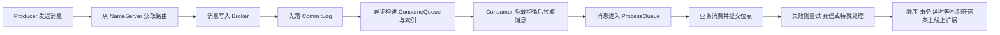

# RocketMQ八股文全局总纲 - 从消息生命周期到存储到消费

RocketMQ 这套知识最适合用一条主线来理解：

> **一条消息是如何从生产者发出，被路由、被存储、被索引、被消费者拉取、被处理，再在异常场景下重试、死信或走特殊机制的。**

如果你先只记一句话，可以记这个：

> **RocketMQ 的本质，是围绕“消息生命周期”设计的一套高吞吐、可扩展、可恢复的消息分发系统。**

所以 RocketMQ 的八股文，最终都在回答下面几个问题：

1. **消息是怎么发出去的**
2. **消息在 Broker 里是怎么存的**
3. **消费者是怎么拿到并处理消息的**
4. **消息失败了会发生什么**
5. **特殊类型的消息为什么能成立**

只要这五个问题串起来，RocketMQ 的知识点就不会散。

## 一、先抓住整条主线

学 RocketMQ 最好的方式，不是先背组件名，而是先顺着这条消息生命周期往下走：



你可以把 RocketMQ 理解成一套围绕“消息流转”展开的系统：

1. Producer 决定把消息发出去。
2. NameServer 负责告诉它消息该去哪里。
3. Broker 负责真正存消息。
4. 存完以后再构建面向消费的逻辑索引。
5. Consumer 通过重平衡分到队列，再拉取消息。
6. 消费失败就进入重试、死信或特殊语义处理。

这条主线一顺，RocketMQ 的大部分机制都会自动落位。

## 二、入门篇：先理解 RocketMQ 到底在解决什么问题

入门阶段最重要的，不是先看 CommitLog 文件格式，而是先回答：

**为什么系统需要消息队列，为什么 RocketMQ 能承担这个角色？**

### 1. RocketMQ 解决的是“系统之间异步解耦与削峰分发”

RocketMQ 本质上不是数据库，也不是缓存，它最擅长的是：

- 异步解耦
- 流量削峰
- 广播与分发
- 业务削峰填谷
- 提高系统弹性

所以 RocketMQ 的定位更接近：

> **把原本直接调用的上下游关系，改造成可缓冲、可重试、可异步推进的消息驱动关系。**

### 2. RocketMQ 的核心对象不是“请求”，而是“消息”

RocketMQ 的世界里，最重要的不是一次 RPC，而是一条消息。

这条消息会经历：

- 生产
- 存储
- 路由
- 拉取
- 消费
- 确认
- 重试

所以学习 RocketMQ 时，不要只盯组件，而要一直盯住：

> **这条消息此刻在哪个阶段，它下一步会去哪里。**

### 3. RocketMQ 为什么能支撑大规模消息流转

从入门视角看，RocketMQ 能成立，核心靠四个点：

1. **路由解耦**
   - NameServer 负责路由发现，不直接参与消息转发。
2. **存储高吞吐**
   - 消息先顺序写入 CommitLog。
3. **消费解耦**
   - Producer 和 Consumer 不直接耦合。
4. **失败补偿**
   - 重试、死信、回查、异常处理把系统拉稳。

这四点正好就是 RocketMQ 后面所有知识的底层支撑。

### 4. 入门阶段你应该先记住什么

- RocketMQ 的主线不是组件关系图，而是消息生命周期。
- NameServer 解决“去哪里”，Broker 解决“怎么存”，Consumer 解决“怎么取和怎么处理”。
- RocketMQ 的高吞吐核心在于顺序写 CommitLog，再异步构建消费索引。
- RocketMQ 的复杂度主要来自消费阶段和异常处理阶段，而不是简单发送本身。

## 三、基础篇：把 RocketMQ 最核心的四条主线打通

基础阶段建议把 RocketMQ 看成四条主线：

1. 整体架构主线
2. 存储主线
3. 消费主线
4. 异常补偿主线

### 1. 整体架构主线：消息系统由谁组成

#### 1.1 NameServer、Broker、Producer、Consumer 各自做什么

RocketMQ 整体架构里最关键的角色有四个：

- **Producer**
  - 生产消息
- **NameServer**
  - 提供 Topic 路由信息
- **Broker**
  - 负责消息存储、转发和管理
- **Consumer**
  - 拉取消息并消费

这四个角色不要平着记，而要按职责记：

- Producer 决定“我要发”
- NameServer 决定“发到哪”
- Broker 决定“怎么落盘和供消费”
- Consumer 决定“怎么拿和怎么处理”

#### 1.2 Topic 和 Queue 是 RocketMQ 的逻辑承载单元

RocketMQ 中一个 Topic 通常会拆成多个 Queue。

这件事很关键，因为它直接影响：

- 并行度
- 负载均衡
- 顺序语义
- 消费扩展能力

所以 Topic 不只是一个分类标签，它下面的 Queue 设计决定了消息如何被并行生产和消费。

#### 1.3 不要混淆 MessageQueue、ProcessQueue、ConsumeQueue

这是 RocketMQ 里非常容易混的三个名字。

- **MessageQueue**
  - 逻辑上的消息队列定义，通常包含 Topic、Broker、queueId
- **ConsumeQueue**
  - Broker 端的逻辑消费索引
- **ProcessQueue**
  - Consumer 端拉取后的内存处理队列

这三个点如果顺起来理解，就会很清楚：

> **Broker 端负责存消息和建索引，Consumer 端负责把拉下来的消息放进本地处理队列。**

### 2. 存储主线：消息在 Broker 里到底怎么存

这是 RocketMQ 最重要的基础能力之一。

#### 2.1 CommitLog 是一切的存储起点

RocketMQ 存储最核心的一句话就是：

> **所有消息先顺序写入 CommitLog。**

这件事的意义非常大，因为顺序写磁盘对吞吐极其友好。

所以 RocketMQ 高吞吐的核心不是魔法，而是非常明确的存储策略：

- 先顺序写一份完整消息
- 再异步派生其他逻辑结构

#### 2.2 ConsumeQueue 不是原始消息，而是逻辑索引

消息真正的完整内容在 CommitLog 里。  
ConsumeQueue 更像一份“消费导航目录”。

它记录的是：

- 指向 CommitLog 的偏移量
- 消息大小
- Tag 相关信息等

所以 ConsumeQueue 的作用不是再存一份完整消息，而是让消费者能更快按队列逻辑定位消息。

#### 2.3 MappedFile 和 DefaultMessageStore 是存储层关键抽象

RocketMQ 存储不是直接“读写普通文件”这么简单。

你在整体结构文章里看到的：

- `MappedFile`
- `MappedFileQueue`
- `DefaultMessageStore`

本质上是在回答：

- 文件如何映射进内存
- 多个文件如何组织成连续存储
- Broker 的核心存储服务如何统一管理写入、分发和索引构建

所以 RocketMQ 存储主线真正想表达的是：

> **RocketMQ 用顺序写 + 文件映射 + 异步分发索引的方式，兼顾吞吐和消费效率。**

### 3. 消费主线：消息是怎么被消费者真正处理掉的

#### 3.1 消费不是 Broker 主动推送，而是消费者侧主导拉取

RocketMQ 的消费理解里一个关键点是：

> **表面上叫 PushConsumer，但底层依然是拉模型。**

这意味着消费者这边会做很多工作：

- 获取路由
- 分配队列
- 拉取消息
- 放入 ProcessQueue
- 提交消费任务

所以消费链路真正复杂的地方，往往在 Consumer 侧。

#### 3.2 Rebalance 决定了“谁消费哪个队列”

只要是集群消费模式，Rebalance 就是绕不开的核心。

它解决的问题是：

- 某个消费组下有多个消费者
- 一个 Topic 下有多个队列
- 到底该怎么把队列分给不同消费者

所以重平衡不是附属功能，而是集群消费能成立的基本条件。

#### 3.3 ProcessQueue 是消费者本地的处理中转层

消息从 Broker 拉下来后，不是立刻就完成消费，而是先进入 ProcessQueue。

它的作用更像：

- 本地缓存
- 处理窗口
- 位点提交前的缓冲区

所以消费主线要记住一个很重要的链条：

> **Broker 端是 CommitLog + ConsumeQueue，Consumer 端是 MessageQueue 分配 + Pull + ProcessQueue + Listener 消费。**

### 4. 异常补偿主线：消息失败以后系统如何自稳

RocketMQ 不是只关注正常路径，它真正有价值的地方，是异常路径也有明确机制。

#### 4.1 消费失败不等于立刻丢消息

在正常场景下，消息消费成功就提交位点。  
但消费失败后，RocketMQ 会根据模式和配置进入：

- 重试
- 延迟重试
- 最终死信

所以 RocketMQ 的可靠性不是“绝不失败”，而是：

> **失败以后有明确的恢复路径。**

#### 4.2 重试和死信是消费系统稳定性的关键保险

你在整体架构与消费流程文章里看到的：

- 重试机制
- 死信队列
- 流控
- 网络异常处理

这些其实都应该挂在同一条线上理解：

> **消费者并不总能稳定处理消息，所以系统必须内建补偿与降级机制。**

#### 4.3 基础阶段你应该形成的整体认知

基础阶段学完，脑子里最好形成这一层结构：

```text
Producer
-> NameServer 获取路由
-> Broker 顺序写 CommitLog
-> 异步构建 ConsumeQueue
-> Consumer Rebalance 分到 MessageQueue
-> PullMessageService 拉消息
-> ProcessQueue 缓冲
-> MessageListener 消费
-> 成功则提交位点 失败则重试/死信
```

这条链一旦顺了，RocketMQ 的核心就立起来了。

## 四、进阶篇：把 RocketMQ 真正讲深的几个主题

基础打牢后，真正拉开差距的，是下面这些进阶机制。

### 1. 顺序消息：为什么既要顺序，又很难顺序

顺序消息的本质不是“消息天然有序”，而是：

> **你希望某一类消息在同一条队列、同一个消费上下文中按顺序被处理。**

这会带来一系列附加问题：

- 消息要正确落到同一队列
- 消费时队列要被正确锁定
- 消费失败会阻塞后续顺序推进

所以顺序消息真正复杂的地方，不在发送，而在：

- 队列锁机制
- 顺序消费失败处理
- 吞吐和顺序语义之间的权衡

### 2. 事务消息：为什么消息发送和本地事务不能简单绑死

事务消息的核心要解决的是：

- 本地事务执行成功了，但消息没成功投递怎么办
- 消息先发出去了，但本地事务失败了怎么办

RocketMQ 的事务消息方案，本质上是用：

- 半消息
- 本地事务执行
- 提交/回滚确认
- Broker 回查

来把分布式场景下的不一致风险收敛住。

所以事务消息不要背成步骤题，而要理解为：

> **RocketMQ 在尝试解决“本地事务状态”和“消息可见性”之间的一致性问题。**

### 3. 延时消息：为什么时间语义需要单独设计

延时消息不是普通消息多加一个时间字段那么简单。  
它真正要解决的是：

- 消息现在先别投递
- 到指定时间点再变成可消费消息

RocketMQ 在延时消息上有两种思路：

- 定时任务方式
- 时间轮方式

这说明：

> **时间语义不是消息系统的天然属性，而是需要额外调度机制去支撑。**

### 4. 时间轮：为什么延时消息最终会走向更高效的调度结构

时间轮相关文章其实是在回答一个更底层的问题：

> **如果延时消息很多，怎么高效管理“未来某个时刻该投递哪些消息”。**

时间轮的价值在于：

- 槽位化时间
- 降低逐条扫描成本
- 支持高效地批量到期投递

所以时间轮不是孤立算法题，而是延时消息这条线在工程层面的优化方案。

### 5. 同组不同 Topic 问题：RocketMQ 的边界理解非常重要

`集群消费模式同组不同Topic问题详细分析-带参数.md` 这篇文章很有价值，因为它提醒你：

> **RocketMQ 的很多语义是以“消费组”为核心建立的，而不是以“你主观理解的订阅关系”建立的。**

它暴露的是：

- 重平衡是按消费组维度看待消费者集合的
- 队列分配不是按你想象中的 Topic 独立小世界运行

所以 RocketMQ 不是只学“机制能做什么”，还要学“机制的边界在哪”。  
这类边界问题，往往最容易在生产上出事故。

### 6. RocketMQ 的全局思想，其实就是“先稳住消息生命周期，再扩展特殊语义”

这是最值得收住的一句话。

RocketMQ 不是先做各种花哨消息类型，而是先把最基础的一条消息主链打稳：

- 路由稳定
- 存储高吞吐
- 消费可恢复
- 异常可补偿

然后再在这条稳定主链上扩展：

- 顺序
- 事务
- 延时

所以 RocketMQ 的全局思想可以压缩成：

> **先把普通消息生命周期打通，再在这条主链上叠加特殊语义。**

## 五、把当前 rocketmq 目录里的知识点挂到这条主线上

你可以把当前目录里的文章这样放回整条主线：

### 1. 起点：RocketMQ 到底由什么组成

- `RocketMQ整体结构详解.md`
- `RocketMQ整体架构与消费流程详解.md`

它们回答的是：

- NameServer、Broker、Producer、Consumer 的角色分工
- CommitLog、ConsumeQueue、ProcessQueue 的关系
- 一条普通消息的完整消费生命周期

### 2. 主干：消息在 Broker 和 Consumer 两侧如何流转

- `RocketMQ整体结构详解.md`

它重点回答的是：

- CommitLog 怎么存
- ConsumeQueue 怎么建
- MappedFile 和 DefaultMessageStore 怎么组织
- ProcessQueue 在消费端做什么

### 3. 正常链路扩展：特殊消息如何建立特殊语义

- `RocketMQ顺序消息与消费流程详解.md`
- `RocketMQ事务消息与消费流程详解.md`
- `RocketMQ延时消息与消费流程详解.md`
- `RocketMQ时间轮实现详解.md`

它们回答的是：

- 顺序消息如何保证队列级顺序
- 事务消息如何协调本地事务与消息投递
- 延时消息如何延后可见
- 时间轮如何更高效支撑大规模延时调度

### 4. 边界与异常：为什么生产问题常常出在重平衡和配置假设上

- `集群消费模式同组不同Topic问题详细分析-带参数.md`

它回答的是：

- 消费组维度的重平衡边界在哪里
- 为什么错误使用同组不同 Topic 会导致问题

## 六、建议你的学习顺序

如果你是把这个目录当成完整复习路线，我建议按下面顺序看。

### 第一阶段：入门认知

先看：

- `RocketMQ整体架构与消费流程详解.md`
- `RocketMQ整体结构详解.md`

目标：

- 先把普通消息的生命周期打通
- 先把 NameServer、Broker、CommitLog、ConsumeQueue、ProcessQueue 的位置搞清楚

### 第二阶段：基础打通

再重点看：

- `RocketMQ整体结构详解.md`
- `RocketMQ整体架构与消费流程详解.md`

目标：

- 把“路由 -> 存储 -> 索引 -> 拉取 -> ProcessQueue -> 消费 -> 重试/死信”这条线彻底打通

### 第三阶段：特殊消息机制

接着看：

- `RocketMQ顺序消息与消费流程详解.md`
- `RocketMQ事务消息与消费流程详解.md`
- `RocketMQ延时消息与消费流程详解.md`
- `RocketMQ时间轮实现详解.md`

目标：

- 理解顺序、事务、延时都不是独立产品，而是在普通消息主链上的特殊扩展

### 第四阶段：边界与踩坑

最后看：

- `集群消费模式同组不同Topic问题详细分析-带参数.md`

目标：

- 理解消费组、重平衡和 Topic 订阅边界
- 建立 RocketMQ 生产问题的风险意识

## 七、最后压缩成一张分层图

如果你最后想把 RocketMQ 压缩成最简版，可以记下面这张分层图：

```text
入门层：
先知道 RocketMQ 的核心是让消息从生产到消费形成稳定生命周期

基础层：
先理解 NameServer 路由、Broker 存储、CommitLog/ConsumeQueue、Consumer 拉取与 ProcessQueue

进阶层：
再理解顺序消息、事务消息、延时消息、时间轮和消费组重平衡边界

全局主线：
生产 -> 路由 -> 存储 -> 索引 -> 拉取 -> 消费 -> 重试补偿 -> 特殊语义扩展
```

最后只记一句话：

> **学 RocketMQ，不要按零散机制背，而要沿着“消息生命周期”这条主线，把普通消息主链先打通，再把顺序、事务、延时这些特性挂上去。**
