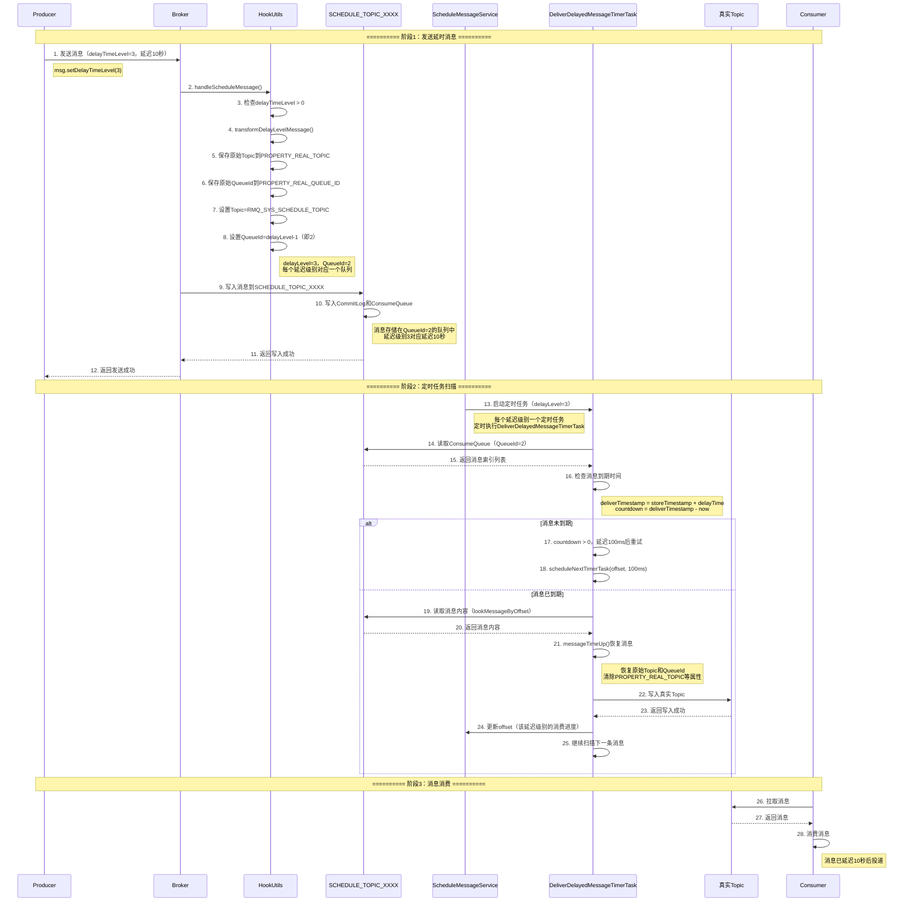
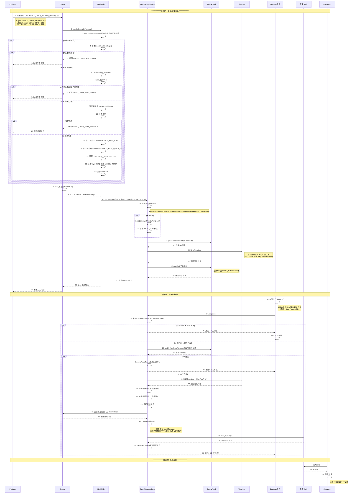

# RocketMQ延时消息与消费流程详解

  

## 一、延时消息整体架构

  

```

┌─────────────────────────────────────────────────────────────────────────────────────┐

│ RocketMQ延时消息架构 │

└─────────────────────────────────────────────────────────────────────────────────────┘

  

┌─────────────────────────────────────────────────────────────────────────────────────┐

│ Producer端 │

│ ┌──────────────────────────────────────────────────────────────────────────────┐ │

│ │ DefaultMQProducer │ │

│ │ ┌────────────────────────────────────────────────────────────────────────┐ │ │

│ │ │ 延时消息发送 │ │ │

│ │ │ - 方式1：delayTimeLevel（定时任务方式） │ │ │

│ │ │ - 方式2：PROPERTY_TIMER_DELIVER_MS（时间轮方式） │ │ │

│ │ └────────────────────────────────────────────────────────────────────────┘ │ │

│ └──────────────────────────────────────────────────────────────────────────────┘ │

└─────────────────────────────────────────────────────────────────────────────────────┘

│

│ 发送延时消息

▼

┌─────────────────────────────────────────────────────────────────────────────────────┐

│ Broker端 │

│ ┌──────────────────────────────────────────────────────────────────────────────┐ │

│ │ 方式1：定时任务方式（ScheduleMessageService） │ │

│ │ ┌────────────────────────────────────────────────────────────────────────┐ │ │

│ │ │ SCHEDULE_TOPIC_XXXX │ │ │

│ │ │ - QueueId = delayTimeLevel - 1 │ │ │

│ │ │ - 18个固定延迟级别 │ │ │

│ │ │ - 定时任务扫描队列 │ │ │

│ │ └────────────────────────────────────────────────────────────────────────┘ │ │

│ │ │ │

│ │ ┌────────────────────────────────────────────────────────────────────────┐ │ │

│ │ │ DeliverDelayedMessageTimerTask │ │ │

│ │ │ - 每个延迟级别一个定时任务 │ │ │

│ │ │ - 扫描ConsumeQueue检查消息到期时间 │ │ │

│ │ │ - 到期后写入真实Topic │ │ │

│ │ └────────────────────────────────────────────────────────────────────────┘ │ │

│ └──────────────────────────────────────────────────────────────────────────────┘ │

│ │

│ ┌──────────────────────────────────────────────────────────────────────────────┐ │

│ │ 方式2：时间轮方式（TimerMessageStore） │ │

│ │ ┌────────────────────────────────────────────────────────────────────────┐ │ │

│ │ │ TimerWheel（时间轮） │ │ │

│ │ │ - 固定槽位数：7天 * 86400秒 │ │ │

│ │ │ - 精度可配置（timerPrecisionMs） │ │ │

│ │ │ - 支持任意精确延时时间 │ │ │

│ │ └────────────────────────────────────────────────────────────────────────┘ │ │

│ │ │ │

│ │ ┌────────────────────────────────────────────────────────────────────────┐ │ │

│ │ │ TimerLog │ │ │

│ │ │ - 记录消息在时间轮中的位置 │ │ │

│ │ │ - 存储消息的物理偏移量 │ │ │

│ │ └────────────────────────────────────────────────────────────────────────┘ │ │

│ │ │ │

│ │ ┌────────────────────────────────────────────────────────────────────────┐ │ │

│ │ │ Dequeue服务 │ │ │

│ │ │ - 定时从时间轮中取出到期消息 │ │ │

│ │ │ - 写入真实Topic │ │ │

│ │ └────────────────────────────────────────────────────────────────────────┘ │ │

│ └──────────────────────────────────────────────────────────────────────────────┘ │

└─────────────────────────────────────────────────────────────────────────────────────┘

│

│ 消息到期后写入真实Topic

▼

┌─────────────────────────────────────────────────────────────────────────────────────┐

│ 真实Topic │

│ ┌──────────────────────────────────────────────────────────────────────────────┐ │

│ │ OrderTopic / UserTopic等 │ │

│ │ - 恢复原始Topic和QueueId │ │

│ │ - 消费者可以正常消费 │ │

│ └──────────────────────────────────────────────────────────────────────────────┘ │

└─────────────────────────────────────────────────────────────────────────────────────┘

```

  

## 二、方式1：定时任务方式完整流程时序图（正常场景）

  



  

## 三、方式1：定时任务方式完整流程时序图（包含异常场景）

```mermaid

sequenceDiagram

participant Producer as Producer

participant Broker as Broker

participant HookUtils as HookUtils

participant ScheduleTopic as SCHEDULE_TOPIC_XXXX

participant ScheduleService as ScheduleMessageService

participant TimerTask as DeliverDelayedMessageTimerTask

participant RealTopic as 真实Topic

participant Consumer as Consumer

  

Note over Producer,Consumer: ========== 阶段1：发送延时消息 ==========

Producer->>Broker: 1. 发送消息（delayTimeLevel=3，延迟10秒）

alt Broker连接失败

Broker-->>Producer: 连接失败/超时

Producer->>Producer: 2. 重试发送（最多3次）

Producer->>Broker: 3. 重试发送消息

else Broker正常

Broker->>HookUtils: 2. handleScheduleMessage()

alt delayTimeLevel > maxDelayLevel

HookUtils->>HookUtils: 3. 调整delayTimeLevel = maxDelayLevel

Note right of HookUtils: 超过最大延迟级别时<br/>自动调整为最大级别

end

HookUtils->>HookUtils: 4. transformDelayLevelMessage()

alt 转换失败

HookUtils-->>Broker: 5. 返回转换失败

Broker-->>Producer: 6. 返回发送失败

else 转换成功

HookUtils->>HookUtils: 5. 保存原始Topic和QueueId

HookUtils->>HookUtils: 6. 设置Topic=RMQ_SYS_SCHEDULE_TOPIC

HookUtils->>HookUtils: 7. 设置QueueId=delayLevel-1

Broker->>ScheduleTopic: 8. 写入消息到SCHEDULE_TOPIC_XXXX

alt CommitLog写入失败

ScheduleTopic-->>Broker: 写入失败（磁盘满/IO异常）

Broker-->>Producer: 9. 返回发送失败

Producer->>Producer: 10. 记录失败，可重试

else CommitLog写入成功

ScheduleTopic-->>Broker: 9. 返回写入成功

Broker-->>Producer: 10. 返回发送成功

end

end

end

Note over Producer,Consumer: ========== 阶段2：定时任务扫描 ==========

ScheduleService->>TimerTask: 11. 启动定时任务（delayLevel=3）

Note right of ScheduleService: 每个延迟级别一个定时任务<br/>首次延迟1秒后执行

TimerTask->>ScheduleTopic: 12. 读取ConsumeQueue（QueueId=2）

alt ConsumeQueue读取失败

ScheduleTopic-->>TimerTask: 读取失败

TimerTask->>TimerTask: 13. 延迟100ms后重试

TimerTask->>TimerTask: 14. scheduleNextTimerTask(offset, 100ms)

else ConsumeQueue读取成功

ScheduleTopic-->>TimerTask: 13. 返回消息索引列表

TimerTask->>TimerTask: 14. 遍历消息索引

alt offset无效

TimerTask->>TimerTask: 15. 重置offset到最小或最大offset

TimerTask->>TimerTask: 16. 延迟100ms后重试

else offset有效

TimerTask->>TimerTask: 15. 检查消息到期时间

Note right of TimerTask: deliverTimestamp = storeTimestamp + delayTime<br/>countdown = deliverTimestamp - now

alt 消息未到期

TimerTask->>TimerTask: 16. countdown > 0

TimerTask->>TimerTask: 17. 延迟100ms后重试

TimerTask->>TimerTask: 18. scheduleNextTimerTask(currOffset, 100ms)

TimerTask->>ScheduleService: 19. 更新offset

else 消息已到期

TimerTask->>ScheduleTopic: 20. 读取消息内容（lookMessageByOffset）

alt 消息读取失败

ScheduleTopic-->>TimerTask: 读取失败

TimerTask->>TimerTask: 21. 跳过该消息，继续下一条

else 消息读取成功

ScheduleTopic-->>TimerTask: 21. 返回消息内容

TimerTask->>TimerTask: 22. messageTimeUp()恢复消息

alt 真实Topic为事务半消息Topic

TimerTask->>TimerTask: 23. 检测到RMQ_SYS_TRANS_HALF_TOPIC

TimerTask->>TimerTask: 24. 丢弃消息，记录错误日志

TimerTask->>TimerTask: 25. 继续下一条消息

else 正常消息

TimerTask->>TimerTask: 23. 恢复原始Topic和QueueId

TimerTask->>TimerTask: 24. 清除PROPERTY_REAL_TOPIC等属性

TimerTask->>RealTopic: 25. 写入真实Topic

alt 同步投递

RealTopic->>RealTopic: 26. 同步写入CommitLog

alt 写入失败

RealTopic-->>TimerTask: 27. 写入失败

TimerTask->>TimerTask: 28. 延迟100ms后重试

TimerTask->>TimerTask: 29. scheduleNextTimerTask(currOffset, 100ms)

else 写入成功

RealTopic-->>TimerTask: 27. 返回写入成功

TimerTask->>ScheduleService: 28. 更新offset

TimerTask->>TimerTask: 29. 继续扫描下一条消息

end

else 异步投递

TimerTask->>TimerTask: 26. 提交异步投递任务

TimerTask->>TimerTask: 27. 检查流控

alt 流控触发

TimerTask->>TimerTask: 28. 流控，延迟投递

Note right of TimerTask: 异步投递队列满<br/>或第一个任务被阻塞

else 正常投递

TimerTask->>RealTopic: 28. 异步写入CommitLog

RealTopic-->>TimerTask: 29. 返回Future

TimerTask->>TimerTask: 30. 添加到deliverPendingTable

TimerTask->>TimerTask: 31. 继续扫描下一条消息

end

end

end

end

end

end

end

Note over Producer,Consumer: ========== 阶段3：异步投递结果处理 ==========

alt 异步投递模式

TimerTask->>TimerTask: 32. HandlePutResultTask处理投递结果

TimerTask->>RealTopic: 33. 检查Future结果

alt 投递成功

RealTopic-->>TimerTask: 34. 返回PUT_OK

TimerTask->>ScheduleService: 35. 更新offset

else 投递失败

RealTopic-->>TimerTask: 34. 返回PUT_FAILED

TimerTask->>TimerTask: 35. 检查是否需要重试

alt 需要重试

TimerTask->>TimerTask: 36. 重新投递消息

TimerTask->>RealTopic: 37. 再次写入真实Topic

else 不需要重试

TimerTask->>TimerTask: 36. 记录错误日志

end

end

end

Note over Producer,Consumer: ========== 阶段4：消息消费 ==========

Consumer->>RealTopic: 38. 拉取消息

alt Broker连接失败

RealTopic-->>Consumer: 连接失败/超时

Consumer->>Consumer: 39. 延迟后重试拉取（3000ms）

else Broker正常

RealTopic->>RealTopic: 39. 读取消息

RealTopic-->>Consumer: 40. 返回消息

Consumer->>Consumer: 41. 消费消息

Note right of Consumer: 消息已延迟10秒后投递

end

```

  



  

## 四、方式2：时间轮方式完整流程时序图（正常场景）

  



  

## 五、方式2：时间轮方式完整流程时序图（包含异常场景）

```mermaid

sequenceDiagram

participant Producer as Producer

participant Broker as Broker

participant HookUtils as HookUtils

participant TimerStore as TimerMessageStore

participant TimerWheel as TimerWheel

participant TimerLog as TimerLog

participant DequeueService as Dequeue服务

participant RealTopic as 真实Topic

participant Consumer as Consumer

  

Note over Producer,Consumer: ========== 阶段1：发送延时消息 ==========

Producer->>Broker: 1. 发送消息（PROPERTY_TIMER_DELIVER_MS=10秒后）

alt Broker连接失败

Broker-->>Producer: 连接失败/超时

Producer->>Producer: 2. 重试发送（最多3次）

else Broker正常

Broker->>HookUtils: 2. handleScheduleMessage()

HookUtils->>HookUtils: 3. checkIfTimerMessage()

alt 不是时间轮消息

HookUtils->>HookUtils: 4. 检查delayTimeLevel

Note right of HookUtils: 如果delayTimeLevel > 0<br/>使用定时任务方式

else 是时间轮消息

HookUtils->>HookUtils: 4. 检查timerWheelEnable配置

alt 时间轮未启用

HookUtils-->>Broker: 5. 返回WHEEL_TIMER_NOT_ENABLE

Broker-->>Producer: 6. 返回发送失败

else 时间轮已启用

HookUtils->>HookUtils: 5. transformTimerMessage()

HookUtils->>HookUtils: 6. 解析延时时间

alt 延时时间解析失败

HookUtils-->>Broker: 7. 返回WHEEL_TIMER_MSG_ILLEGAL

Broker-->>Producer: 8. 返回发送失败

else 延时时间解析成功

HookUtils->>HookUtils: 7. 检查延时时间是否超过最大限制

alt 超过最大限制

HookUtils-->>Broker: 8. 返回WHEEL_TIMER_MSG_ILLEGAL

Broker-->>Producer: 9. 返回发送失败

else 延时时间合法

HookUtils->>HookUtils: 8. 对齐到精度（timerPrecisionMs）

HookUtils->>TimerStore: 9. isReject(deliverMs)检查流控

alt 流控触发

TimerStore-->>HookUtils: 10. 返回true（流控）

HookUtils-->>Broker: 11. 返回WHEEL_TIMER_FLOW_CONTROL

Broker-->>Producer: 12. 返回发送失败

else 正常处理

HookUtils->>HookUtils: 10. 保存原始Topic和QueueId

HookUtils->>HookUtils: 11. 设置PROPERTY_TIMER_OUT_MS

HookUtils->>HookUtils: 12. 设置Topic=RMQ_SYS_WHEEL_TIMER

end

end

end

end

end

end

Broker->>Broker: 13. 写入消息到CommitLog

alt CommitLog写入失败

Broker-->>HookUtils: 写入失败（磁盘满/IO异常）

HookUtils-->>Broker: 14. 返回写入失败

Broker-->>Producer: 15. 返回发送失败

else CommitLog写入成功

Broker-->>HookUtils: 14. 返回写入成功（offsetPy, sizePy）

HookUtils->>TimerStore: 15. doEnqueue(offsetPy, sizePy, delayedTime, messageExt)

TimerStore->>TimerStore: 16. 检查是否需要Roll

alt 需要Roll

TimerStore->>TimerStore: 17. 调整delayedTime到Roll窗口内

TimerStore->>TimerStore: 18. 设置MAGIC_ROLL标志

end

TimerStore->>TimerWheel: 19. getSlot(delayedTime)获取时间槽

alt Slot获取失败

TimerWheel-->>TimerStore: 获取失败

TimerStore-->>HookUtils: 20. 返回enqueue失败

HookUtils-->>Broker: 21. 返回处理失败

else Slot获取成功

TimerWheel-->>TimerStore: 20. 返回Slot对象

TimerStore->>TimerLog: 21. 写入TimerLog

alt TimerLog写入失败

TimerLog-->>TimerStore: 写入失败

TimerStore-->>HookUtils: 22. 返回enqueue失败

else TimerLog写入成功

TimerLog-->>TimerStore: 22. 返回写入位置

TimerStore->>TimerWheel: 23. putSlot()更新Slot

alt Slot更新失败

TimerWheel-->>TimerStore: 更新失败

TimerStore-->>HookUtils: 24. 返回enqueue失败

else Slot更新成功

TimerWheel-->>TimerStore: 24. 返回更新成功

TimerStore-->>HookUtils: 25. 返回enqueue成功

HookUtils-->>Broker: 26. 返回处理成功

Broker-->>Producer: 27. 返回发送成功

end

end

end

end

Note over Producer,Consumer: ========== 阶段2：时间轮扫描 ==========

DequeueService->>DequeueService: 28. 定时执行dequeue()

Note right of DequeueService: 定时从时间轮中取出到期消息<br/>精度：timerPrecisionMs

DequeueService->>TimerStore: 29. dequeue()

TimerStore->>TimerStore: 30. 检查状态

alt timerStopDequeue=true

TimerStore-->>DequeueService: 31. 返回-1（停止扫描）

else !isRunningDequeue()

TimerStore-->>DequeueService: 32. 返回-1（未运行）

else currReadTimeMs >= currWriteTimeMs

TimerStore-->>DequeueService: 33. 返回-1（无消息）

else 正常扫描

TimerStore->>TimerWheel: 34. getSlot(currReadTimeMs)获取当前时间槽

alt Slot获取失败

TimerWheel-->>TimerStore: 获取失败

TimerStore->>TimerStore: 35. moveReadTime()移动读取时间

TimerStore-->>DequeueService: 36. 返回0（无消息）

else Slot获取成功

TimerWheel-->>TimerStore: 35. 返回Slot对象

alt Slot为空（timeMs=-1）

TimerStore->>TimerStore: 36. moveReadTime()移动读取时间

TimerStore-->>DequeueService: 37. 返回0（无消息）

else Slot有消息

TimerStore->>TimerLog: 38. 读取TimerLog（从lastPos开始）

alt TimerLog读取失败

TimerLog-->>TimerStore: 读取失败

TimerStore->>TimerStore: 39. 记录错误，移动读取时间

TimerStore-->>DequeueService: 40. 返回-1（错误）

else TimerLog读取成功

TimerLog-->>TimerStore: 39. 返回消息列表

TimerStore->>TimerStore: 40. 分离删除消息和普通消息

TimerStore->>Broker: 41. 读取消息内容（从CommitLog）

alt CommitLog读取失败

Broker-->>TimerStore: 读取失败

TimerStore->>TimerStore: 42. 记录错误，跳过该消息

TimerStore->>TimerStore: 43. 继续处理下一条消息

else CommitLog读取成功

Broker-->>TimerStore: 42. 返回消息内容

TimerStore->>TimerStore: 43. convert()转换消息

alt 转换失败

TimerStore->>TimerStore: 44. 记录错误，跳过该消息

else 转换成功

TimerStore->>RealTopic: 45. 写入真实Topic

alt 写入失败

RealTopic-->>TimerStore: 46. 写入失败

TimerStore->>TimerStore: 47. 检查重试次数

alt 重试次数未超限

TimerStore->>RealTopic: 48. 重试写入

else 重试次数超限

TimerStore->>TimerStore: 49. 记录错误日志

end

else 写入成功

RealTopic-->>TimerStore: 46. 返回写入成功

TimerStore->>TimerStore: 47. moveReadTime()移动读取时间

TimerStore-->>DequeueService: 48. 返回1（处理成功）

end

end

end

end

end

end

end

Note over Producer,Consumer: ========== 阶段3：消息消费 ==========

Consumer->>RealTopic: 49. 拉取消息

alt Broker连接失败

RealTopic-->>Consumer: 连接失败/超时

Consumer->>Consumer: 50. 延迟后重试拉取（3000ms）

else Broker正常

RealTopic->>RealTopic: 50. 读取消息

RealTopic-->>Consumer: 51. 返回消息

Consumer->>Consumer: 52. 消费消息

Note right of Consumer: 消息已延迟10秒后投递

end

```

  



  

## 六、两种方式对比

  

| 特性 | 定时任务方式 | 时间轮方式 |

|-----|------------|-----------|

| **实现类** | ScheduleMessageService | TimerMessageStore |

| **存储Topic** | SCHEDULE_TOPIC_XXXX | RMQ_SYS_WHEEL_TIMER |

| **延迟级别** | 18个固定级别（1s-2h） | 任意精确时间 |

| **精度** | 固定（按级别） | 可配置（timerPrecisionMs） |

| **队列分配** | QueueId = delayLevel - 1 | 所有消息QueueId=0 |

| **扫描方式** | 定时任务扫描ConsumeQueue | 时间轮扫描Slot |

| **性能** | 中等 | 较高 |

| **适用场景** | 固定延迟级别场景 | 精确延迟时间场景 |

| **配置** | messageDelayLevel | timerWheelEnable, timerPrecisionMs |

  

## 七、关键配置参数

  

### 7.1 定时任务方式配置

  

| 配置项 | 默认值 | 说明 |

|-------|--------|------|

| `messageDelayLevel` | "1s 5s 10s 30s 1m 2m 3m 4m 5m 6m 7m 8m 9m 10m 20m 30m 1h 2h" | 延迟级别配置 |

| `enableScheduleAsyncDeliver` | false | 是否启用异步投递 |

| `scheduleAsyncDeliverMaxPendingLimit` | 10000 | 异步投递最大待处理数 |

| `flushDelayOffsetInterval` | 10000ms | 延迟offset刷新间隔 |

  

### 7.2 时间轮方式配置

  

| 配置项 | 默认值 | 说明 |

|-------|--------|------|

| `timerWheelEnable` | false | 是否启用时间轮 |

| `timerPrecisionMs` | 1000ms | 时间轮精度 |

| `timerMaxDelaySec` | 2592000（30天） | 最大延迟时间 |

| `timerRollWindowSlots` | 60 | Roll窗口槽位数 |

| `timerStopDequeue` | false | 是否停止出队 |

| `timerWarmEnable` | false | 是否启用预热 |

  

## 八、异常场景详细处理

  

### 8.1 定时任务方式异常

  

**异常场景：**

1. **消息写入失败**：CommitLog写入失败，返回发送失败，Producer可重试

2. **ConsumeQueue读取失败**：延迟100ms后重试扫描

3. **消息到期时间计算错误**：使用correctDeliverTimestamp()校正

4. **真实Topic写入失败**：延迟100ms后重试投递

5. **异步投递流控**：检查deliverPendingTable大小，超过限制时延迟投递

  

### 8.2 时间轮方式异常

  

**异常场景：**

1. **时间轮未启用**：返回WHEEL_TIMER_NOT_ENABLE错误

2. **延时时间超过最大限制**：返回WHEEL_TIMER_MSG_ILLEGAL错误

3. **流控触发**：返回WHEEL_TIMER_FLOW_CONTROL错误

4. **TimerLog写入失败**：返回enqueue失败

5. **Slot更新失败**：返回enqueue失败

6. **CommitLog读取失败**：跳过该消息，继续处理下一条

7. **真实Topic写入失败**：重试写入，超过重试次数后记录错误

  

## 九、最佳实践

  

### 9.1 使用建议

  

1. **选择合适的方式**：

- 固定延迟级别场景：使用定时任务方式

- 精确延迟时间场景：使用时间轮方式

  

2. **合理设置延迟时间**：

- 定时任务方式：使用预定义的延迟级别

- 时间轮方式：注意最大延迟时间限制

  

3. **监控告警**：

- 监控消息投递延迟

- 监控投递失败率

- 监控时间轮Slot使用情况

  

### 9.2 性能优化建议

  

1. **定时任务方式**：

- 启用异步投递提高性能

- 合理设置异步投递队列大小

  

2. **时间轮方式**：

- 合理设置时间轮精度

- 监控时间轮Slot分布

  

## 十、总结

  

### 10.1 两种方式核心机制

  

1. **定时任务方式**：

- 使用SCHEDULE_TOPIC_XXXX存储延时消息

- 每个延迟级别对应一个队列

- 定时任务扫描ConsumeQueue检查消息到期时间

  

2. **时间轮方式**：

- 使用TimerWheel存储延时消息

- 支持任意精确的延时时间

- 通过TimerLog记录消息在时间轮中的位置

  

### 10.2 异常处理策略

  

1. **写入异常**：返回错误，Producer可重试

2. **扫描异常**：延迟重试，保证消息不丢失

3. **投递异常**：重试投递，超过重试次数后记录错误

  

### 10.3 关键要点

  

1. **选择合适的实现方式**：根据业务需求选择定时任务或时间轮

2. **合理设置延迟时间**：注意最大延迟时间限制

3. **监控告警**：及时处理投递失败和延迟异常