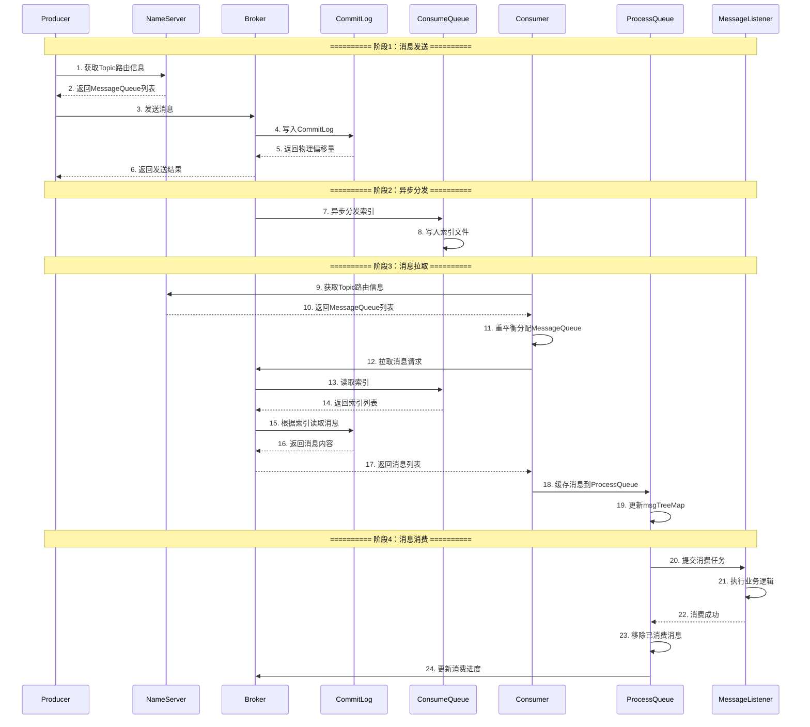
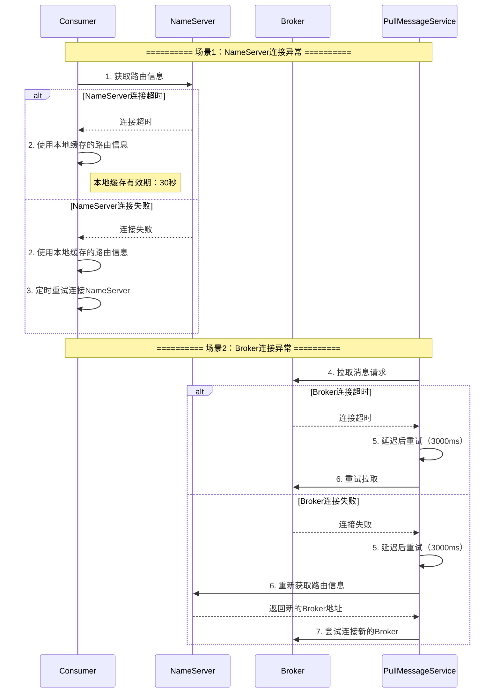
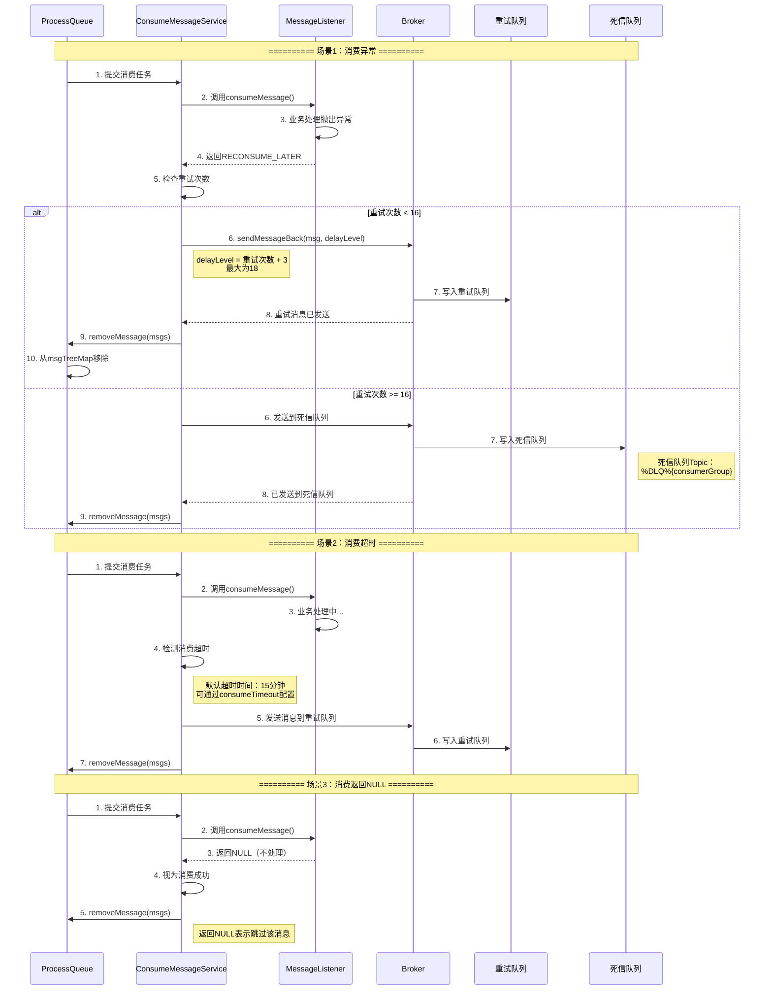
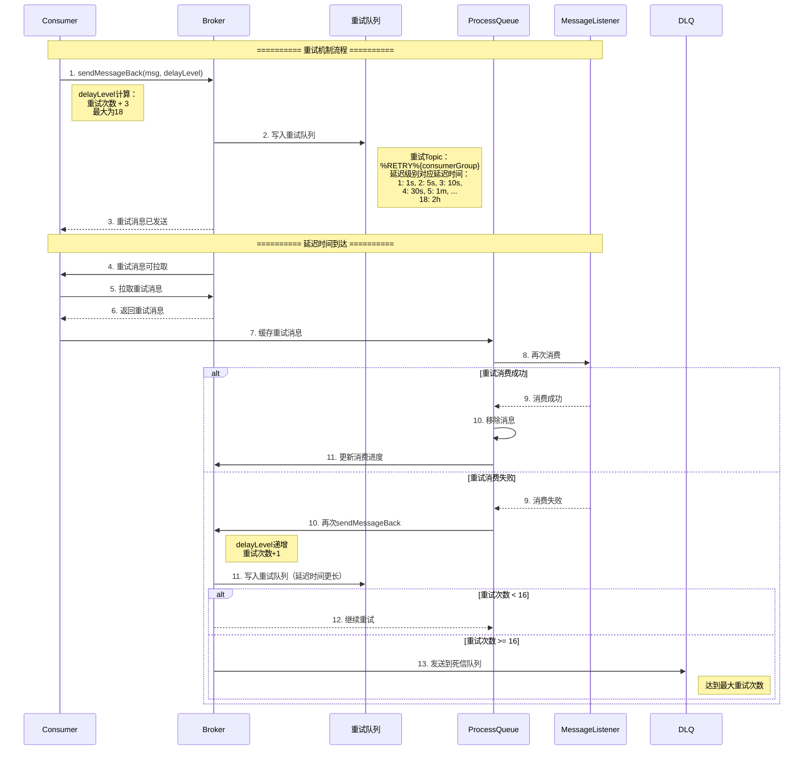
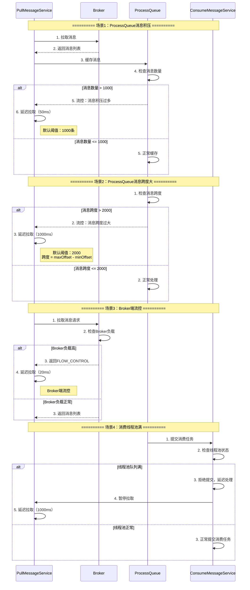
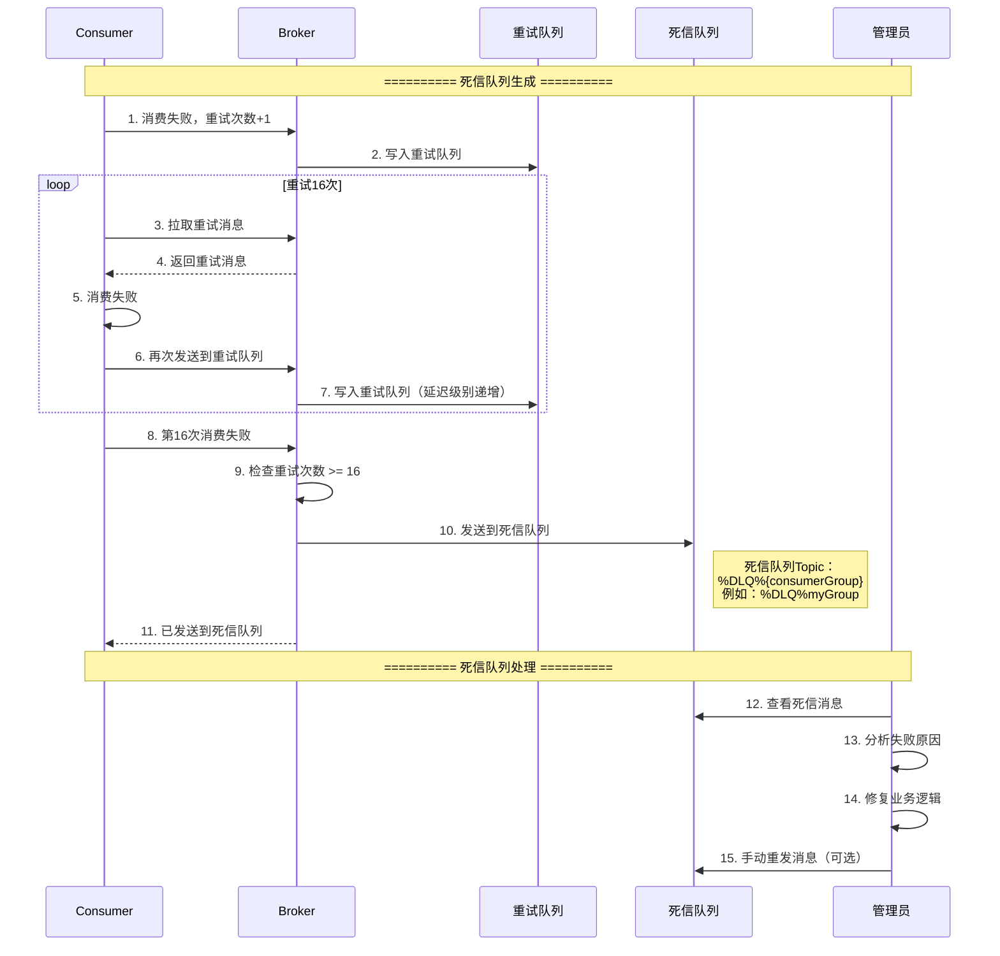

# RocketMQ整体架构与消费流程详解

## 一、RocketMQ整体架构图

```
┌─────────────────────────────────────────────────────────────────────────────────────┐
│                        RocketMQ整体架构图                                            │
└─────────────────────────────────────────────────────────────────────────────────────┘

┌─────────────────────────────────────────────────────────────────────────────────────┐
│                                    NameServer集群                                    │
│  ┌──────────────┐  ┌──────────────┐  ┌──────────────┐                            │
│  │  NameServer1  │  │  NameServer2  │  │  NameServer3  │                            │
│  │  (路由注册中心) │  │  (路由注册中心) │  │  (路由注册中心) │                            │
│  └──────────────┘  └──────────────┘  └──────────────┘                            │
│         │                  │                  │                                      │
│         └──────────────────┼──────────────────┘                                      │
│                            │                                                         │
│         ┌──────────────────┼──────────────────┐                                      │
│         │                  │                  │                                      │
│   注册路由│             注册路由│             注册路由│                                      │
│         │                  │                  │                                      │
└─────────┼──────────────────┼──────────────────┼─────────────────────────────────────┘
          │                  │                  │
          │ 获取路由         │ 获取路由         │ 获取路由
          │                  │                  │
    ┌─────┴─────┐      ┌─────┴─────┐      ┌─────┴─────┐
    │           │      │           │      │           │
┌───┴───┐   ┌───┴───┐ ┌───┴───┐ ┌───┴───┐ ┌───┴───┐ ┌───┴───┐
│Producer│   │Consumer│ │Broker │ │Broker │ │Consumer│ │Consumer│
│集群    │   │集群    │ │Master │ │Slave  │ │实例1   │ │实例2   │
└───┬───┘   └───┬───┘ └───┬───┘ └───┬───┘ └───┬───┘ └───┬───┘
    │           │         │         │         │         │
    │ 发送消息   │         │         │         │ 拉取消息 │
    └───────────┼─────────┼─────────┼─────────┼─────────┘
                │         │         │         │
                └─────────┴─────────┴─────────┘
                         │         │
                         │ 主从同步│
                         └─────────┘

┌─────────────────────────────────────────────────────────────────────────────────────┐
│                              Broker内部结构                                         │
│  ┌──────────────────────────────────────────────────────────────────────────────┐  │
│  │  DefaultMessageStore                                                         │  │
│  │  ┌──────────────────────┐  ┌──────────────────────┐                         │  │
│  │  │  CommitLog          │  │  ConsumeQueueStore   │                         │  │
│  │  │  (物理存储)          │  │  ┌────────────────┐ │                         │  │
│  │  │  ┌────────────────┐ │  │  │ ConsumeQueue   │ │                         │  │
│  │  │  │ MappedFileQueue│ │  │  │ (逻辑索引)      │ │                         │  │
│  │  │  │ - 所有Topic顺序 │ │  │  │ - 20字节/条    │ │                         │  │
│  │  │  │  写入           │ │  │  │ - 指向CommitLog│ │                         │  │
│  │  │  └────────────────┘ │  │  └────────────────┘ │                         │  │
│  │  └──────────────────────┘  └──────────────────────┘                         │  │
│  │                                                                               │  │
│  │  ┌──────────────────────┐  ┌──────────────────────┐                         │  │
│  │  │  ReputMessageService │  │  IndexService        │                         │  │
│  │  │  (异步分发)          │  │  (索引服务)          │                         │  │
│  │  └──────────────────────┘  └──────────────────────┘                         │  │
│  └──────────────────────────────────────────────────────────────────────────────┘  │
└─────────────────────────────────────────────────────────────────────────────────────┘

┌─────────────────────────────────────────────────────────────────────────────────────┐
│                            Consumer内部结构                                         │
│  ┌──────────────────────────────────────────────────────────────────────────────┐  │
│  │  DefaultMQPushConsumer                                                      │  │
│  │  ┌──────────────────────┐  ┌──────────────────────┐                       │  │
│  │  │  RebalanceImpl       │  │  PullMessageService  │                       │  │
│  │  │  - 负载均衡           │  │  - 拉取消息服务       │                       │  │
│  │  │  - 分配MessageQueue  │  │  - 定时拉取          │                       │  │
│  │  └──────────────────────┘  └──────────────────────┘                       │  │
│  │                                                                             │  │
│  │  ┌──────────────────────┐  ┌──────────────────────┐                       │  │
│  │  │  ProcessQueue        │  │  ConsumeMessageService│                       │  │
│  │  │  - 消息缓存          │  │  - 消费服务           │                       │  │
│  │  │  - TreeMap存储       │  │  - 提交消费任务       │                       │  │
│  │  └──────────────────────┘  └──────────────────────┘                       │  │
│  │                                                                             │  │
│  │  ┌──────────────────────┐  ┌──────────────────────┐                       │  │
│  │  │  MessageListener     │  │  OffsetStore         │                       │  │
│  │  │  - 用户业务逻辑       │  │  - 消费进度管理       │                       │  │
│  │  └──────────────────────┘  └──────────────────────┘                       │  │
│  └──────────────────────────────────────────────────────────────────────────────┘  │
└─────────────────────────────────────────────────────────────────────────────────────┘
```

## 二、消息消费完整流程时序图（正常场景）



## 三、消息消费完整流程时序图（包含异常场景）

```mermaid
sequenceDiagram
    participant Producer as Producer
    participant NameServer as NameServer
    participant Broker as Broker
    participant CommitLog as CommitLog
    participant ConsumeQueue as ConsumeQueue
    participant Consumer as Consumer
    participant PullService as PullMessageService
    participant ProcessQueue as ProcessQueue
    participant ConsumeService as ConsumeMessageService
    participant Listener as MessageListener
    participant RetryQueue as 重试队列
    participant DLQ as 死信队列

    Note over Producer,DLQ: ========== 消息发送阶段 ==========
    
    Producer->>NameServer: 1. 获取Topic路由信息
    alt NameServer不可用
        NameServer-->>Producer: 连接失败
        Producer->>Producer: 使用本地缓存路由信息
    else NameServer正常
        NameServer-->>Producer: 返回MessageQueue列表
    end
    
    Producer->>Broker: 2. 发送消息
    alt Broker不可用
        Broker-->>Producer: 连接失败/超时
        Producer->>Producer: 选择其他Broker重试
        Producer->>Broker: 重试发送消息
    else Broker正常
        Broker->>CommitLog: 3. 写入CommitLog
        alt CommitLog写入失败
            CommitLog-->>Broker: 写入失败（磁盘满/IO异常）
            Broker-->>Producer: 返回发送失败
            Producer->>Producer: 记录失败，可重试
        else CommitLog写入成功
            CommitLog-->>Broker: 返回物理偏移量
            Broker-->>Producer: 返回发送成功
        end
    end
    
    Note over Producer,DLQ: ========== 异步分发阶段 ==========
    
    Broker->>ConsumeQueue: 4. 异步分发索引
    alt ConsumeQueue写入失败
        ConsumeQueue->>ConsumeQueue: 写入失败（磁盘满/IO异常）
        Broker->>Broker: 记录错误，稍后重试
    else ConsumeQueue写入成功
        ConsumeQueue->>ConsumeQueue: 写入索引文件
    end
    
    Note over Producer,DLQ: ========== 消息拉取阶段 ==========
    
    Consumer->>NameServer: 5. 获取Topic路由信息
    alt NameServer不可用
        NameServer-->>Consumer: 连接失败
        Consumer->>Consumer: 使用本地缓存路由信息
    else NameServer正常
        NameServer-->>Consumer: 返回MessageQueue列表
    end
    
    Consumer->>Consumer: 6. 重平衡分配MessageQueue
    Consumer->>ProcessQueue: 7. 为分配的MessageQueue创建ProcessQueue
    
    PullService->>Broker: 8. 拉取消息请求
    alt Broker不可用
        Broker-->>PullService: 连接失败/超时
        PullService->>PullService: 延迟后重试拉取
        Note right of PullService: 延迟时间：3000ms
    else Broker正常
        Broker->>ConsumeQueue: 9. 读取索引
        alt ConsumeQueue读取失败
            ConsumeQueue-->>Broker: 读取失败
            Broker-->>PullService: 返回拉取失败
            PullService->>PullService: 延迟后重试
        else ConsumeQueue读取成功
            ConsumeQueue-->>Broker: 返回索引列表
            Broker->>CommitLog: 10. 根据索引读取消息
            alt CommitLog读取失败
                CommitLog-->>Broker: 读取失败（文件损坏/IO异常）
                Broker-->>PullService: 返回拉取失败
                PullService->>PullService: 延迟后重试
            else CommitLog读取成功
                CommitLog-->>Broker: 返回消息内容
                Broker-->>PullService: 11. 返回消息列表
                
                PullService->>ProcessQueue: 12. 缓存消息
                alt ProcessQueue缓存失败
                    ProcessQueue-->>PullService: 缓存失败（内存不足）
                    PullService->>PullService: 流控，延迟拉取
                    Note right of PullService: 延迟时间：50ms
                else ProcessQueue缓存成功
                    ProcessQueue->>ProcessQueue: 更新msgTreeMap
                    ProcessQueue-->>PullService: dispatchToConsume=true
                end
            end
        end
    end
    
    Note over Producer,DLQ: ========== 消息消费阶段 ==========
    
    ProcessQueue->>ConsumeService: 13. 提交消费任务
    ConsumeService->>ConsumeService: 14. 提交到消费线程池
    
    ConsumeService->>Listener: 15. 调用consumeMessage()
    
    alt 消费超时
        Listener->>Listener: 业务处理超时
        Note right of Listener: 默认超时时间：15分钟
        ConsumeService->>ConsumeService: 检测到超时
        ConsumeService->>Broker: 16. 发送消息到重试队列
        Broker->>RetryQueue: 写入重试队列
        ConsumeService->>ProcessQueue: 17. 移除消息（等待重试）
    else 消费异常
        Listener->>Listener: 业务处理抛出异常
        Listener-->>ConsumeService: 16. 返回消费失败
        ConsumeService->>ConsumeService: 判断重试次数
        alt 重试次数未超限
            ConsumeService->>Broker: 17. sendMessageBack(msg, delayLevel)
            Broker->>RetryQueue: 写入重试队列
            Note right of RetryQueue: 延迟级别：1-18<br/>对应延迟时间：1s-2h
            Broker-->>ConsumeService: 重试消息已发送
            ConsumeService->>ProcessQueue: 18. 移除消息（等待重试）
        else 重试次数超限
            ConsumeService->>Broker: 17. 发送到死信队列
            Broker->>DLQ: 写入死信队列
            Note right of DLQ: 重试次数 >= 16次<br/>或达到最大重试时间
            Broker-->>ConsumeService: 已发送到死信队列
            ConsumeService->>ProcessQueue: 18. 移除消息
        end
    else 消费成功
        Listener->>Listener: 业务处理成功
        Listener-->>ConsumeService: 16. 返回消费成功
        ConsumeService->>ProcessQueue: 17. removeMessage(msgs)
        ProcessQueue->>ProcessQueue: 从msgTreeMap移除消息
        ProcessQueue-->>ConsumeService: 返回nextOffset
        ConsumeService->>Broker: 18. 更新消费进度
        Broker-->>ConsumeService: 更新成功
    end
    
    Note over Producer,DLQ: ========== 重试消息消费 ==========
    
    alt 重试消息到达
        Broker->>Consumer: 19. 重试消息可拉取
        Consumer->>Broker: 20. 拉取重试消息
        Broker-->>Consumer: 21. 返回重试消息
        Consumer->>ProcessQueue: 22. 缓存重试消息
        ProcessQueue->>Listener: 23. 再次消费
        alt 重试消费成功
            Listener-->>ProcessQueue: 消费成功
            ProcessQueue->>ProcessQueue: 移除消息
        else 重试消费失败
            Listener-->>ProcessQueue: 消费失败
            ProcessQueue->>Broker: 再次发送到重试队列
            Note right of Broker: 延迟级别递增
        end
    end
```



## 四、异常场景详细处理流程

### 4.1 网络异常场景



### 4.2 消费失败场景



### 4.3 重试机制详细流程



### 4.4 流控场景



### 4.5 死信队列场景



## 五、完整消费流程异常处理总结

### 5.1 异常场景分类

| 异常类型 | 场景 | 处理方式 | 重试机制 |
|---------|------|---------|---------|
| **网络异常** | NameServer连接失败 | 使用本地缓存 | 定时重试连接 |
| **网络异常** | Broker连接失败 | 延迟重试拉取 | 延迟3000ms后重试 |
| **存储异常** | CommitLog写入失败 | 返回发送失败 | Producer端重试 |
| **存储异常** | ConsumeQueue写入失败 | 记录错误 | Broker端稍后重试 |
| **消费异常** | 业务处理抛出异常 | 发送到重试队列 | 延迟重试，最多16次 |
| **消费异常** | 消费超时 | 发送到重试队列 | 延迟重试，最多16次 |
| **流控异常** | ProcessQueue消息积压 | 延迟拉取 | 延迟50ms |
| **流控异常** | 消息跨度过大 | 延迟拉取 | 延迟1000ms |
| **流控异常** | Broker端流控 | 延迟拉取 | 延迟20ms |
| **流控异常** | 消费线程池满 | 暂停拉取 | 延迟1000ms |

### 5.2 重试机制详解

**重试延迟级别：**

| 延迟级别 | 延迟时间 | 说明 |
|---------|---------|------|
| 1 | 1秒 | 第1次重试 |
| 2 | 5秒 | 第2次重试 |
| 3 | 10秒 | 第3次重试 |
| 4 | 30秒 | 第4次重试 |
| 5 | 1分钟 | 第5次重试 |
| 6 | 2分钟 | 第6次重试 |
| 7 | 3分钟 | 第7次重试 |
| 8 | 4分钟 | 第8次重试 |
| 9 | 5分钟 | 第9次重试 |
| 10 | 6分钟 | 第10次重试 |
| 11 | 7分钟 | 第11次重试 |
| 12 | 8分钟 | 第12次重试 |
| 13 | 9分钟 | 第13次重试 |
| 14 | 10分钟 | 第14次重试 |
| 15 | 20分钟 | 第15次重试 |
| 16 | 30分钟 | 第16次重试 |
| 17 | 1小时 | 第17次重试 |
| 18 | 2小时 | 第18次重试（最大） |

**重试次数计算：**
- delayLevel = 重试次数 + 3
- 最大重试次数：16次（默认）
- 超过16次后，消息发送到死信队列

### 5.3 死信队列机制

**死信队列特点：**
- Topic名称：`%DLQ%{consumerGroup}`
- 触发条件：重试次数 >= 16次
- 处理方式：需要管理员手动处理
- 消息属性：保留原始消息的所有属性

**死信队列处理流程：**
1. 消息达到最大重试次数
2. 自动发送到死信队列
3. 管理员查看死信消息
4. 分析失败原因
5. 修复业务逻辑
6. 可选：手动重发消息

## 六、关键配置参数

### 6.1 消费相关配置

| 配置项 | 默认值 | 说明 |
|-------|--------|------|
| `consumeTimeout` | 15分钟 | 消费超时时间 |
| `maxReconsumeTimes` | 16 | 最大重试次数 |
| `consumeMessageBatchMaxSize` | 1 | 批量消费大小 |
| `consumeThreadMin` | 20 | 消费线程池最小线程数 |
| `consumeThreadMax` | 20 | 消费线程池最大线程数 |
| `pullBatchSize` | 32 | 拉取消息批量大小 |
| `pullInterval` | 0 | 拉取间隔（0表示长轮询） |

### 6.2 流控相关配置

| 配置项 | 默认值 | 说明 |
|-------|--------|------|
| `pullThresholdForQueue` | 1000 | ProcessQueue消息数量阈值 |
| `pullThresholdSizeForQueue` | 100MB | ProcessQueue消息大小阈值 |
| `pullThresholdForTopic` | -1 | Topic级别消息数量阈值 |
| `consumeConcurrentlyMaxSpan` | 2000 | 并发消费最大跨度 |

### 6.3 重试相关配置

| 配置项 | 默认值 | 说明 |
|-------|--------|------|
| `messageDelayLevel` | 1s 5s 10s 30s 1m 2m 3m 4m 5m 6m 7m 8m 9m 10m 20m 30m 1h 2h | 延迟级别配置 |
| `maxReconsumeTimes` | 16 | 最大重试次数 |

## 七、最佳实践建议

### 7.1 异常处理建议

1. **消费逻辑要幂等**：确保重复消费不会产生副作用
2. **合理设置超时时间**：根据业务处理时间设置`consumeTimeout`
3. **监控重试次数**：及时处理频繁重试的消息
4. **处理死信队列**：定期查看死信队列，分析失败原因
5. **合理设置流控阈值**：根据业务量调整流控参数

### 7.2 性能优化建议

1. **批量消费**：合理设置`consumeMessageBatchMaxSize`
2. **线程池配置**：根据CPU核数设置消费线程数
3. **拉取批量大小**：合理设置`pullBatchSize`
4. **避免消息积压**：及时处理消息，避免ProcessQueue积压

### 7.3 监控告警建议

1. **监控消费延迟**：关注消息从生产到消费的时间
2. **监控重试率**：关注消息重试比例
3. **监控死信队列**：及时处理死信消息
4. **监控流控次数**：关注流控触发频率

