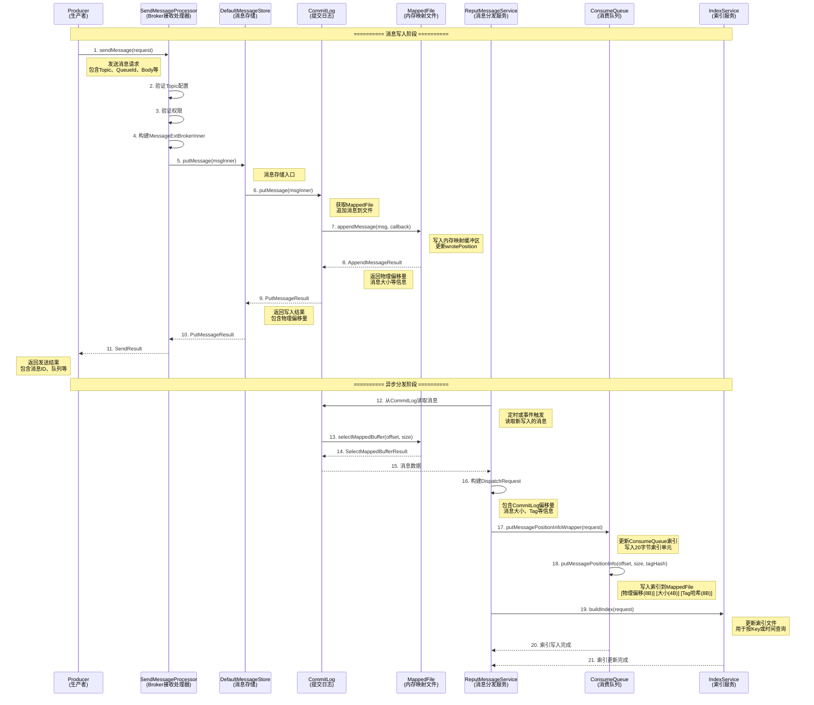
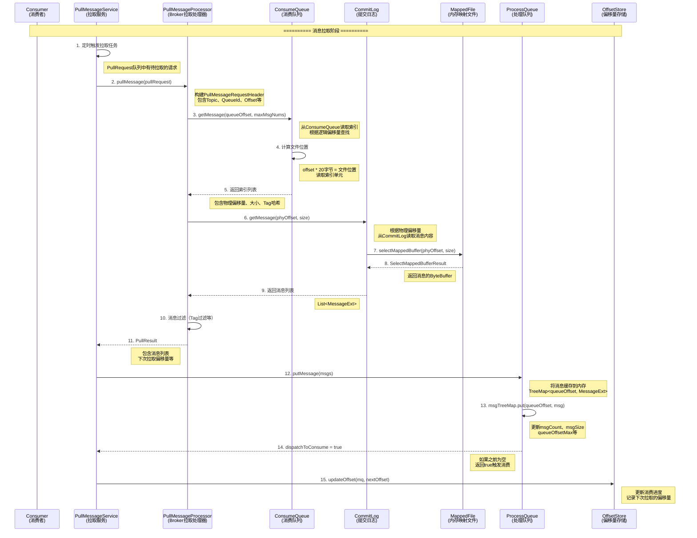
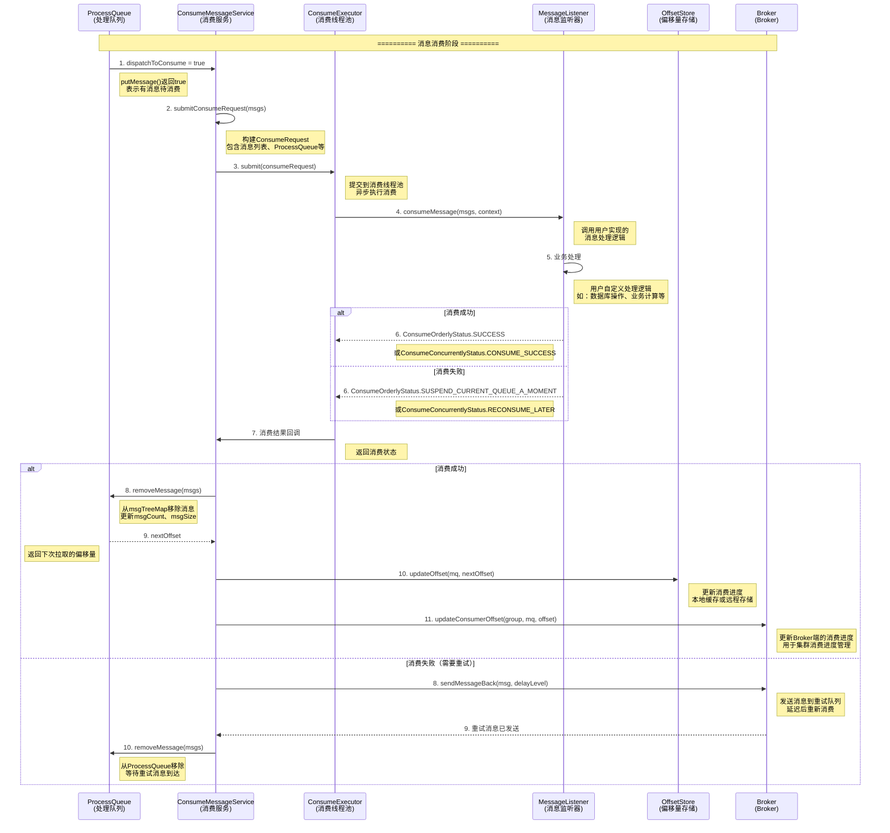
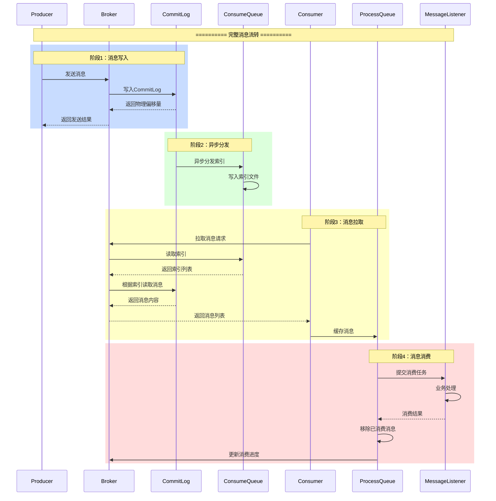

# RocketMQ整体结构详解

## 📌 概述

本文档详细解析RocketMQ的整体架构，包括Topic/Queue、ProcessQueue、ConsumeQueue、CommitLog等核心组件的内部结构和它们之间的关系。

---

## 一、RocketMQ整体架构

### 1.1 三层存储架构

RocketMQ采用**三层存储架构**：

```
┌─────────────────────────────────────────────────────────────────┐
│                    RocketMQ存储架构                               │
└─────────────────────────────────────────────────────────────────┘

┌─────────────────────────────────────────────────────────────────┐
│ 第一层：CommitLog（提交日志）                                     │
│ - 所有Topic的消息都顺序写入CommitLog                            │
│ - 物理存储，消息的完整内容                                        │
│ - 文件：store/commitlog/00000000000000000000                    │
└─────────────────────────────────────────────────────────────────┘
                            │
                            │ 异步分发
                            ▼
┌─────────────────────────────────────────────────────────────────┐
│ 第二层：ConsumeQueue（消费队列）                                 │
│ - 每个Topic的每个Queue对应一个ConsumeQueue                     │
│ - 逻辑索引，指向CommitLog中的消息                                │
│ - 文件：store/consumequeue/{topic}/{queueId}/00000000000000000000│
└─────────────────────────────────────────────────────────────────┘
                            │
                            │ 消费者拉取
                            ▼
┌─────────────────────────────────────────────────────────────────┐
│ 第三层：ProcessQueue（处理队列）                                 │
│ - 消费者端的内存缓存                                             │
│ - 存储从Broker拉取的消息                                         │
│ - 等待消费者处理                                                 │
└─────────────────────────────────────────────────────────────────┘
```

---

## 二、Topic和Queue结构

### 2.1 TopicConfig结构

**TopicConfig**是Topic的配置信息，定义在Broker端：

```31:84:common/src/main/java/org/apache/rocketmq/common/TopicConfig.java
public class TopicConfig {
    private static final String SEPARATOR = " ";
    public static int defaultReadQueueNums = 16;
    // 默认读队列数量：16
    public static int defaultWriteQueueNums = 16;
    // 默认写队列数量：16
    private static final TypeReference<Map<String, String>> ATTRIBUTES_TYPE_REFERENCE = new TypeReference<Map<String, String>>() {
    };
    private String topicName;
    // Topic名称，如"TopicTest"
    private int readQueueNums = defaultReadQueueNums;
    // 读队列数量（消费者可读的队列数），默认16
    private int writeQueueNums = defaultWriteQueueNums;
    // 写队列数量（生产者可写的队列数），默认16
    private int perm = PermName.PERM_READ | PermName.PERM_WRITE;
    // 权限：读+写权限（二进制位标志）
    private TopicFilterType topicFilterType = TopicFilterType.SINGLE_TAG;
    // Topic过滤类型：单Tag过滤
    private int topicSysFlag = 0;
    // Topic系统标志
    private boolean order = false;
    // 是否顺序消息
    // Field attributes should not have ' ' char in key or value, otherwise will lead to decode failure.
    private Map<String, String> attributes = new HashMap<>();
    // 扩展属性（如消息类型等）
```

**TopicConfig结构图：**

```
┌─────────────────────────────────────────────────────────────────┐
│                    TopicConfig结构                               │
└─────────────────────────────────────────────────────────────────┘

TopicConfig {
    topicName: "TopicTest"              // Topic名称
    readQueueNums: 16                   // 读队列数量
    writeQueueNums: 16                   // 写队列数量
    perm: 6 (READ|WRITE)                // 权限：读+写
    topicFilterType: SINGLE_TAG         // 过滤类型
    topicSysFlag: 0                      // 系统标志
    order: false                         // 是否顺序消息
    attributes: {                        // 扩展属性
        "messageType": "NORMAL"
    }
}
```

### 2.2 MessageQueue结构

**MessageQueue**是消息队列的逻辑标识，包含Topic、Broker和QueueId：

```21:65:common/src/main/java/org/apache/rocketmq/common/message/MessageQueue.java
public class MessageQueue implements Comparable<MessageQueue>, Serializable {
    private static final long serialVersionUID = 6191200464116433425L;
    private String topic;
    // Topic名称，如"TopicTest"
    private String brokerName;
    // Broker名称，如"broker-a"
    private int queueId;
    // 队列ID，从0开始，如0, 1, 2, ..., 15

    public MessageQueue(String topic, String brokerName, int queueId) {
        this.topic = topic;
        this.brokerName = brokerName;
        this.queueId = queueId;
    }
```

**MessageQueue结构图：**

```
┌─────────────────────────────────────────────────────────────────┐
│                    MessageQueue结构                               │
└─────────────────────────────────────────────────────────────────┘

MessageQueue {
    topic: "TopicTest"                  // Topic名称
    brokerName: "broker-a"              // Broker名称
    queueId: 0                          // 队列ID（0-15）
}

示例：
- MessageQueue("TopicTest", "broker-a", 0)  // TopicTest的第0个队列
- MessageQueue("TopicTest", "broker-a", 1)  // TopicTest的第1个队列
- ...
- MessageQueue("TopicTest", "broker-a", 15) // TopicTest的第15个队列
```

### 2.3 Topic/Queue关系图

```
┌─────────────────────────────────────────────────────────────────┐
│                    Topic/Queue关系                               │
└─────────────────────────────────────────────────────────────────┘

Topic: "TopicTest"
    │
    ├─── Broker: "broker-a"
    │    │
    │    ├─── Queue 0 (MessageQueue)
    │    ├─── Queue 1 (MessageQueue)
    │    ├─── Queue 2 (MessageQueue)
    │    ├─── ...
    │    └─── Queue 15 (MessageQueue)
    │
    └─── Broker: "broker-b"
         │
         ├─── Queue 0 (MessageQueue)
         ├─── Queue 1 (MessageQueue)
         ├─── ...
         └─── Queue 15 (MessageQueue)

说明：
- 一个Topic可以有多个Broker
- 每个Broker上，一个Topic有多个Queue（默认16个）
- 每个Queue用MessageQueue标识：topic + brokerName + queueId
```

---

## 三、ProcessQueue结构（消费者端）

### 3.1 ProcessQueue组成

**ProcessQueue**是消费者端的内存缓存，存储从Broker拉取的消息：

```39:62:client/src/main/java/org/apache/rocketmq/client/impl/consumer/ProcessQueue.java
public class ProcessQueue {
    public final static long REBALANCE_LOCK_MAX_LIVE_TIME =
        Long.parseLong(System.getProperty("rocketmq.client.rebalance.lockMaxLiveTime", "30000"));
    // 重平衡锁最大存活时间：30秒
    public final static long REBALANCE_LOCK_INTERVAL = Long.parseLong(System.getProperty("rocketmq.client.rebalance.lockInterval", "20000"));
    // 重平衡锁间隔：20秒
    private final static long PULL_MAX_IDLE_TIME = Long.parseLong(System.getProperty("rocketmq.client.pull.pullMaxIdleTime", "120000"));
    // 拉取最大空闲时间：120秒
    private final Logger log = LoggerFactory.getLogger(ProcessQueue.class);
    private final ReadWriteLock treeMapLock = new ReentrantReadWriteLock();
    // 读写锁，保护msgTreeMap的并发访问
    private final TreeMap<Long, MessageExt> msgTreeMap = new TreeMap<>();
    // 消息缓存：key=queueOffset（队列偏移量），value=MessageExt（消息扩展对象）
    private final AtomicLong msgCount = new AtomicLong();
    // 消息数量（原子操作）
    private final AtomicLong msgSize = new AtomicLong();
    // 消息总大小（字节，原子操作）
    private final ReadWriteLock consumeLock = new ReentrantReadWriteLock();
    // 消费锁，用于顺序消费
    /**
     * A subset of msgTreeMap, will only be used when orderly consume
     */
    private final TreeMap<Long, MessageExt> consumingMsgOrderlyTreeMap = new TreeMap<>();
    // 顺序消费时的消息缓存（msgTreeMap的子集）
    private final AtomicLong tryUnlockTimes = new AtomicLong(0);
    // 尝试解锁次数
    private volatile long queueOffsetMax = 0L;
    // 队列最大偏移量（volatile保证可见性）
    private volatile boolean dropped = false;
    // 是否被丢弃（重平衡时可能被丢弃，volatile保证可见性）
    private volatile long lastPullTimestamp = System.currentTimeMillis();
    // 最后一次拉取时间戳（用于检测拉取是否超时）
    private volatile long lastConsumeTimestamp = System.currentTimeMillis();
    // 最后一次消费时间戳（用于检测消费是否超时）
    private volatile boolean locked = false;
    // 是否锁定（顺序消费需要锁定队列，volatile保证可见性）
    private volatile long lastLockTimestamp = System.currentTimeMillis();
    // 最后一次锁定时间戳
    private volatile boolean consuming = false;
    // 是否正在消费（volatile保证可见性）
    private volatile long msgAccCnt = 0;
    // 消息累积数量（用于流控）
```

### 3.2 ProcessQueue核心方法

#### putMessage：放入消息

```129:168:client/src/main/java/org/apache/rocketmq/client/impl/consumer/ProcessQueue.java
    public boolean putMessage(final List<MessageExt> msgs) {
        // 将拉取到的消息放入ProcessQueue
        boolean dispatchToConsume = false;
        // 是否分发到消费（如果之前为空且未在消费，则返回true）
        try {
            this.treeMapLock.writeLock().lockInterruptibly();
            // 获取写锁
            try {
                int validMsgCnt = 0;
                // 有效消息数量
                for (MessageExt msg : msgs) {
                    // 遍历消息列表
                    MessageExt old = msgTreeMap.put(msg.getQueueOffset(), msg);
                    // 以queueOffset为key放入TreeMap（如果已存在则覆盖）
                    if (null == old) {
                        // 如果是新消息（之前不存在）
                        validMsgCnt++;
                        // 有效消息数+1
                        this.queueOffsetMax = msg.getQueueOffset();
                        // 更新最大偏移量
                        msgSize.addAndGet(null == msg.getBody() ? 0 : msg.getBody().length);
                        // 累加消息大小
                    }
                }
                msgCount.addAndGet(validMsgCnt);
                // 更新消息总数

                if (!msgTreeMap.isEmpty() && !this.consuming) {
                    // 如果消息缓存不为空且未在消费
                    dispatchToConsume = true;
                    // 标记为需要分发到消费
                    this.consuming = true;
                    // 设置消费标志为true
                }

                if (!msgs.isEmpty()) {
                    // 如果消息列表不为空
                    MessageExt messageExt = msgs.get(msgs.size() - 1);
                    // 获取最后一条消息
                    String property = messageExt.getProperty(MessageConst.PROPERTY_MAX_OFFSET);
                    // 获取最大偏移量属性
                    if (property != null) {
                        // 如果属性不为空
                        long accTotal = Long.parseLong(property) - messageExt.getQueueOffset();
                        // 计算累积消息数（最大偏移量 - 当前偏移量）
                        if (accTotal > 0) {
                            this.msgAccCnt = accTotal;
                            // 更新消息累积数量
                        }
                    }
                }
            } finally {
                this.treeMapLock.writeLock().unlock();
                // 释放写锁
            }
        } catch (InterruptedException e) {
            log.error("putMessage exception", e);
        }

        return dispatchToConsume;
        // 返回是否分发到消费
    }
```

#### removeMessage：移除消息

```187:223:client/src/main/java/org/apache/rocketmq/client/impl/consumer/ProcessQueue.java
    public long removeMessage(final List<MessageExt> msgs) {
        // 移除已消费的消息
        long result = -1;
        // 返回值：下一个拉取的offset（-1表示无消息）
        final long now = System.currentTimeMillis();
        // 当前时间
        try {
            this.treeMapLock.writeLock().lockInterruptibly();
            // 获取写锁
            this.lastConsumeTimestamp = now;
            // 更新最后消费时间
            try {
                if (!msgTreeMap.isEmpty()) {
                    // 如果消息缓存不为空
                    result = this.queueOffsetMax + 1;
                    // 初始化为最大偏移量+1
                    int removedCnt = 0;
                    // 移除的消息数量
                    for (MessageExt msg : msgs) {
                        // 遍历要移除的消息
                        MessageExt prev = msgTreeMap.remove(msg.getQueueOffset());
                        // 从TreeMap中移除（key=queueOffset）
                        if (prev != null) {
                            // 如果成功移除
                            removedCnt--;
                            // 移除数量-1（注意是负数）
                            long bodySize = null == msg.getBody() ? 0 : msg.getBody().length;
                            // 计算消息体大小
                            if (bodySize > 0) {
                                msgSize.addAndGet(-bodySize);
                                // 减少消息总大小
                            }
                        }
                    }
                    if (msgCount.addAndGet(removedCnt) == 0) {
                        // 如果消息数量变为0
                        msgSize.set(0);
                        // 消息大小也设为0
                    }

                    if (!msgTreeMap.isEmpty()) {
                        // 如果还有消息
                        result = msgTreeMap.firstKey();
                        // 返回最小偏移量（下次从这开始拉取）
                    }
                }
            } finally {
                this.treeMapLock.writeLock().unlock();
                // 释放写锁
            }
        } catch (Throwable t) {
            log.error("removeMessage exception", t);
        }

        return result;
        // 返回下一个拉取的offset
    }
```

### 3.3 ProcessQueue结构图

```
┌─────────────────────────────────────────────────────────────────┐
│                    ProcessQueue结构                               │
└─────────────────────────────────────────────────────────────────┘

ProcessQueue {
    // ========== 消息缓存 ==========
    msgTreeMap: TreeMap<Long, MessageExt> {
        // key: queueOffset（队列偏移量）
        // value: MessageExt（消息对象）
        // 示例：
        100 -> MessageExt { queueOffset=100, body="msg1", ... }
        101 -> MessageExt { queueOffset=101, body="msg2", ... }
        102 -> MessageExt { queueOffset=102, body="msg3", ... }
    }
    
    // ========== 统计信息 ==========
    msgCount: AtomicLong = 3              // 消息数量：3条
    msgSize: AtomicLong = 1024             // 消息总大小：1024字节
    queueOffsetMax: 102                    // 最大偏移量：102
    
    // ========== 状态标志 ==========
    dropped: false                         // 是否被丢弃
    locked: true                           // 是否锁定（顺序消费）
    consuming: true                        // 是否正在消费
    
    // ========== 时间戳 ==========
    lastPullTimestamp: 1234567890          // 最后拉取时间
    lastConsumeTimestamp: 1234567891        // 最后消费时间
    lastLockTimestamp: 1234567880          // 最后锁定时间
    
    // ========== 顺序消费专用 ==========
    consumingMsgOrderlyTreeMap: TreeMap<Long, MessageExt> {
        // 顺序消费时的消息缓存（msgTreeMap的子集）
    }
    
    // ========== 锁 ==========
    treeMapLock: ReadWriteLock             // 保护msgTreeMap的读写锁
    consumeLock: ReadWriteLock             // 消费锁（顺序消费用）
}
```

### 3.4 ProcessQueue与MessageQueue的关系

```
┌─────────────────────────────────────────────────────────────────┐
│            ProcessQueue与MessageQueue的关系                      │
└─────────────────────────────────────────────────────────────────┘

消费者端：
    RebalanceImpl {
        processQueueTable: Map<MessageQueue, ProcessQueue> {
            // key: MessageQueue（逻辑队列标识）
            // value: ProcessQueue（处理队列，内存缓存）
            
            MessageQueue("TopicA", "broker-a", 0) -> ProcessQueue {
                msgTreeMap: { 100->msg1, 101->msg2, ... }
            }
            
            MessageQueue("TopicA", "broker-a", 1) -> ProcessQueue {
                msgTreeMap: { 200->msg3, 201->msg4, ... }
            }
        }
    }

说明：
- 一个MessageQueue对应一个ProcessQueue
- ProcessQueue是MessageQueue在消费者端的内存缓存
- 重平衡时，会为分配的MessageQueue创建ProcessQueue
```

---

## 四、ConsumeQueue结构（Broker端）

### 4.1 ConsumeQueue组成

**ConsumeQueue**是Broker端的消费队列索引，指向CommitLog中的消息：

```45:120:store/src/main/java/org/apache/rocketmq/store/ConsumeQueue.java
public class ConsumeQueue implements ConsumeQueueInterface, FileQueueLifeCycle {
    private static final Logger log = LoggerFactory.getLogger(LoggerName.STORE_LOGGER_NAME);

    /**
     * ConsumeQueue's store unit. Format:
     * <pre>
     * ┌───────────────────────────────┬───────────────────┬───────────────────────────────┐
     * │    CommitLog Physical Offset  │      Body Size    │            Tag HashCode       │
     * │          (8 Bytes)            │      (4 Bytes)    │             (8 Bytes)         │
     * ├───────────────────────────────┴───────────────────┴───────────────────────────────┤
     * │                                     Store Unit                                    │
     * │                                                                                   │
     * </pre>
     * ConsumeQueue's store unit. Size: CommitLog Physical Offset(8) + Body Size(4) + Tag HashCode(8) = 20 Bytes
     */
    public static final int CQ_STORE_UNIT_SIZE = 20;
    // ConsumeQueue存储单元大小：20字节
    public static final int MSG_TAG_OFFSET_INDEX = 12;
    // Tag HashCode在存储单元中的偏移：12字节（8+4）
    private static final Logger LOG_ERROR = LoggerFactory.getLogger(LoggerName.STORE_ERROR_LOGGER_NAME);

    private final MessageStore messageStore;
    // 消息存储（DefaultMessageStore）
    private final ConsumeQueueStore consumeQueueStore;
    // ConsumeQueue存储（ConsumeQueueStore）

    private final MappedFileQueue mappedFileQueue;
    // 内存映射文件队列（MappedFileQueue）
    private final String topic;
    // Topic名称
    private final int queueId;
    // 队列ID
    private final ByteBuffer byteBufferIndex;
    // 索引缓冲区（20字节）

    private final String storePath;
    // 存储路径
    private final int mappedFileSize;
    // 映射文件大小
    private long maxPhysicOffset = -1;
    // 最大物理偏移量（指向CommitLog）

    /**
     * Minimum offset of the consume file queue that points to valid commit log record.
     */
    private volatile long minLogicOffset = 0;
    // 最小逻辑偏移量（ConsumeQueue的索引）
    private ConsumeQueueExt consumeQueueExt = null;
    // ConsumeQueue扩展（可选，用于存储额外信息）
```

### 4.2 ConsumeQueue存储格式

**ConsumeQueue存储单元格式（20字节）：**

```
┌─────────────────────────────────────────────────────────────────┐
│            ConsumeQueue存储单元格式（20字节）                     │
└─────────────────────────────────────────────────────────────────┘

┌───────────────────────────────┬───────────────────┬───────────────────────────────┐
│    CommitLog Physical Offset  │      Body Size    │            Tag HashCode       │
│          (8 Bytes)            │      (4 Bytes)    │             (8 Bytes)         │
├───────────────────────────────┴───────────────────┴───────────────────────────────┤
│                                     Store Unit (20 Bytes)                         │
└───────────────────────────────────────────────────────────────────────────────────┘

说明：
1. CommitLog Physical Offset (8字节)：
   - 消息在CommitLog中的物理偏移量
   - 用于从CommitLog读取消息内容

2. Body Size (4字节)：
   - 消息体大小
   - 用于计算消息在CommitLog中的结束位置

3. Tag HashCode (8字节)：
   - Tag的哈希码
   - 用于消息过滤（Tag过滤）

示例：
Offset 0:  [0x0000000000001000] [0x00000100] [0x1234567890ABCDEF]
          └─ CommitLog偏移: 4096  └─ 大小:256  └─ Tag哈希码

Offset 1:  [0x0000000000001100] [0x00000080] [0xFEDCBA0987654321]
          └─ CommitLog偏移: 4352  └─ 大小:128  └─ Tag哈希码
```

### 4.3 ConsumeQueue文件结构

```
┌─────────────────────────────────────────────────────────────────┐
│            ConsumeQueue文件结构                                   │
└─────────────────────────────────────────────────────────────────┘

存储路径：store/consumequeue/{topic}/{queueId}/

文件命名：00000000000000000000（20位数字，表示起始偏移量）

示例：TopicTest的Queue 0
store/consumequeue/TopicTest/0/
    ├── 00000000000000000000    (第1个文件，偏移量0-599999)
    ├── 00000000000000600000    (第2个文件，偏移量600000-1199999)
    ├── 00000000000001200000    (第3个文件，偏移量1200000-1799999)
    └── ...

文件大小：默认5.8MB（可配置）
每个文件可存储：5.8MB / 20字节 = 约30万条索引

文件内容：
┌─────────────────────────────────────────────────────────────┐
│ 00000000000000000000                                          │
├─────────────────────────────────────────────────────────────┤
│ Offset 0:   [CommitLog偏移] [大小] [Tag哈希]  (20字节)        │
│ Offset 1:   [CommitLog偏移] [大小] [Tag哈希]  (20字节)        │
│ Offset 2:   [CommitLog偏移] [大小] [Tag哈希]  (20字节)        │
│ ...                                                           │
│ Offset 299999: [CommitLog偏移] [大小] [Tag哈希] (20字节)       │
└─────────────────────────────────────────────────────────────┘
```

### 4.4 ConsumeQueue与CommitLog的关系

```
┌─────────────────────────────────────────────────────────────────┐
│        ConsumeQueue与CommitLog的关系                              │
└─────────────────────────────────────────────────────────────────┘

CommitLog（物理存储）：
┌─────────────────────────────────────────────────────────────┐
│ Offset 4096:  Message1 (TopicA, Queue0, body="msg1")       │
│ Offset 4352:  Message2 (TopicA, Queue0, body="msg2")       │
│ Offset 4608:  Message3 (TopicB, Queue1, body="msg3")       │
│ Offset 4864:  Message4 (TopicA, Queue0, body="msg4")       │
└─────────────────────────────────────────────────────────────┘

ConsumeQueue (TopicA, Queue0)：
┌─────────────────────────────────────────────────────────────┐
│ Index 0:  [4096] [256] [TagHash]  → 指向Message1            │
│ Index 1:  [4352] [256] [TagHash]  → 指向Message2            │
│ Index 2:  [4864] [256] [TagHash]  → 指向Message4            │
└─────────────────────────────────────────────────────────────┘

ConsumeQueue (TopicB, Queue1)：
┌─────────────────────────────────────────────────────────────┐
│ Index 0:  [4608] [256] [TagHash]  → 指向Message3            │
└─────────────────────────────────────────────────────────────┘

说明：
1. CommitLog顺序存储所有消息（所有Topic混合）
2. ConsumeQueue按Topic+Queue组织，存储索引
3. ConsumeQueue的索引指向CommitLog中的消息
4. 消费者通过ConsumeQueue找到消息在CommitLog中的位置
```

---

## 五、CommitLog结构（Broker端）

### 5.1 CommitLog组成

**CommitLog**是消息的物理存储，所有Topic的消息都顺序写入：

```77:154:store/src/main/java/org/apache/rocketmq/store/CommitLog.java
/**
 * Store all metadata downtime for recovery, data protection reliability
 */
public class CommitLog implements Swappable {
    // 存储所有消息的元数据，用于恢复和数据保护可靠性
    // Message's MAGIC CODE daa320a7
    public final static int MESSAGE_MAGIC_CODE = -626843481;
    // 消息魔数：用于标识消息格式
    protected static final Logger log = LoggerFactory.getLogger(LoggerName.STORE_LOGGER_NAME);
    // End of file empty MAGIC CODE cbd43194
    public final static int BLANK_MAGIC_CODE = -875286124;
    // 文件末尾空白魔数：用于标识文件结束
    /**
     * CRC32 Format: [PROPERTY_CRC32 + NAME_VALUE_SEPARATOR + 10-digit fixed-length string + PROPERTY_SEPARATOR]
     */
    public static final int CRC32_RESERVED_LEN = MessageConst.PROPERTY_CRC32.length() + 1 + 10 + 1;
    // CRC32保留长度
    protected final MappedFileQueue mappedFileQueue;
    // 内存映射文件队列（MappedFileQueue）
    protected final DefaultMessageStore defaultMessageStore;
    // 消息存储（DefaultMessageStore）

    private final FlushManager flushManager;
    // 刷盘管理器
    private final ColdDataCheckService coldDataCheckService;
    // 冷数据检查服务

    private final AppendMessageCallback appendMessageCallback;
    // 追加消息回调
    private final ThreadLocal<PutMessageThreadLocal> putMessageThreadLocal;
    // 线程本地变量（用于消息编码）

    protected volatile long confirmOffset = -1L;
    // 确认偏移量（volatile保证可见性）

    private volatile long beginTimeInLock = 0;
    // 锁定开始时间

    protected final PutMessageLock putMessageLock;
    // 写消息锁

    protected final TopicQueueLock topicQueueLock;
    // Topic队列锁

    private volatile Set<String> fullStorePaths = Collections.emptySet();
    // 已满的存储路径集合

    private final FlushDiskWatcher flushDiskWatcher;
    // 刷盘监视器

    protected int commitLogSize;
    // CommitLog文件大小

    private final boolean enabledAppendPropCRC;
    // 是否启用属性CRC
```

### 5.2 CommitLog文件结构

```
┌─────────────────────────────────────────────────────────────────┐
│            CommitLog文件结构                                      │
└─────────────────────────────────────────────────────────────────┘

存储路径：store/commitlog/

文件命名：00000000000000000000（20位数字，表示起始偏移量）

示例：
store/commitlog/
    ├── 00000000000000000000    (第1个文件，偏移量0-1GB)
    ├── 00000000001073741824    (第2个文件，偏移量1GB-2GB)
    ├── 00000000002147483648    (第3个文件，偏移量2GB-3GB)
    └── ...

文件大小：默认1GB（可配置）

文件内容：
┌─────────────────────────────────────────────────────────────┐
│ 00000000000000000000                                          │
├─────────────────────────────────────────────────────────────┤
│ Offset 0:     Message1 (完整消息内容)                         │
│ Offset 256:   Message2 (完整消息内容)                         │
│ Offset 512:   Message3 (完整消息内容)                         │
│ ...                                                           │
│ Offset 1GB-256: MessageN (完整消息内容)                       │
│ [BLANK_MAGIC_CODE] (文件结束标记)                             │
└─────────────────────────────────────────────────────────────┘
```

### 5.3 消息在CommitLog中的格式

```
┌─────────────────────────────────────────────────────────────────┐
│            消息在CommitLog中的格式                                │
└─────────────────────────────────────────────────────────────────┘

┌─────────────────────────────────────────────────────────────────┐
│                        消息头（固定部分）                         │
├─────────────────────────────────────────────────────────────────┤
│ 1. Total Size (4字节)       消息总长度                          │
│ 2. MAGIC CODE (4字节)       魔数：MESSAGE_MAGIC_CODE            │
│ 3. Body CRC (4字节)         消息体CRC校验                       │
│ 4. Queue ID (4字节)         队列ID                              │
│ 5. Flag (4字节)             消息标志                            │
│ 6. Queue Offset (8字节)    队列偏移量                          │
│ 7. Physical Offset (8字节)  物理偏移量（在CommitLog中的位置）    │
│ 8. SysFlag (4字节)          系统标志                            │
│ 9. Born Timestamp (8字节)    消息产生时间                        │
│ 10. Born Host (8字节)       消息产生主机                        │
│ 11. Store Timestamp (8字节) 消息存储时间                        │
│ 12. Store Host (8字节)       消息存储主机                        │
│ 13. Reconsume Times (4字节) 重试次数                            │
│ 14. Prepared Transaction Offset (8字节) 事务消息准备偏移量      │
│ 15. Body Length (4字节)      消息体长度                          │
│ 16. Body (变长)             消息体内容                           │
│ 17. Topic Length (1字节)    Topic名称长度                       │
│ 18. Topic (变长)            Topic名称                           │
│ 19. Properties Length (2字节) 属性长度                           │
│ 20. Properties (变长)        消息属性（Key-Value对）             │
└─────────────────────────────────────────────────────────────────┘

总大小 = 固定部分（约100字节）+ Body长度 + Topic长度 + Properties长度
```

---

## 六、MappedFile结构

### 6.1 MappedFile组成

**MappedFile**是内存映射文件，RocketMQ使用内存映射技术提高IO性能：

```64:90:store/src/main/java/org/apache/rocketmq/store/logfile/DefaultMappedFile.java
public class DefaultMappedFile extends AbstractMappedFile {
    public static final int OS_PAGE_SIZE = 1024 * 4;
    // 操作系统页大小：4KB
    public static final Unsafe UNSAFE = getUnsafe();
    // Unsafe对象（用于直接内存操作）
    private static final Method IS_LOADED_METHOD;
    public static final int UNSAFE_PAGE_SIZE = UNSAFE == null ? OS_PAGE_SIZE : UNSAFE.pageSize();
    // Unsafe页大小

    protected static final Logger log = LoggerFactory.getLogger(LoggerName.STORE_LOGGER_NAME);

    protected static final AtomicLong TOTAL_MAPPED_VIRTUAL_MEMORY = new AtomicLong(0);
    // 总映射虚拟内存（所有MappedFile的总大小）
    protected static final AtomicInteger TOTAL_MAPPED_FILES = new AtomicInteger(0);
    // 总映射文件数

    protected static final AtomicIntegerFieldUpdater<DefaultMappedFile> WROTE_POSITION_UPDATER;
    // 写入位置更新器（原子操作）
    protected static final AtomicIntegerFieldUpdater<DefaultMappedFile> COMMITTED_POSITION_UPDATER;
    // 提交位置更新器
    protected static final AtomicIntegerFieldUpdater<DefaultMappedFile> FLUSHED_POSITION_UPDATER;
    // 刷盘位置更新器

    protected volatile int wrotePosition;
    // 写入位置（已写入但未提交，volatile保证可见性）
    protected volatile int committedPosition;
    // 提交位置（已提交但未刷盘，volatile保证可见性）
    protected volatile int flushedPosition;
    // 刷盘位置（已刷盘到磁盘，volatile保证可见性）
    protected int fileSize;
    // 文件大小
    protected FileChannel fileChannel;
    // 文件通道

    /**
     * Message will put to here first, and then reput to FileChannel if writeBuffer is not null.
     */
    protected ByteBuffer writeBuffer = null;
    // 写缓冲区（如果启用，消息先写入缓冲区，再写入文件通道）
    protected TransientStorePool transientStorePool = null;
    // 临时存储池（用于写缓冲区）
```

### 6.2 MappedFileQueue结构

**MappedFileQueue**管理多个MappedFile：

```40:86:store/src/main/java/org/apache/rocketmq/store/MappedFileQueue.java
public class MappedFileQueue implements Swappable {
    private static final Logger log = LoggerFactory.getLogger(LoggerName.STORE_LOGGER_NAME);
    private static final Logger LOG_ERROR = LoggerFactory.getLogger(LoggerName.STORE_ERROR_LOGGER_NAME);

    protected final String storePath;
    // 存储路径

    protected final int mappedFileSize;
    // 映射文件大小

    protected final CopyOnWriteArrayList<MappedFile> mappedFiles = new CopyOnWriteArrayList<>();
    // 映射文件列表（线程安全的列表）

    protected final AllocateMappedFileService allocateMappedFileService;
    // 分配映射文件服务

    protected long flushedWhere = 0;
    // 已刷盘位置

    protected long committedWhere = 0;
    // 已提交位置

    protected volatile long storeTimestamp = 0;
    // 存储时间戳
```

### 6.3 MappedFile结构图

```
┌─────────────────────────────────────────────────────────────────┐
│                    MappedFile结构                                 │
└─────────────────────────────────────────────────────────────────┘

MappedFile {
    fileName: "00000000000000000000"     // 文件名（起始偏移量）
    fileSize: 1073741824                 // 文件大小：1GB
    fileFromOffset: 0                    // 文件起始偏移量：0
    
    // ========== 位置指针 ==========
    wrotePosition: 1024                  // 写入位置：1024字节（已写入）
    committedPosition: 512               // 提交位置：512字节（已提交）
    flushedPosition: 256                 // 刷盘位置：256字节（已刷盘）
    
    // ========== 内存映射 ==========
    mappedByteBuffer: MappedByteBuffer   // 内存映射缓冲区
    fileChannel: FileChannel             // 文件通道
    
    // ========== 写缓冲区（可选）==========
    writeBuffer: ByteBuffer              // 写缓冲区（如果启用）
    transientStorePool: TransientStorePool // 临时存储池
}

位置关系：
[0] ──── [flushedPosition] ──── [committedPosition] ──── [wrotePosition] ──── [fileSize]
     已刷盘              已提交但未刷盘          已写入但未提交          文件大小

说明：
- flushedPosition <= committedPosition <= wrotePosition <= fileSize
- 数据流向：写入 → 提交 → 刷盘
```

---

## 七、DefaultMessageStore结构（Broker端核心）

### 7.1 DefaultMessageStore组成

**DefaultMessageStore**是Broker端的消息存储核心，管理CommitLog和ConsumeQueue：

```125:256:store/src/main/java/org/apache/rocketmq/store/DefaultMessageStore.java
public class DefaultMessageStore implements MessageStore {
    protected static final Logger LOGGER = LoggerFactory.getLogger(LoggerName.STORE_LOGGER_NAME);
    protected static final Logger ERROR_LOG = LoggerFactory.getLogger(LoggerName.STORE_ERROR_LOGGER_NAME);

    public final PerfCounter.Ticks perfs = new PerfCounter.Ticks(LOGGER);
    // 性能计数器

    private final MessageStoreConfig messageStoreConfig;
    // 消息存储配置
    // CommitLog
    protected final CommitLog commitLog;
    // CommitLog（提交日志）

    protected final ConsumeQueueStoreInterface consumeQueueStore;
    // ConsumeQueue存储接口

    protected final CleanCommitLogService cleanCommitLogService;
    // 清理CommitLog服务

    protected final IndexService indexService;
    // 索引服务（用于按时间或Key查询消息）
    protected final IndexRocksDBStore indexRocksDBStore;
    // 索引RocksDB存储

    private final AllocateMappedFileService allocateMappedFileService;
    // 分配映射文件服务

    private ReputMessageService reputMessageService;
    // 重新分发消息服务（将CommitLog中的消息分发到ConsumeQueue）

    private HAService haService;
    // 高可用服务（主从同步）

    // CompactionLog
    private CompactionStore compactionStore;
    // 压缩存储

    private CompactionService compactionService;
    // 压缩服务

    private final StoreStatsService storeStatsService;
    // 存储统计服务

    private final TransientStorePool transientStorePool;
    // 临时存储池

    protected final RunningFlags runningFlags = new RunningFlags();
    // 运行标志
    private final SystemClock systemClock = new SystemClock();
    // 系统时钟

    private final ScheduledExecutorService scheduledExecutorService;
    // 定时任务执行器
    private final BrokerStatsManager brokerStatsManager;
    // Broker统计管理器
    private final MessageArrivingListener messageArrivingListener;
    // 消息到达监听器
    private final BrokerConfig brokerConfig;
    // Broker配置

    private volatile boolean shutdown = true;
    // 是否关闭

    private boolean notifyMessageArriveInBatch = false;
    // 是否批量通知消息到达

    protected StoreCheckpoint storeCheckpoint;
    // 存储检查点
    private MessageRocksDBStorage messageRocksDBStorage;
    // 消息RocksDB存储
    private TimerMessageStore timerMessageStore;
    // 定时消息存储
    private final DefaultStoreMetricsManager defaultStoreMetricsManager;
    // 存储指标管理器
    private TransMessageRocksDBStore transMessageRocksDBStore;
    // 事务消息RocksDB存储
```

### 7.2 消息写入流程

```
┌─────────────────────────────────────────────────────────────────┐
│                   消息写入流程                                    │
└─────────────────────────────────────────────────────────────────┘

Producer发送消息
    │
    ▼
┌──────────────────────┐
│ Broker接收消息       │
│ SendMessageProcessor │
└──────────────────────┘
    │
    ▼
┌──────────────────────┐
│ DefaultMessageStore  │
│ putMessage()         │
└──────────────────────┘
    │
    ▼
┌──────────────────────┐
│ CommitLog            │
│ putMessage()         │
│ 1. 获取MappedFile    │
│ 2. 追加消息到文件    │
│ 3. 返回物理偏移量    │
└──────────────────────┘
    │
    ├──────────────────────┬──────────────────────┐
    │                      │                      │
    ▼                      ▼                      ▼
┌──────────┐        ┌──────────┐        ┌──────────┐
│ 异步分发 │        │ 异步分发 │        │ 异步分发 │
│ ReputMessageService│        │        │        │
└──────────┘        └──────────┘        └──────────┘
    │                      │                      │
    ▼                      ▼                      ▼
┌──────────┐        ┌──────────┐        ┌──────────┐
│ ConsumeQueue│      │ IndexService│     │ TransIndex│
│ 更新索引  │        │ 更新索引  │        │ 更新索引  │
└──────────┘        └──────────┘        └──────────┘
```

---

## 八、完整结构关系图

### 8.1 整体架构图

```
┌─────────────────────────────────────────────────────────────────┐
│                RocketMQ整体架构                                  │
└─────────────────────────────────────────────────────────────────┘

┌─────────────────────────────────────────────────────────────────┐
│                        Producer端                                │
└─────────────────────────────────────────────────────────────────┘
    │
    │ 发送消息
    ▼
┌─────────────────────────────────────────────────────────────────┐
│                        Broker端                                   │
├─────────────────────────────────────────────────────────────────┤
│                                                                   │
│  ┌─────────────────────────────────────────────────────────┐   │
│  │              DefaultMessageStore                         │   │
│  │  ┌──────────────────────────────────────────────────┐  │   │
│  │  │  CommitLog (物理存储)                              │  │   │
│  │  │  ┌────────────────────────────────────────────┐  │  │   │
│  │  │  │  MappedFileQueue                            │  │  │   │
│  │  │  │  ┌──────────┐ ┌──────────┐ ┌──────────┐    │  │  │   │
│  │  │  │  │MappedFile│ │MappedFile│ │MappedFile│    │  │  │   │
│  │  │  │  │  1GB     │ │  1GB     │ │  1GB     │    │  │  │   │
│  │  │  │  └──────────┘ └──────────┘ └──────────┘    │  │  │   │
│  │  │  └────────────────────────────────────────────┘  │  │   │
│  │  │  所有Topic的消息顺序写入                          │  │   │
│  │  └──────────────────────────────────────────────────┘  │   │
│  │                          │                              │   │
│  │                          │ ReputMessageService          │   │
│  │                          │ (异步分发)                   │   │
│  │                          ▼                              │   │
│  │  ┌──────────────────────────────────────────────────┐  │   │
│  │  │  ConsumeQueueStore                                │  │   │
│  │  │  ┌────────────────────────────────────────────┐  │  │   │
│  │  │  │  consumeQueueTable                         │  │  │   │
│  │  │  │  Map<String, Map<Integer, ConsumeQueue>>   │  │  │   │
│  │  │  │                                            │  │  │   │
│  │  │  │  "TopicA" -> {                             │  │  │   │
│  │  │  │      0 -> ConsumeQueue {                   │  │  │   │
│  │  │  │          MappedFileQueue {                 │  │  │   │
│  │  │  │            MappedFile (5.8MB)               │  │  │   │
│  │  │  │            MappedFile (5.8MB)              │  │  │   │
│  │  │  │            ...                              │  │  │   │
│  │  │  │          }                                  │  │  │   │
│  │  │  │      },                                    │  │  │   │
│  │  │  │      1 -> ConsumeQueue { ... },            │  │  │   │
│  │  │  │      ...                                   │  │  │   │
│  │  │  │  }                                         │  │  │   │
│  │  │  │                                            │  │  │   │
│  │  │  │  "TopicB" -> { ... }                       │  │  │   │
│  │  │  └────────────────────────────────────────────┘  │  │   │
│  │  │  每个Topic的每个Queue对应一个ConsumeQueue        │  │   │
│  │  └──────────────────────────────────────────────────┘  │   │
│  └─────────────────────────────────────────────────────────┘   │
└─────────────────────────────────────────────────────────────────┘
                            │
                            │ 拉取消息
                            ▼
┌─────────────────────────────────────────────────────────────────┐
│                        Consumer端                                │
├─────────────────────────────────────────────────────────────────┤
│                                                                   │
│  ┌─────────────────────────────────────────────────────────┐   │
│  │  RebalanceImpl                                          │   │
│  │  ┌──────────────────────────────────────────────────┐  │   │
│  │  │  processQueueTable                               │  │   │
│  │  │  Map<MessageQueue, ProcessQueue>                 │  │   │
│  │  │                                                   │  │   │
│  │  │  MessageQueue("TopicA", "broker-a", 0) ->        │  │   │
│  │  │    ProcessQueue {                                 │  │   │
│  │  │      msgTreeMap: TreeMap<Long, MessageExt> {     │  │   │
│  │  │        100 -> MessageExt { ... }                 │  │   │
│  │  │        101 -> MessageExt { ... }                 │  │   │
│  │  │        ...                                       │  │   │
│  │  │      }                                           │  │   │
│  │  │      msgCount: 10                                 │  │   │
│  │  │      msgSize: 10240                               │  │   │
│  │  │    }                                              │  │   │
│  │  │                                                   │  │   │
│  │  │  MessageQueue("TopicA", "broker-a", 1) ->        │  │   │
│  │  │    ProcessQueue { ... }                          │  │   │
│  │  └──────────────────────────────────────────────────┘  │   │
│  └─────────────────────────────────────────────────────────┘   │
└─────────────────────────────────────────────────────────────────┘
```

### 8.2 数据流转时序图

#### 8.2.1 消息写入流程时序图



#### 8.2.2 消息拉取流程时序图



#### 8.2.3 消息消费流程时序图



#### 8.2.4 完整消息流转时序图



#### 8.2.5 关键数据流转说明

**1. 消息写入阶段：**
- Producer发送消息到Broker
- Broker将消息顺序写入CommitLog（MappedFile）
- 返回物理偏移量和消息ID

**2. 异步分发阶段：**
- ReputMessageService从CommitLog读取新消息
- 构建DispatchRequest，包含消息的物理偏移量、大小、Tag等信息
- 异步分发到ConsumeQueue（写入20字节索引单元）
- 同时更新IndexService（用于按Key或时间查询）

**3. 消息拉取阶段：**
- Consumer的PullMessageService定时触发拉取
- 从ConsumeQueue读取索引（根据逻辑偏移量）
- 根据索引中的物理偏移量，从CommitLog读取消息内容
- 消息过滤后，缓存到ProcessQueue的msgTreeMap

**4. 消息消费阶段：**
- ProcessQueue有消息时，触发消费
- ConsumeMessageService提交消费任务到线程池
- MessageListener执行用户业务逻辑
- 消费成功后，从ProcessQueue移除消息，更新消费进度
- 消费失败时，发送到重试队列，延迟后重新消费

---

## 九、文件系统结构

### 9.1 Broker存储目录结构

```
┌─────────────────────────────────────────────────────────────────┐
│            Broker存储目录结构                                     │
└─────────────────────────────────────────────────────────────────┘

store/
├── commitlog/                          # CommitLog目录
│   ├── 00000000000000000000            # 第1个文件（1GB）
│   ├── 00000000001073741824            # 第2个文件（1GB）
│   └── ...
│
├── consumequeue/                       # ConsumeQueue目录
│   ├── TopicA/                         # TopicA的ConsumeQueue
│   │   ├── 0/                          # Queue 0
│   │   │   ├── 00000000000000000000    # 第1个文件（5.8MB）
│   │   │   ├── 00000000000000600000    # 第2个文件（5.8MB）
│   │   │   └── ...
│   │   ├── 1/                          # Queue 1
│   │   │   └── ...
│   │   └── ...
│   │
│   ├── TopicB/                         # TopicB的ConsumeQueue
│   │   └── ...
│   └── ...
│
├── index/                              # 索引文件目录
│   ├── 20240123120000                  # 按时间命名的索引文件
│   └── ...
│
├── checkpoint/                         # 检查点文件
│   └── storeCheckpoint                 # 存储检查点
│
└── config/                             # 配置文件
    ├── topics.json                     # Topic配置
    └── subscriptionGroup.json          # 订阅组配置
```

### 9.2 文件大小说明

| 文件类型 | 默认大小 | 说明 |
|---------|---------|------|
| CommitLog文件 | 1GB | 可配置，建议1GB |
| ConsumeQueue文件 | 5.8MB | 可配置，建议5.8MB |
| Index文件 | 400MB | 可配置 |

**计算：**
- ConsumeQueue文件大小 = 5.8MB = 5.8 * 1024 * 1024 = 6,087,680 字节
- 每个索引单元 = 20字节
- 每个文件可存储 = 6,087,680 / 20 = 304,384 条索引

---

## 十、关键数据结构总结

### 10.1 TopicConfig（Topic配置）

```java
TopicConfig {
    topicName: String                    // Topic名称
    readQueueNums: int = 16              // 读队列数量
    writeQueueNums: int = 16            // 写队列数量
    perm: int                           // 权限
    topicFilterType: TopicFilterType    // 过滤类型
    order: boolean                      // 是否顺序消息
}
```

### 10.2 MessageQueue（消息队列）

```java
MessageQueue {
    topic: String                       // Topic名称
    brokerName: String                  // Broker名称
    queueId: int                       // 队列ID
}
```

### 10.3 ProcessQueue（处理队列）

```java
ProcessQueue {
    msgTreeMap: TreeMap<Long, MessageExt>  // 消息缓存（key=queueOffset）
    msgCount: AtomicLong                    // 消息数量
    msgSize: AtomicLong                     // 消息总大小
    queueOffsetMax: long                   // 最大偏移量
    dropped: boolean                       // 是否被丢弃
    locked: boolean                        // 是否锁定
    consuming: boolean                     // 是否正在消费
}
```

### 10.4 ConsumeQueue（消费队列）

```java
ConsumeQueue {
    topic: String                        // Topic名称
    queueId: int                        // 队列ID
    mappedFileQueue: MappedFileQueue    // 映射文件队列
    maxPhysicOffset: long              // 最大物理偏移量
    minLogicOffset: long               // 最小逻辑偏移量
}

存储单元（20字节）：
[CommitLog物理偏移(8字节)] [Body大小(4字节)] [Tag哈希(8字节)]
```

### 10.5 CommitLog（提交日志）

```java
CommitLog {
    mappedFileQueue: MappedFileQueue    // 映射文件队列
    defaultMessageStore: DefaultMessageStore
    flushManager: FlushManager          // 刷盘管理器
}

消息格式：
[消息头(约100字节)] [Body(变长)] [Topic(变长)] [Properties(变长)]
```

### 10.6 MappedFile（映射文件）

```java
MappedFile {
    fileName: String                    // 文件名（起始偏移量）
    fileSize: int                      // 文件大小
    fileFromOffset: long               // 文件起始偏移量
    wrotePosition: int                 // 写入位置
    committedPosition: int             // 提交位置
    flushedPosition: int               // 刷盘位置
    mappedByteBuffer: MappedByteBuffer  // 内存映射缓冲区
}
```

---

## 十一、组件关系总结

### 11.1 层级关系

```
┌─────────────────────────────────────────────────────────────────┐
│                    组件层级关系                                   │
└─────────────────────────────────────────────────────────────────┘

第1层：逻辑层
    TopicConfig (Topic配置)
        │
        └─── MessageQueue (消息队列标识)
                │
                └─── ProcessQueue (消费者端处理队列)

第2层：索引层
    ConsumeQueue (消费队列索引)
        │
        └─── MappedFileQueue (映射文件队列)
                │
                └─── MappedFile (映射文件)

第3层：存储层
    CommitLog (提交日志)
        │
        └─── MappedFileQueue (映射文件队列)
                │
                └─── MappedFile (映射文件)
```

### 11.2 映射关系

```
┌─────────────────────────────────────────────────────────────────┐
│                    组件映射关系                                   │
└─────────────────────────────────────────────────────────────────┘

1. Topic → Queue映射：
   1个Topic → N个Queue (默认16个)
   
2. Queue → ConsumeQueue映射：
   1个Queue → 1个ConsumeQueue
   
3. ConsumeQueue → CommitLog映射：
   ConsumeQueue索引 → CommitLog物理偏移量
   
4. MessageQueue → ProcessQueue映射：
   1个MessageQueue → 1个ProcessQueue
   
5. ProcessQueue → ConsumeQueue映射：
   ProcessQueue缓存的消息来自ConsumeQueue指向的CommitLog消息
```

---

## 十二、总结

### 12.1 核心组件

1. **TopicConfig**：Topic的配置信息（队列数量、权限等）
2. **MessageQueue**：消息队列的逻辑标识（Topic + Broker + QueueId）
3. **ProcessQueue**：消费者端的内存缓存（TreeMap存储消息）
4. **ConsumeQueue**：Broker端的消费队列索引（20字节/条，指向CommitLog）
5. **CommitLog**：消息的物理存储（所有Topic顺序写入）
6. **MappedFile**：内存映射文件（提高IO性能）

### 12.2 数据流向

```
Producer → CommitLog → ConsumeQueue → Consumer → ProcessQueue → MessageListener
```

### 12.3 设计优势

1. **顺序写入**：CommitLog顺序写入，提高写入性能
2. **逻辑分离**：ConsumeQueue按Topic+Queue组织，支持按队列消费
3. **内存映射**：使用MappedFile提高IO性能
4. **异步分发**：ReputMessageService异步将CommitLog分发到ConsumeQueue
5. **内存缓存**：ProcessQueue在消费者端缓存消息，提高消费性能

---

## 附录：源码位置

- **TopicConfig**: `common/src/main/java/org/apache/rocketmq/common/TopicConfig.java`
- **MessageQueue**: `common/src/main/java/org/apache/rocketmq/common/message/MessageQueue.java`
- **ProcessQueue**: `client/src/main/java/org/apache/rocketmq/client/impl/consumer/ProcessQueue.java`
- **ConsumeQueue**: `store/src/main/java/org/apache/rocketmq/store/ConsumeQueue.java`
- **CommitLog**: `store/src/main/java/org/apache/rocketmq/store/CommitLog.java`
- **MappedFile**: `store/src/main/java/org/apache/rocketmq/store/logfile/DefaultMappedFile.java`
- **DefaultMessageStore**: `store/src/main/java/org/apache/rocketmq/store/DefaultMessageStore.java`

