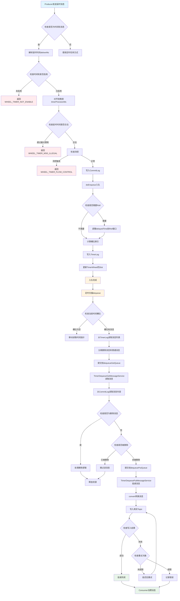

# RocketMQ时间轮实现详解

## 一、时间轮基础知识

### 1.1 什么是时间轮？

**时间轮（Timer Wheel）**是一种高效管理定时任务的数据结构，类似于时钟的刻度盘。它将时间轴划分为多个固定大小的槽位（Slot），每个槽位对应一个时间范围，用于存储在该时间范围内需要执行的任务。

**形象比喻：**
- 想象一个时钟，有12个刻度（槽位）
- 每个刻度代表1小时
- 当指针指向某个刻度时，执行该刻度上的所有任务
- 时间轮就是这样的"时钟"，但刻度更细，可以精确到毫秒

### 1.2 时间轮的基本原理

```
┌─────────────────────────────────────────────────────────────────────────────────────┐
│                        时间轮基本原理示意图                                           │
└─────────────────────────────────────────────────────────────────────────────────────┘

时间轴：    0s    1s    2s    3s    4s    5s    6s    7s    8s    9s    10s   11s   12s
           │     │     │     │     │     │     │     │     │     │     │     │     │
           ▼     ▼     ▼     ▼     ▼     ▼     ▼     ▼     ▼     ▼     ▼     ▼     ▼
槽位索引：  [0]   [1]   [2]   [3]   [4]   [5]   [6]   [7]   [8]   [9]   [10]  [11]  [12]
           │     │     │     │     │     │     │     │     │     │     │     │     │
           └─────┴─────┴─────┴─────┴─────┴─────┴─────┴─────┴─────┴─────┴─────┴─────┘
           每个槽位存储在该时间范围内需要执行的任务

示例：
- 消息A：延迟3秒 → 放入槽位[3]
- 消息B：延迟5秒 → 放入槽位[5]
- 消息C：延迟3秒 → 放入槽位[3]（与消息A在同一槽位）

当前时间指针指向槽位[0]，每秒向前移动一个槽位：
- 1秒后：指针指向[1]，执行槽位[1]中的任务
- 3秒后：指针指向[3]，执行槽位[3]中的任务（消息A和消息C）
- 5秒后：指针指向[5]，执行槽位[5]中的任务（消息B）
```

### 1.3 时间轮的优势

| 优势 | 说明 |
|-----|------|
| **高效** | O(1)时间复杂度插入和删除任务 |
| **精确** | 可以精确到毫秒级别 |
| **可扩展** | 支持大量定时任务 |
| **低内存** | 固定大小的数据结构，内存占用可控 |

### 1.4 时间轮的应用场景

1. **延时消息**：消息延迟指定时间后投递
2. **定时任务**：定时执行某些操作
3. **超时检测**：检测连接、请求等是否超时
4. **重试机制**：延迟重试失败的操作

## 二、RocketMQ时间轮设计思想

### 2.1 设计目标

1. **高性能**：支持大量延时消息的高效管理
2. **高精度**：支持毫秒级别的精确延时
3. **可扩展**：支持长时间延迟（最长7天）
4. **可靠性**：保证消息不丢失，支持持久化

### 2.2 核心设计思想

#### 2.2.1 分层设计

```
┌─────────────────────────────────────────────────────────────────────────────────────┐
│                        时间轮分层设计思想                                             │
└─────────────────────────────────────────────────────────────────────────────────────┘

第一层：TimerWheel（时间轮索引层）
├── 作用：快速定位消息所在的槽位
├── 存储：Slot数组（固定大小，内存映射文件）
├── 特点：O(1)时间复杂度查找槽位
└── 优势：高效、低内存占用

第二层：TimerLog（时间日志层）
├── 作用：存储消息的详细信息
├── 存储：消息在CommitLog中的位置（offsetPy, sizePy）
├── 特点：链表结构，支持同一槽位多个消息
└── 优势：节省内存，只存储索引信息

第三层：CommitLog（物理存储层）
├── 作用：存储消息的完整内容
├── 存储：消息的完整数据
├── 特点：顺序写入，高性能
└── 优势：持久化，可靠性高
```

#### 2.2.2 双缓冲设计

**问题：** 读写冲突
- 写入线程：不断将新消息入队到时间轮
- 读取线程：不断从时间轮中取出到期消息

**解决方案：** 双缓冲
- 使用`slotsTotal * 2`个槽位（双倍大小）
- 读写操作可以并发进行，互不干扰
- 通过取模运算实现循环使用

**示例：**
```
槽位总数：604800 * 2 = 1209600个槽位

写入时：slotIndex = (delayedTime / precisionMs) % 1209600
读取时：slotIndex = (currReadTimeMs / precisionMs) % 1209600

由于槽位数是双倍，读写可以同时进行而不会冲突
```

#### 2.2.3 链表结构设计

**问题：** 同一槽位可能有多个消息

**解决方案：** 每个槽位维护一个链表
- `firstPos`：链表头（第一个消息）
- `lastPos`：链表尾（最后一个消息）
- `prevPos`：指向前一个消息（从后向前遍历）

**优势：**
- 支持同一槽位多个消息
- 插入和删除都是O(1)操作
- 内存占用小（只存储指针）

#### 2.2.4 Roll机制设计

**问题：** 延迟时间超过时间轮范围怎么办？

**解决方案：** Roll机制
- 如果延迟时间超过Roll窗口，先放入Roll窗口内
- 设置MAGIC_ROLL标志
- 出队时检测到MAGIC_ROLL，重新计算延迟时间并重新入队

**示例：**
```
当前时间：1000ms
延迟时间：100000ms（超过Roll窗口）
Roll窗口：60 * 1000ms = 60000ms

处理：将延迟时间调整为 1000 + 60000 = 61000ms
设置MAGIC_ROLL标志，出队时重新计算
```

### 2.3 设计框架

```
┌─────────────────────────────────────────────────────────────────────────────────────┐
│                        RocketMQ时间轮设计框架                                         │
└─────────────────────────────────────────────────────────────────────────────────────┘

┌─────────────────────────────────────────────────────────────────────────────────────┐
│                          设计层次结构                                                 │
│  ┌──────────────────────────────────────────────────────────────────────────────┐  │
│  │  应用层（Application Layer）                                                 │  │
│  │  ┌────────────────────────────────────────────────────────────────────────┐  │  │
│  │  │  Producer发送延时消息                                                    │  │  │
│  │  │  Consumer消费延时消息                                                    │  │  │
│  │  └────────────────────────────────────────────────────────────────────────┘  │  │
│  └──────────────────────────────────────────────────────────────────────────────┘  │
│         │                                                                           │
│         │ 消息转换                                                                  │
│         ▼                                                                           │
│  ┌──────────────────────────────────────────────────────────────────────────────┐  │
│  │  转换层（Transform Layer）                                                    │  │
│  │  ┌────────────────────────────────────────────────────────────────────────┐  │  │
│  │  │  HookUtils.transformTimerMessage()                                     │  │  │
│  │  │  - 解析延时时间                                                         │  │  │
│  │  │  - 对齐到精度                                                           │  │  │
│  │  │  - 保存原始Topic和QueueId                                               │  │  │
│  │  └────────────────────────────────────────────────────────────────────────┘  │  │
│  └──────────────────────────────────────────────────────────────────────────────┘  │
│         │                                                                           │
│         │ 入队/出队                                                                 │
│         ▼                                                                           │
│  ┌──────────────────────────────────────────────────────────────────────────────┐  │
│  │  存储层（Storage Layer）                                                      │  │
│  │  ┌────────────────────────────────────────────────────────────────────────┐  │  │
│  │  │  TimerMessageStore                                                      │  │  │
│  │  │  ├── doEnqueue()：消息入队                                               │  │  │
│  │  │  ├── dequeue()：消息出队                                                 │  │  │
│  │  │  └── doPut()：消息投递                                                   │  │  │
│  │  └────────────────────────────────────────────────────────────────────────┘  │  │
│  └──────────────────────────────────────────────────────────────────────────────┘  │
│         │                                                                           │
│         │ 索引/日志                                                                 │
│         ▼                                                                           │
│  ┌──────────────────────────────────────────────────────────────────────────────┐  │
│  │  索引层（Index Layer）                                                        │  │
│  │  ┌────────────────────────────────────────────────────────────────────────┐  │  │
│  │  │  TimerWheel（时间轮索引）                                                │  │  │
│  │  │  - Slot数组：快速定位消息槽位                                            │  │  │
│  │  │  - 内存映射文件：高性能访问                                              │  │  │
│  │  └────────────────────────────────────────────────────────────────────────┘  │  │
│  │  ┌────────────────────────────────────────────────────────────────────────┐  │  │
│  │  │  TimerLog（时间日志）                                                   │  │  │
│  │  │  - 链表结构：存储消息索引                                                │  │  │
│  │  │  - MappedFile：持久化存储                                                │  │  │
│  │  └────────────────────────────────────────────────────────────────────────┘  │  │
│  └──────────────────────────────────────────────────────────────────────────────┘  │
│         │                                                                           │
│         │ 物理存储                                                                 │
│         ▼                                                                           │
│  ┌──────────────────────────────────────────────────────────────────────────────┐  │
│  │  物理层（Physical Layer）                                                    │  │
│  │  ┌────────────────────────────────────────────────────────────────────────┐  │  │
│  │  │  CommitLog（物理存储）                                                   │  │  │
│  │  │  - 存储消息完整内容                                                      │  │  │
│  │  │  - 顺序写入，高性能                                                      │  │  │
│  │  └────────────────────────────────────────────────────────────────────────┘  │  │
│  └──────────────────────────────────────────────────────────────────────────────┘  │
└─────────────────────────────────────────────────────────────────────────────────────┘
```

### 2.4 时间轮工作流程概述

**时间轮工作流程可以概括为四个阶段：**

```
┌─────────────────────────────────────────────────────────────────────────────────────┐
│                        时间轮工作流程概述                                             │
└─────────────────────────────────────────────────────────────────────────────────────┘

阶段1：消息入队（Enqueue）
├── 1. Producer发送延时消息
├── 2. HookUtils转换消息（保存原始Topic，设置延时时间）
├── 3. 写入CommitLog（物理存储）
├── 4. doEnqueue()入队到时间轮
│   ├── 计算槽位索引：slotIndex = (delayedTime / precisionMs) % (slotsTotal * 2)
│   ├── 写入TimerLog（记录消息在CommitLog中的位置）
│   └── 更新TimerWheel的Slot（更新firstPos, lastPos, num）
└── 5. 返回入队成功

阶段2：时间轮扫描（Dequeue）
├── 1. 定时执行dequeue()（精度：timerPrecisionMs）
├── 2. 获取当前时间对应的Slot
├── 3. 从TimerLog读取该Slot的所有消息（从lastPos开始，沿着prevPos遍历）
├── 4. 分离删除消息和普通消息
├── 5. 提交到dequeueGetQueue（等待读取服务处理）
└── 6. 移动读取时间指针：currReadTimeMs += precisionMs

阶段3：读取消息（GetMessage）
├── 1. TimerDequeueGetMessageService从dequeueGetQueue获取消息列表
├── 2. 从CommitLog读取消息内容（根据offsetPy和sizePy）
├── 3. 处理删除消息（提取PROPERTY_TIMER_DEL_UNIQKEY）
├── 4. 检查普通消息是否被删除
├── 5. 如果未被删除，提交到dequeuePutQueue
└── 6. 释放资源

阶段4：投递消息（PutMessage）
├── 1. TimerDequeuePutMessageService从dequeuePutQueue获取消息
├── 2. convert()转换消息（恢复原始Topic和QueueId）
├── 3. 写入真实Topic（doPut()）
├── 4. 检查写入结果
│   ├── 成功：投递完成
│   └── 失败：重试机制（最多3次或直到成功）
└── 5. Consumer可以正常消费消息
```

### 2.5 整体关键流程图



## 三、时间轮整体架构

```
┌─────────────────────────────────────────────────────────────────────────────────────┐
│                        RocketMQ时间轮架构                                             │
└─────────────────────────────────────────────────────────────────────────────────────┘

┌─────────────────────────────────────────────────────────────────────────────────────┐
│                              TimerMessageStore                                      │
│  ┌──────────────────────────────────────────────────────────────────────────────┐  │
│  │  TimerWheel（时间轮）                                                        │  │
│  │  ┌────────────────────────────────────────────────────────────────────────┐  │  │
│  │  │  固定槽位数：slotsTotal = 7天 * 86400秒 = 604800个槽位                  │  │  │
│  │  │  精度：precisionMs（可配置，默认1000ms）                                 │  │  │
│  │  │  存储结构：内存映射文件（MappedByteBuffer）                             │  │  │
│  │  │                                                                          │  │  │
│  │  │  Slot结构（每个槽位）：                                                  │  │  │
│  │  │  ┌──────────────┬──────────────┬──────────────┬──────────┬──────────┐  │  │  │
│  │  │  │ timeMs      │ firstPos     │ lastPos      │ num      │ magic   │  │  │  │
│  │  │  │ (8字节)     │ (8字节)      │ (8字节)      │ (4字节)  │ (4字节) │  │  │  │
│  │  │  └──────────────┴──────────────┴──────────────┴──────────┴──────────┘  │  │  │
│  │  │                                                                          │  │  │
│  │  │  - timeMs：时间戳（对齐到精度）                                          │  │  │
│  │  │  - firstPos：该槽位第一个消息在TimerLog中的位置                          │  │  │
│  │  │  - lastPos：该槽位最后一个消息在TimerLog中的位置                         │  │  │
│  │  │  - num：该槽位消息数量                                                    │  │  │
│  │  │  - magic：标志位（MAGIC_DEFAULT, MAGIC_ROLL, MAGIC_DELETE）              │  │  │
│  │  └────────────────────────────────────────────────────────────────────────┘  │  │
│  │                                                                               │  │
│  │  ┌────────────────────────────────────────────────────────────────────────┐  │  │
│  │  │  TimerLog（时间日志）                                                   │  │  │
│  │  │  ┌──────────────────────────────────────────────────────────────────┐  │  │  │
│  │  │  │  记录消息在时间轮中的位置                                         │  │  │  │
│  │  │  │                                                                   │  │  │  │
│  │  │  │  UNIT结构（每个单元）：                                           │  │  │  │
│  │  │  │  ┌──────┬──────────┬──────┬──────────────┬──────────┬──────────┐│  │  │  │
│  │  │  │  │ size │ prevPos  │magic │currWriteTime │delayTime │offsetPy  ││  │  │  │
│  │  │  │  │ (4)  │ (8)      │ (4)  │ (8)          │ (4)      │ (8)      ││  │  │  │
│  │  │  │  └──────┴──────────┴──────┴──────────────┴──────────┴──────────┘│  │  │  │
│  │  │  │  ┌──────────┬──────────┬──────────┐                               │  │  │  │
│  │  │  │  │ sizePy   │topicHash │reserved  │                               │  │  │  │
│  │  │  │  │ (4)      │ (4)      │ (8)      │                               │  │  │  │
│  │  │  │  └──────────┴──────────┴──────────┘                               │  │  │  │
│  │  │  │                                                                   │  │  │  │
│  │  │  │  总大小：UNIT_SIZE = 48字节                                       │  │  │  │
│  │  │  │  - prevPos：指向前一个消息在TimerLog中的位置（链表结构）           │  │  │  │
│  │  │  │  - offsetPy：消息在CommitLog中的物理偏移量                        │  │  │  │
│  │  │  │  - sizePy：消息在CommitLog中的大小                                │  │  │  │
│  │  │  └──────────────────────────────────────────────────────────────────┘  │  │  │
│  │  └────────────────────────────────────────────────────────────────────────┘  │  │
│  │                                                                               │  │
│  │  ┌────────────────────────────────────────────────────────────────────────┐  │  │
│  │  │  时间指针                                                               │  │  │
│  │  │  - currWriteTimeMs：当前写入时间（入队时使用）                          │  │  │
│  │  │  - currReadTimeMs：当前读取时间（出队时使用）                           │  │  │
│  │  │  - preReadTimeMs：预读时间（预热时使用）                                │  │  │
│  │  └────────────────────────────────────────────────────────────────────────┘  │  │
│  └──────────────────────────────────────────────────────────────────────────────┘  │
│                                                                                      │
│  ┌──────────────────────────────────────────────────────────────────────────────┐  │
│  │  服务线程                                                                     │  │
│  │  ┌────────────────────────────────────────────────────────────────────────┐  │  │
│  │  │  TimerDequeueWarmService（预热服务）                                    │  │  │
│  │  │  - 预热读取，提前加载消息到内存                                         │  │  │
│  │  └────────────────────────────────────────────────────────────────────────┘  │  │
│  │  ┌────────────────────────────────────────────────────────────────────────┐  │  │
│  │  │  TimerDequeueGetMessageService（读取服务）                              │  │  │
│  │  │  - 从CommitLog读取消息内容                                              │  │  │
│  │  │  - 处理删除消息                                                         │  │  │
│  │  └────────────────────────────────────────────────────────────────────────┘  │  │
│  │  ┌────────────────────────────────────────────────────────────────────────┐  │  │
│  │  │  TimerDequeuePutMessageService（投递服务）                             │  │  │
│  │  │  - 投递消息到真实Topic                                                  │  │  │
│  │  │  - 重试机制                                                             │  │  │
│  │  └────────────────────────────────────────────────────────────────────────┘  │  │
│  └──────────────────────────────────────────────────────────────────────────────┘  │
└─────────────────────────────────────────────────────────────────────────────────────┘
```

## 二、时间轮数据结构详解

### 2.1 时间轮数据结构总览

**时间轮由三个核心数据结构组成：**

```
┌─────────────────────────────────────────────────────────────────────────────────────┐
│                        时间轮数据结构总览                                             │
└─────────────────────────────────────────────────────────────────────────────────────┘

┌─────────────────────────────────────────────────────────────────────────────────────┐
│  TimerWheel（时间轮索引）                                                            │
│  ┌──────────────────────────────────────────────────────────────────────────────┐  │
│  │  存储方式：内存映射文件（MappedByteBuffer）                                   │  │
│  │  总大小：slotsTotal * 2 * Slot.SIZE = 604800 * 2 * 32 = 38,707,200字节       │  │
│  │  槽位数：604800 * 2 = 1,209,600个槽位（双缓冲设计）                          │  │
│  │                                                                               │  │
│  │  槽位索引计算：                                                                │  │
│  │  slotIndex = (timeMs / precisionMs) % (slotsTotal * 2)                         │  │
│  │                                                                               │  │
│  │  示例（precisionMs = 1000ms）：                                                │  │
│  │  - 时间1000ms → slotIndex = (1000 / 1000) % 1209600 = 1                      │  │
│  │  - 时间2000ms → slotIndex = (2000 / 1000) % 1209600 = 2                      │  │
│  │  - 时间604800000ms（7天）→ slotIndex = (604800000 / 1000) % 1209600 = 0      │  │
│  └──────────────────────────────────────────────────────────────────────────────┘  │
└─────────────────────────────────────────────────────────────────────────────────────┘

┌─────────────────────────────────────────────────────────────────────────────────────┐
│  TimerLog（时间日志）                                                                │
│  ┌──────────────────────────────────────────────────────────────────────────────┐  │
│  │  存储方式：MappedFile队列（类似CommitLog）                                    │  │
│  │  单元大小：UNIT_SIZE = 48字节                                                 │  │
│  │  结构：链表结构，每个Slot维护一个链表                                          │  │
│  │                                                                               │  │
│  │  链表结构：                                                                    │  │
│  │  Slot.firstPos → TimerLog单元1 → TimerLog单元2 → ... → TimerLog单元N         │  │
│  │  Slot.lastPos ← TimerLog单元N ← TimerLog单元N-1 ← ... ← TimerLog单元1        │  │
│  │                                                                               │  │
│  │  遍历方式：从lastPos开始，沿着prevPos向前遍历（LIFO）                         │  │
│  └──────────────────────────────────────────────────────────────────────────────┘  │
└─────────────────────────────────────────────────────────────────────────────────────┘

┌─────────────────────────────────────────────────────────────────────────────────────┐
│  CommitLog（物理存储）                                                               │
│  ┌──────────────────────────────────────────────────────────────────────────────┐  │
│  │  存储方式：顺序写入文件                                                        │  │
│  │  作用：存储消息的完整内容                                                     │  │
│  │  索引：TimerLog中存储offsetPy和sizePy，指向CommitLog中的消息                  │  │
│  └──────────────────────────────────────────────────────────────────────────────┘  │
└─────────────────────────────────────────────────────────────────────────────────────┘
```

### 2.2 不同精度下的槽位映射机制

**关键点：槽位索引计算支持不同精度**

```
┌─────────────────────────────────────────────────────────────────────────────────────┐
│                        不同精度下的槽位映射                                           │
└─────────────────────────────────────────────────────────────────────────────────────┘

精度 = 1000ms（1秒）：
├── 槽位总数：604800 * 2 = 1,209,600个槽位
├── 每个槽位代表：1秒
├── 时间范围：0秒 ~ 604800秒（7天）
└── 槽位索引计算：slotIndex = (timeMs / 1000) % 1209600

精度 = 100ms（0.1秒）：
├── 槽位总数：604800 * 2 = 1,209,600个槽位（固定）
├── 每个槽位代表：0.1秒
├── 时间范围：0秒 ~ 60480秒（约70小时）
└── 槽位索引计算：slotIndex = (timeMs / 100) % 1209600

精度 = 10ms（0.01秒）：
├── 槽位总数：604800 * 2 = 1,209,600个槽位（固定）
├── 每个槽位代表：0.01秒
├── 时间范围：0秒 ~ 6048秒（约1.68小时）
└── 槽位索引计算：slotIndex = (timeMs / 10) % 1209600

说明：
- 槽位总数是固定的（604800 * 2），不随精度变化
- 精度越小，每个槽位代表的时间越短，时间轮覆盖的时间范围越小
- 精度越大，每个槽位代表的时间越长，时间轮覆盖的时间范围越大
- 通过取模运算实现循环使用，支持超过时间轮范围的延迟时间
```

### 2.3 消息插入槽位示例

#### 示例1：精度1000ms，消息A延迟3秒，消息B延迟5秒

```
┌─────────────────────────────────────────────────────────────────────────────────────┐
│                        示例1：精度1000ms                                             │
└─────────────────────────────────────────────────────────────────────────────────────┘

配置：
- precisionMs = 1000ms（1秒）
- slotsTotal = 604800（7天 * 86400秒）
- 双缓冲：slotsTotal * 2 = 1,209,600个槽位
- 当前时间：currWriteTimeMs = 1000000ms（2024-01-01 00:00:00）

消息A：
- 延迟时间：delayedTime = 1000000 + 3000 = 1003000ms（延迟3秒）
- 槽位索引计算：
  slotIndex = (1003000 / 1000) % 1209600
           = 1003 % 1209600
           = 1003
- 插入操作：
  1. 获取Slot[1003]
  2. 写入TimerLog，记录offsetPy和sizePy
  3. 更新Slot[1003]：
     - firstPos = TimerLog写入位置（如果是第一个消息）
     - lastPos = TimerLog写入位置
     - num = 1

消息B：
- 延迟时间：delayedTime = 1000000 + 5000 = 1005000ms（延迟5秒）
- 槽位索引计算：
  slotIndex = (1005000 / 1000) % 1209600
           = 1005 % 1209600
           = 1005
- 插入操作：
  1. 获取Slot[1005]
  2. 写入TimerLog，记录offsetPy和sizePy
  3. 更新Slot[1005]：
     - firstPos = TimerLog写入位置（如果是第一个消息）
     - lastPos = TimerLog写入位置
     - num = 1

时间轮状态：
┌─────────────────────────────────────────────────────────────────────────────────────┐
│  槽位索引    │  时间范围（ms）          │  消息                                    │
├─────────────┼─────────────────────────┼──────────────────────────────────────────┤
│  Slot[1003] │  1003000 ~ 1003999      │  消息A（延迟3秒）                        │
│  Slot[1005] │  1005000 ~ 1005999      │  消息B（延迟5秒）                        │
│  ...        │  ...                    │  ...                                     │
└─────────────┴─────────────────────────┴──────────────────────────────────────────┘
```

#### 示例2：精度100ms，消息C延迟350ms，消息D延迟1200ms

```
┌─────────────────────────────────────────────────────────────────────────────────────┐
│                        示例2：精度100ms                                              │
└─────────────────────────────────────────────────────────────────────────────────────┘

配置：
- precisionMs = 100ms（0.1秒）
- slotsTotal = 604800（固定）
- 双缓冲：slotsTotal * 2 = 1,209,600个槽位
- 当前时间：currWriteTimeMs = 1000000ms（2024-01-01 00:00:00）

消息C：
- 延迟时间：delayedTime = 1000000 + 350 = 1000350ms（延迟350ms）
- 对齐到精度：
  deliverMs = 1000350 / 100 * 100 = 1000300ms（对齐到100ms的倍数）
- 槽位索引计算：
  slotIndex = (1000300 / 100) % 1209600
           = 10003 % 1209600
           = 10003
- 插入操作：
  1. 获取Slot[10003]
  2. 写入TimerLog，记录offsetPy和sizePy
  3. 更新Slot[10003]：
     - firstPos = TimerLog写入位置（如果是第一个消息）
     - lastPos = TimerLog写入位置
     - num = 1

消息D：
- 延迟时间：delayedTime = 1000000 + 1200 = 1001200ms（延迟1.2秒）
- 对齐到精度：
  deliverMs = 1001200 / 100 * 100 = 1001200ms（已经是100ms的倍数）
- 槽位索引计算：
  slotIndex = (1001200 / 100) % 1209600
           = 10012 % 1209600
           = 10012
- 插入操作：
  1. 获取Slot[10012]
  2. 写入TimerLog，记录offsetPy和sizePy
  3. 更新Slot[10012]：
     - firstPos = TimerLog写入位置（如果是第一个消息）
     - lastPos = TimerLog写入位置
     - num = 1

时间轮状态：
┌─────────────────────────────────────────────────────────────────────────────────────┐
│  槽位索引      │  时间范围（ms）          │  消息                                    │
├───────────────┼─────────────────────────┼──────────────────────────────────────────┤
│  Slot[10003]  │  1000300 ~ 1000399      │  消息C（延迟350ms，对齐到300ms）        │
│  Slot[10012]  │  1001200 ~ 1001299      │  消息D（延迟1200ms，对齐到1200ms）      │
│  ...          │  ...                    │  ...                                     │
└───────────────┴─────────────────────────┴──────────────────────────────────────────┘
```

### 2.4 消息取出槽位示例

#### 示例1：精度1000ms，取出消息A和消息B

```
┌─────────────────────────────────────────────────────────────────────────────────────┐
│                        示例1：精度1000ms，取出消息                                    │
└─────────────────────────────────────────────────────────────────────────────────────┘

时间线：
- T0 = 1000000ms：消息A和消息B入队
- T1 = 1003000ms：消息A到期
- T2 = 1005000ms：消息B到期

T1时刻（1003000ms）：
├── 1. 计算槽位索引：
│   slotIndex = (1003000 / 1000) % 1209600 = 1003
│
├── 2. 获取Slot[1003]：
│   Slot[1003] = {
│     timeMs = 1003000,
│     firstPos = 0x1000,
│     lastPos = 0x1000,
│     num = 1
│   }
│
├── 3. 从TimerLog读取消息（从lastPos开始）：
│   currOffsetPy = 0x1000
│   读取TimerLog单元：
│   {
│     prevPos = -1,
│     offsetPy = 0x5000,
│     sizePy = 1024,
│     delayedTime = 1003000
│   }
│
├── 4. 从CommitLog读取消息内容：
│   MessageExt msgA = CommitLog.getMessage(0x5000, 1024)
│
├── 5. 转换消息（恢复原始Topic）：
│   msgA.setTopic("OrderTopic")  // 恢复原始Topic
│   msgA.setQueueId(0)           // 恢复原始QueueId
│
└── 6. 投递到真实Topic：
    RealTopic.putMessage(msgA)
    
T2时刻（1005000ms）：
├── 1. 计算槽位索引：
│   slotIndex = (1005000 / 1000) % 1209600 = 1005
│
├── 2. 获取Slot[1005]：
│   Slot[1005] = {
│     timeMs = 1005000,
│     firstPos = 0x2000,
│     lastPos = 0x2000,
│     num = 1
│   }
│
├── 3. 从TimerLog读取消息：
│   currOffsetPy = 0x2000
│   读取TimerLog单元：
│   {
│     prevPos = -1,
│     offsetPy = 0x6000,
│     sizePy = 2048,
│     delayedTime = 1005000
│   }
│
├── 4. 从CommitLog读取消息内容：
│   MessageExt msgB = CommitLog.getMessage(0x6000, 2048)
│
├── 5. 转换消息：
│   msgB.setTopic("OrderTopic")
│   msgB.setQueueId(1)
│
└── 6. 投递到真实Topic：
    RealTopic.putMessage(msgB)
```

#### 示例2：精度100ms，取出消息C和消息D

```
┌─────────────────────────────────────────────────────────────────────────────────────┐
│                        示例2：精度100ms，取出消息                                     │
└─────────────────────────────────────────────────────────────────────────────────────┘

时间线：
- T0 = 1000000ms：消息C和消息D入队
- T1 = 1000300ms：消息C到期（对齐后的时间）
- T2 = 1001200ms：消息D到期

T1时刻（1000300ms）：
├── 1. 计算槽位索引：
│   slotIndex = (1000300 / 100) % 1209600 = 10003
│
├── 2. 获取Slot[10003]：
│   Slot[10003] = {
│     timeMs = 1000300,
│     firstPos = 0x3000,
│     lastPos = 0x3000,
│     num = 1
│   }
│
├── 3. 从TimerLog读取消息：
│   currOffsetPy = 0x3000
│   读取TimerLog单元：
│   {
│     prevPos = -1,
│     offsetPy = 0x7000,
│     sizePy = 512,
│     delayedTime = 1000300  // 对齐后的时间
│   }
│
├── 4. 从CommitLog读取消息内容：
│   MessageExt msgC = CommitLog.getMessage(0x7000, 512)
│
├── 5. 转换消息：
│   msgC.setTopic("UserTopic")
│   msgC.setQueueId(0)
│
└── 6. 投递到真实Topic：
    RealTopic.putMessage(msgC)
    
T2时刻（1001200ms）：
├── 1. 计算槽位索引：
│   slotIndex = (1001200 / 100) % 1209600 = 10012
│
├── 2. 获取Slot[10012]：
│   Slot[10012] = {
│     timeMs = 1001200,
│     firstPos = 0x4000,
│     lastPos = 0x4000,
│     num = 1
│   }
│
├── 3. 从TimerLog读取消息：
│   currOffsetPy = 0x4000
│   读取TimerLog单元：
│   {
│     prevPos = -1,
│     offsetPy = 0x8000,
│     sizePy = 1536,
│     delayedTime = 1001200
│   }
│
├── 4. 从CommitLog读取消息内容：
│   MessageExt msgD = CommitLog.getMessage(0x8000, 1536)
│
├── 5. 转换消息：
│   msgD.setTopic("UserTopic")
│   msgD.setQueueId(1)
│
└── 6. 投递到真实Topic：
    RealTopic.putMessage(msgD)
```

### 2.5 同一槽位多个消息的处理

#### 示例：精度1000ms，三个消息都延迟3秒

```
┌─────────────────────────────────────────────────────────────────────────────────────┐
│                        同一槽位多个消息的处理                                         │
└─────────────────────────────────────────────────────────────────────────────────────┘

场景：
- 消息A：延迟3秒，入队时间T0 = 1000000ms
- 消息B：延迟3秒，入队时间T1 = 1000100ms
- 消息C：延迟3秒，入队时间T2 = 1000200ms

入队过程：

T0时刻，消息A入队：
├── 槽位索引：slotIndex = (1003000 / 1000) % 1209600 = 1003
├── 写入TimerLog：位置0x1000
└── 更新Slot[1003]：
    firstPos = 0x1000
    lastPos = 0x1000
    num = 1

T1时刻，消息B入队：
├── 槽位索引：slotIndex = (1003100 / 1000) % 1209600 = 1003（同一槽位）
├── 写入TimerLog：位置0x2000
│   prevPos = 0x1000（指向前一个消息）
└── 更新Slot[1003]：
    firstPos = 0x1000（保持不变，第一个消息）
    lastPos = 0x2000（更新为最新消息）
    num = 2

T2时刻，消息C入队：
├── 槽位索引：slotIndex = (1003200 / 1000) % 1209600 = 1003（同一槽位）
├── 写入TimerLog：位置0x3000
│   prevPos = 0x2000（指向前一个消息）
└── 更新Slot[1003]：
    firstPos = 0x1000（保持不变）
    lastPos = 0x3000（更新为最新消息）
    num = 3

Slot[1003]的链表结构：
┌─────────────────────────────────────────────────────────────────────────────────────┐
│  Slot[1003]                                                                        │
│  firstPos = 0x1000  ───────────────────────────────────────────────────────────┐  │
│  lastPos = 0x3000   ───────────────────────────────────────────────────────┐  │  │
│  num = 3                                                                     │  │  │
│                                                                              │  │  │
│  TimerLog链表：                                                               │  │  │
│  0x1000 (消息A) ←── prevPos ─── 0x2000 (消息B) ←── prevPos ─── 0x3000 (消息C)│  │
│     │                                                          │              │  │
│     └──────────────────────────────────────────────────────────┴──────────────┘  │
└─────────────────────────────────────────────────────────────────────────────────────┘

T3时刻（1003000ms），取出消息：
├── 1. 获取Slot[1003]：
│   Slot[1003] = {
│     timeMs = 1003000,
│     firstPos = 0x1000,
│     lastPos = 0x3000,
│     num = 3
│   }
│
├── 2. 从lastPos开始遍历TimerLog链表：
│   currOffsetPy = 0x3000（从最后一个消息开始）
│   
│   读取消息C：
│   {
│     prevPos = 0x2000,
│     offsetPy = 0xC000,
│     sizePy = 2048
│   }
│   
│   currOffsetPy = 0x2000（移动到前一个消息）
│   读取消息B：
│   {
│     prevPos = 0x1000,
│     offsetPy = 0xB000,
│     sizePy = 1536
│   }
│   
│   currOffsetPy = 0x1000（移动到前一个消息）
│   读取消息A：
│   {
│     prevPos = -1,
│     offsetPy = 0xA000,
│     sizePy = 1024
│   }
│   
│   currOffsetPy = -1（链表结束）
│
├── 3. 分离消息：
│   normalMsgStack = [消息C, 消息B, 消息A]（后入先出）
│
└── 4. 依次投递：
    投递消息C → 投递消息B → 投递消息A
```

### 2.6 槽位索引计算的循环特性

**关键点：通过取模运算实现循环使用**

```
┌─────────────────────────────────────────────────────────────────────────────────────┐
│                        槽位索引循环使用示例                                           │
└─────────────────────────────────────────────────────────────────────────────────────┘

精度 = 1000ms，槽位总数 = 1209600

示例1：正常范围
- 时间1000ms → slotIndex = (1000 / 1000) % 1209600 = 1
- 时间604800000ms（7天）→ slotIndex = (604800000 / 1000) % 1209600 = 0

示例2：超过时间轮范围（循环使用）
- 时间604801000ms（7天+1秒）→ slotIndex = (604801000 / 1000) % 1209600 = 1
- 时间1209600000ms（14天）→ slotIndex = (1209600000 / 1000) % 1209600 = 0

说明：
- 当延迟时间超过7天时，通过取模运算循环使用槽位
- 槽位会被覆盖，但通过timeMs字段可以区分不同时间周期的消息
- 如果消息延迟时间超过7天，需要Roll机制处理
```

## 三、时间槽类型和数量说明

### 3.1 时间槽类型

**重要结论：RocketMQ时间轮只有一种槽类型！**

```
┌─────────────────────────────────────────────────────────────────────────────────────┐
│                        时间槽类型说明                                                 │
└─────────────────────────────────────────────────────────────────────────────────────┘

槽类型：只有一种Slot类
├── 结构：统一的Slot结构（32字节）
│   ├── timeMs：时间戳（8字节）
│   ├── firstPos：第一个消息位置（8字节）
│   ├── lastPos：最后一个消息位置（8字节）
│   ├── num：消息数量（4字节）
│   └── magic：标志位（4字节）
│
├── 特点：
│   ├── 所有槽位使用相同的Slot结构
│   ├── 不区分精度，所有精度共用同一套槽位
│   ├── 通过槽位索引计算来支持不同精度
│   └── 槽位结构固定，不随精度变化
│
└── 代码位置：store/src/main/java/org/apache/rocketmq/store/timer/Slot.java
```

### 3.2 时间槽数量

**重要结论：时间槽数量是固定的，不随精度变化！**

```
┌─────────────────────────────────────────────────────────────────────────────────────┐
│                        时间槽数量说明                                                 │
└─────────────────────────────────────────────────────────────────────────────────────┘

槽位总数：固定为 604800 * 2 = 1,209,600个槽位

计算方式：
├── slotsTotal = TIMER_WHEEL_TTL_DAY * DAY_SECS
│   = 7 * 86400
│   = 604800
│
├── 双缓冲设计：slotsTotal * 2 = 1,209,600个槽位
│
└── 代码位置：TimerMessageStore.java:178
    this.slotsTotal = TIMER_WHEEL_TTL_DAY * DAY_SECS;

关键点：
├── 槽位总数是固定的，不随精度变化
├── 精度只影响每个槽位代表的时间范围
├── 所有精度共用同一套槽位数组
└── 通过槽位索引计算来区分不同精度的消息
```

### 3.3 精度与槽位的关系

**关键理解：精度不影响槽位类型和数量，只影响槽位的时间范围！**

```
┌─────────────────────────────────────────────────────────────────────────────────────┐
│                        精度与槽位的关系                                               │
└─────────────────────────────────────────────────────────────────────────────────────┘

┌─────────────────────────────────────────────────────────────────────────────────────┐
│  精度 = 1000ms（1秒）                                                                │
├─────────────────────────────────────────────────────────────────────────────────────┤
│  槽位总数：1,209,600个（固定）                                                       │
│  每个槽位代表：1秒                                                                   │
│  时间轮覆盖范围：0秒 ~ 604,800秒（7天）                                             │
│  槽位索引计算：slotIndex = (timeMs / 1000) % 1209600                                 │
│                                                                                      │
│  示例：                                                                              │
│  - 时间1000ms → slotIndex = 1                                                       │
│  - 时间2000ms → slotIndex = 2                                                       │
│  - 时间604800000ms（7天）→ slotIndex = 0（循环）                                    │
└─────────────────────────────────────────────────────────────────────────────────────┘

┌─────────────────────────────────────────────────────────────────────────────────────┐
│  精度 = 100ms（0.1秒）                                                               │
├─────────────────────────────────────────────────────────────────────────────────────┤
│  槽位总数：1,209,600个（固定，与1000ms相同）                                        │
│  每个槽位代表：0.1秒                                                                 │
│  时间轮覆盖范围：0秒 ~ 60,480秒（约70小时）                                         │
│  槽位索引计算：slotIndex = (timeMs / 100) % 1209600                                 │
│                                                                                      │
│  示例：                                                                              │
│  - 时间100ms → slotIndex = 1                                                        │
│  - 时间200ms → slotIndex = 2                                                        │
│  - 时间60480000ms（70小时）→ slotIndex = 0（循环）                                  │
└─────────────────────────────────────────────────────────────────────────────────────┘

┌─────────────────────────────────────────────────────────────────────────────────────┐
│  精度 = 10ms（0.01秒）                                                               │
├─────────────────────────────────────────────────────────────────────────────────────┤
│  槽位总数：1,209,600个（固定，与1000ms相同）                                        │
│  每个槽位代表：0.01秒                                                                │
│  时间轮覆盖范围：0秒 ~ 6,048秒（约1.68小时）                                        │
│  槽位索引计算：slotIndex = (timeMs / 10) % 1209600                                  │
│                                                                                      │
│  示例：                                                                              │
│  - 时间10ms → slotIndex = 1                                                         │
│  - 时间20ms → slotIndex = 2                                                         │
│  - 时间6048000ms（1.68小时）→ slotIndex = 0（循环）                                 │
└─────────────────────────────────────────────────────────────────────────────────────┘

总结：
├── 槽位类型：只有一种（Slot类）
├── 槽位数量：固定为1,209,600个
├── 精度影响：只影响每个槽位代表的时间范围
└── 实现方式：通过槽位索引计算来支持不同精度
```

### 3.4 多种精度的消息会分配到同一个槽位吗？

**关键结论：会！如果消息的延迟时间经过精度对齐后相同，就会分配到同一个槽位！**

```
┌─────────────────────────────────────────────────────────────────────────────────────┐
│                        多种精度消息分配到同一槽位的机制                                 │
└─────────────────────────────────────────────────────────────────────────────────────┘

重要前提：
├── 每个Broker只有一个精度配置（precisionMs）
├── 所有消息的延迟时间都会被对齐到这个精度
└── 对齐公式：delayedTime = (delayedTime / precisionMs) * precisionMs

时间对齐机制（HookUtils.java:200-205）：
├── 如果 delayedTime % precisionMs == 0：
│   └── delayedTime = delayedTime - precisionMs（向前对齐）
└── 否则：
    └── delayedTime = (delayedTime / precisionMs) * precisionMs（向下对齐）

槽位索引计算（TimerWheel.java:284-286）：
└── slotIndex = (delayedTime / precisionMs) % (slotsTotal * 2)

关键点：
├── 所有消息使用同一个精度配置（Broker级别）
├── 延迟时间会被对齐到精度边界
├── 对齐后时间相同的消息会分配到同一个槽位
└── 槽位内部使用链表结构存储多个消息
```

### 3.5 多种精度消息分配到同一槽位的示例

**场景：Broker配置precisionMs = 1000ms，多个消息的延迟时间不同**

```
┌─────────────────────────────────────────────────────────────────────────────────────┐
│                        示例1：不同延迟时间，对齐后分配到同一槽位                       │
└─────────────────────────────────────────────────────────────────────────────────────┘

Broker配置：
├── precisionMs = 1000ms（1秒精度）
├── 当前时间：currTime = 1000000ms（2024-01-01 00:00:00）
└── slotsTotal * 2 = 1,209,600个槽位

消息A：
├── 原始延迟时间：1003000ms（延迟3秒）
├── 对齐检查：1003000 % 1000 = 0（正好是精度倍数）
├── 对齐后时间：1003000 - 1000 = 1002000ms（向前对齐到2秒）
├── 槽位索引：slotIndex = (1002000 / 1000) % 1209600 = 1002
└── 使用槽位：Slot[1002]

消息B：
├── 原始延迟时间：1002500ms（延迟2.5秒）
├── 对齐检查：1002500 % 1000 = 500（不是精度倍数）
├── 对齐后时间：(1002500 / 1000) * 1000 = 1002000ms（向下对齐到2秒）
├── 槽位索引：slotIndex = (1002000 / 1000) % 1209600 = 1002
└── 使用槽位：Slot[1002]（与消息A相同！）

消息C：
├── 原始延迟时间：1002999ms（延迟2.999秒）
├── 对齐检查：1002999 % 1000 = 999（不是精度倍数）
├── 对齐后时间：(1002999 / 1000) * 1000 = 1002000ms（向下对齐到2秒）
├── 槽位索引：slotIndex = (1002000 / 1000) % 1209600 = 1002
└── 使用槽位：Slot[1002]（与消息A、B相同！）

结果：
├── 消息A、B、C都被分配到Slot[1002]
├── 它们在TimerLog中形成链表结构
├── Slot[1002].firstPos → TimerLog单元A → TimerLog单元B → TimerLog单元C
└── Slot[1002].lastPos ← TimerLog单元C ← TimerLog单元B ← TimerLog单元A

说明：
├── 虽然原始延迟时间不同（3秒、2.5秒、2.999秒）
├── 但经过精度对齐后都变成了2秒（1002000ms）
├── 所以它们被分配到同一个槽位
└── 这是时间轮设计的核心机制：按精度对齐，相同对齐时间的消息共享槽位
```

```
┌─────────────────────────────────────────────────────────────────────────────────────┐
│                        示例2：不同延迟时间，对齐后分配到不同槽位                       │
└─────────────────────────────────────────────────────────────────────────────────────┘

Broker配置：
├── precisionMs = 1000ms（1秒精度）
├── 当前时间：currTime = 1000000ms
└── slotsTotal * 2 = 1,209,600个槽位

消息D：
├── 原始延迟时间：1003000ms（延迟3秒）
├── 对齐后时间：1003000 - 1000 = 1002000ms（对齐到2秒）
├── 槽位索引：slotIndex = 1002
└── 使用槽位：Slot[1002]

消息E：
├── 原始延迟时间：1005000ms（延迟5秒）
├── 对齐后时间：1005000 - 1000 = 1004000ms（对齐到4秒）
├── 槽位索引：slotIndex = 1004
└── 使用槽位：Slot[1004]（与消息D不同）

消息F：
├── 原始延迟时间：1007000ms（延迟7秒）
├── 对齐后时间：1007000 - 1000 = 1006000ms（对齐到6秒）
├── 槽位索引：slotIndex = 1006
└── 使用槽位：Slot[1006]（与消息D、E不同）

结果：
├── 消息D分配到Slot[1002]
├── 消息E分配到Slot[1004]
├── 消息F分配到Slot[1006]
└── 它们被分配到不同的槽位，因为对齐后的时间不同

说明：
├── 虽然都是精度倍数（3秒、5秒、7秒）
├── 但对齐后时间不同（2秒、4秒、6秒）
├── 所以它们被分配到不同的槽位
└── 每个槽位代表一个精度时间单位（1秒）
```

```
┌─────────────────────────────────────────────────────────────────────────────────────┐
│                        示例3：精度对齐的边界情况                                       │
└─────────────────────────────────────────────────────────────────────────────────────┘

Broker配置：
├── precisionMs = 1000ms（1秒精度）
├── 当前时间：currTime = 1000000ms
└── slotsTotal * 2 = 1,209,600个槽位

消息G：
├── 原始延迟时间：1000000ms（延迟0秒，正好是精度倍数）
├── 对齐检查：1000000 % 1000 = 0
├── 对齐后时间：1000000 - 1000 = 999000ms（向前对齐）
├── 槽位索引：slotIndex = 999
└── 使用槽位：Slot[999]

消息H：
├── 原始延迟时间：1000999ms（延迟0.999秒）
├── 对齐检查：1000999 % 1000 = 999（不是精度倍数）
├── 对齐后时间：(1000999 / 1000) * 1000 = 1000000ms（向下对齐）
├── 对齐检查：1000000 % 1000 = 0（对齐后是精度倍数）
├── 对齐后时间：1000000 - 1000 = 999000ms（再次向前对齐）
├── 槽位索引：slotIndex = 999
└── 使用槽位：Slot[999]（与消息G相同）

说明：
├── 精度倍数的消息会向前对齐（减去一个精度单位）
├── 非精度倍数的消息会向下对齐（取整）
├── 如果向下对齐后正好是精度倍数，会再次向前对齐
└── 这样可以避免消息在边界时间点投递
```

### 3.6 源码中的对齐逻辑

**关键代码位置：**

```
┌─────────────────────────────────────────────────────────────────────────────────────┐
│                        时间对齐源码分析                                               │
└─────────────────────────────────────────────────────────────────────────────────────┘

1. HookUtils.java:200-205（消息入队前的对齐）
   ┌──────────────────────────────────────────────────────────────────────────────┐
   │ int timerPrecisionMs = brokerController.getMessageStoreConfig().getTimerPrecisionMs(); │
   │ if (deliverMs % timerPrecisionMs == 0) {                                      │
   │     deliverMs -= timerPrecisionMs;  // 向前对齐                               │
   │ } else {                                                                      │
   │     deliverMs = deliverMs / timerPrecisionMs * timerPrecisionMs;  // 向下对齐  │
   │ }                                                                             │
   └──────────────────────────────────────────────────────────────────────────────┘

2. TimerWheel.java:269-275（获取槽位时的对齐检查）
   ┌──────────────────────────────────────────────────────────────────────────────┐
   │ public Slot getSlot(long timeMs) {                                           │
   │     Slot slot = getRawSlot(timeMs);                                         │
   │     if (slot.timeMs != timeMs / precisionMs * precisionMs) {               │
   │         return new Slot(-1, -1, -1);  // 时间未对齐，返回空槽位              │
   │     }                                                                        │
   │     return slot;                                                             │
   │ }                                                                            │
   └──────────────────────────────────────────────────────────────────────────────┘

3. TimerWheel.java:284-286（槽位索引计算）
   ┌──────────────────────────────────────────────────────────────────────────────┐
   │ public int getSlotIndex(long timeMs) {                                       │
   │     return (int) (timeMs / precisionMs % (slotsTotal * 2));                  │
   │ }                                                                            │
   └──────────────────────────────────────────────────────────────────────────────┘

对齐机制总结：
├── 第一步：HookUtils中对齐延迟时间（入队前）
├── 第二步：TimerWheel中计算槽位索引（使用对齐后的时间）
├── 第三步：getSlot时验证时间是否对齐（防止未对齐的时间）
└── 结果：对齐后时间相同的消息会分配到同一个槽位
```

### 3.5 槽位索引计算的统一性

**关键点：所有精度使用相同的槽位索引计算公式，只是除数不同！**

```
┌─────────────────────────────────────────────────────────────────────────────────────┐
│                        槽位索引计算公式的统一性                                         │
└─────────────────────────────────────────────────────────────────────────────────────┘

统一公式：
slotIndex = (timeMs / precisionMs) % (slotsTotal * 2)

不同精度下的计算：

精度1000ms：
├── slotIndex = (timeMs / 1000) % 1209600
├── 示例：timeMs = 1003000 → slotIndex = 1003
└── 每个槽位代表1秒

精度100ms：
├── slotIndex = (timeMs / 100) % 1209600
├── 示例：timeMs = 100300 → slotIndex = 1003
└── 每个槽位代表0.1秒

精度10ms：
├── slotIndex = (timeMs / 10) % 1209600
├── 示例：timeMs = 10030 → slotIndex = 1003
└── 每个槽位代表0.01秒

关键理解：
├── 公式是统一的，只是precisionMs参数不同
├── 槽位数组是同一个，不随精度变化
├── 不同精度的消息会映射到不同的槽位索引
└── 槽位结构完全相同，都是32字节的Slot
```

## 四、时间轮核心数据结构

### 4.1 Slot（时间槽）

```java
public class Slot {
    public final long timeMs;      // 时间戳（对齐到精度）
    public final long firstPos;    // 第一个消息在TimerLog中的位置
    public final long lastPos;     // 最后一个消息在TimerLog中的位置
    public final int num;          // 消息数量
    public final int magic;        // 标志位
}
```

**Slot存储结构：**
- 使用内存映射文件（MappedByteBuffer）存储
- 每个Slot占用32字节（8+8+8+4+4）
- 总槽位数：slotsTotal * 2（双缓冲设计）

### 2.2 TimerLog单元结构

```
┌─────────────────────────────────────────────────────────────────────────────────────┐
│                        TimerLog UNIT结构（48字节）                                    │
└─────────────────────────────────────────────────────────────────────────────────────┘

┌──────┬──────────┬──────┬──────────────┬──────────┬──────────┬──────────┬──────────┬──────────┐
│ size │ prevPos  │magic │currWriteTime │delayTime │offsetPy  │ sizePy   │topicHash │reserved  │
│ (4)  │ (8)      │ (4)  │ (8)          │ (4)      │ (8)      │ (4)      │ (4)      │ (8)      │
└──────┴──────────┴──────┴──────────────┴──────────┴──────────┴──────────┴──────────┴──────────┘
```

**字段说明：**
- `size`：单元大小（固定48字节）
- `prevPos`：指向前一个消息在TimerLog中的位置（链表结构）
- `magic`：标志位（MAGIC_DEFAULT, MAGIC_ROLL, MAGIC_DELETE）
- `currWriteTime`：入队时的写入时间
- `delayTime`：延迟时间（相对currWriteTime）
- `offsetPy`：消息在CommitLog中的物理偏移量
- `sizePy`：消息在CommitLog中的大小
- `topicHash`：真实Topic的哈希值（用于统计）
- `reserved`：保留字段

## 三、时间轮完整流程时序图

```mermaid
sequenceDiagram
    participant Producer as Producer
    participant Broker as Broker
    participant HookUtils as HookUtils
    participant TimerStore as TimerMessageStore
    participant TimerWheel as TimerWheel
    participant TimerLog as TimerLog
    participant CommitLog as CommitLog
    participant DequeueService as Dequeue服务
    participant GetService as TimerDequeueGetMessageService
    participant PutService as TimerDequeuePutMessageService
    participant RealTopic as 真实Topic
    participant Consumer as Consumer

    Note over Producer,Consumer: ========== 阶段1：消息入队（Enqueue） ==========
    
    Producer->>Broker: 1. 发送延时消息
    Note right of Producer: 设置PROPERTY_TIMER_DELIVER_MS<br/>或PROPERTY_TIMER_DELAY_MS
    Broker->>HookUtils: 2. handleScheduleMessage()
    HookUtils->>HookUtils: 3. checkIfTimerMessage()
    HookUtils->>HookUtils: 4. transformTimerMessage()
    HookUtils->>HookUtils: 5. 解析延时时间deliverMs
    HookUtils->>HookUtils: 6. 对齐到精度（timerPrecisionMs）
    HookUtils->>HookUtils: 7. 保存原始Topic和QueueId
    HookUtils->>HookUtils: 8. 设置Topic=RMQ_SYS_WHEEL_TIMER
    
    Broker->>CommitLog: 9. 写入消息到CommitLog
    CommitLog-->>Broker: 10. 返回offsetPy和sizePy
    
    HookUtils->>TimerStore: 11. doEnqueue(offsetPy, sizePy, delayedTime, messageExt)
    TimerStore->>TimerStore: 12. 检查是否需要Roll
    Note right of TimerStore: needRoll = delayedTime - currWriteTimeMs<br/>>= timerRollWindowSlots * precisionMs
    
    alt 需要Roll
        TimerStore->>TimerStore: 13. 调整delayedTime到Roll窗口内
        TimerStore->>TimerStore: 14. 设置MAGIC_ROLL标志
    end
    
    TimerStore->>TimerWheel: 15. getSlot(delayedTime)
    Note right of TimerWheel: slotIndex = (delayedTime / precisionMs) % (slotsTotal * 2)
    TimerWheel->>TimerWheel: 16. 计算槽位索引
    TimerWheel->>TimerWheel: 17. 从内存映射文件读取Slot
    TimerWheel-->>TimerStore: 18. 返回Slot对象
    
    TimerStore->>TimerStore: 19. 构建TimerLog单元
    Note right of TimerStore: 包含：offsetPy, sizePy, delayedTime等
    
    TimerStore->>TimerLog: 20. append()写入TimerLog
    TimerLog->>TimerLog: 21. 获取或创建MappedFile
    TimerLog->>TimerLog: 22. 写入单元数据
    TimerLog-->>TimerStore: 23. 返回写入位置ret
    
    TimerStore->>TimerWheel: 24. putSlot()更新Slot
    Note right of TimerWheel: 更新firstPos和lastPos<br/>更新num（消息数量）<br/>如果是删除消息，num-1
    TimerWheel->>TimerWheel: 25. 更新内存映射文件
    TimerWheel-->>TimerStore: 26. 返回更新成功
    
    TimerStore-->>HookUtils: 27. 返回enqueue成功
    HookUtils-->>Broker: 28. 返回处理成功
    Broker-->>Producer: 29. 返回发送成功
    
    Note over Producer,Consumer: ========== 阶段2：时间轮扫描（Dequeue） ==========
    
    DequeueService->>DequeueService: 30. 定时执行dequeue()
    Note right of DequeueService: 定时从时间轮中取出到期消息<br/>精度：timerPrecisionMs
    
    DequeueService->>TimerStore: 31. dequeue()
    TimerStore->>TimerStore: 32. 检查状态
    alt timerStopDequeue=true
        TimerStore-->>DequeueService: 返回-1（停止扫描）
    else !isRunningDequeue()
        TimerStore-->>DequeueService: 返回-1（未运行）
    else currReadTimeMs >= currWriteTimeMs
        TimerStore-->>DequeueService: 返回-1（无消息）
    else 正常扫描
        TimerStore->>TimerWheel: 33. getSlot(currReadTimeMs)
        TimerWheel->>TimerWheel: 34. 计算槽位索引
        TimerWheel->>TimerWheel: 35. 从内存映射文件读取Slot
        TimerWheel-->>TimerStore: 36. 返回Slot对象
        
        alt Slot为空（timeMs=-1）
            TimerStore->>TimerStore: 37. moveReadTime()移动读取时间
            TimerStore-->>DequeueService: 38. 返回0（无消息）
        else Slot有消息
            TimerStore->>TimerStore: 39. 初始化消息栈
            Note right of TimerStore: normalMsgStack：普通消息<br/>deleteMsgStack：删除消息
            
            TimerStore->>TimerLog: 40. 从lastPos开始读取TimerLog
            Note right of TimerLog: 从Slot.lastPos开始<br/>沿着prevPos链表向前遍历
            
            loop 遍历TimerLog链表
                TimerLog->>TimerLog: 41. getWholeBuffer(currOffsetPy)
                TimerLog-->>TimerStore: 42. 返回SelectMappedBufferResult
                TimerStore->>TimerStore: 43. 解析TimerLog单元
                Note right of TimerStore: 读取：prevPos, magic, offsetPy, sizePy等
                
                alt 是删除消息（MAGIC_DELETE）
                    TimerStore->>TimerStore: 44. 添加到deleteMsgStack
                else 是普通消息
                    TimerStore->>TimerStore: 45. 添加到normalMsgStack（头部插入）
                end
                
                TimerStore->>TimerStore: 46. currOffsetPy = prevPos（继续遍历）
            end
            
            TimerStore->>TimerStore: 47. 分离删除消息和普通消息
            TimerStore->>GetService: 48. 提交删除消息到dequeueGetQueue
            TimerStore->>GetService: 49. 提交普通消息到dequeueGetQueue
            TimerStore->>TimerStore: 50. 等待处理完成（CountDownLatch）
            TimerStore->>TimerStore: 51. moveReadTime()移动读取时间
            TimerStore-->>DequeueService: 52. 返回1（处理成功）
        end
    end
    
    Note over Producer,Consumer: ========== 阶段3：读取消息（GetMessage） ==========
    
    GetService->>GetService: 53. 从dequeueGetQueue获取消息列表
    GetService->>GetService: 54. 遍历消息列表
    
    loop 处理每条消息
        GetService->>CommitLog: 55. getMessageByCommitOffset(offsetPy, sizePy)
        CommitLog-->>GetService: 56. 返回MessageExt
        
        alt 消息读取失败
            GetService->>GetService: 57. 记录错误，跳过该消息
        else 消息读取成功
            alt 是删除消息
                GetService->>GetService: 58. 处理删除消息
                Note right of GetService: 提取PROPERTY_TIMER_DEL_UNIQKEY<br/>添加到deleteList
                GetService->>GetService: 59. idempotentRelease()释放
            else 是普通消息
                GetService->>GetService: 60. 检查是否在deleteList中
                alt 消息已被删除
                    GetService->>GetService: 61. 跳过该消息，不投递
                    GetService->>GetService: 62. idempotentRelease()释放
                else 消息未被删除
                    GetService->>PutService: 63. 提交到dequeuePutQueue
                end
            end
        end
    end
    
    Note over Producer,Consumer: ========== 阶段4：投递消息（PutMessage） ==========
    
    PutService->>PutService: 64. 从dequeuePutQueue获取TimerRequest
    PutService->>PutService: 65. convert()转换消息
    Note right of PutService: 恢复原始Topic和QueueId<br/>添加TIMER_ENQUEUE_MS等属性
    
    PutService->>RealTopic: 66. doPut()写入真实Topic
    alt 写入成功
        RealTopic-->>PutService: 67. 返回PUT_OK
        PutService->>PutService: 68. 处理成功，继续下一条
    else 写入失败
        RealTopic-->>PutService: 67. 返回PUT_NEED_RETRY
        PutService->>PutService: 68. 检查重试次数
        alt 重试次数 < 3 或启用重试直到成功
            PutService->>PutService: 69. 延迟后重试
            Note right of PutService: 延迟时间：500ms * precisionMs / 1000
            PutService->>RealTopic: 70. 重试写入
        else 重试次数 >= 3
            PutService->>PutService: 69. 记录错误，跳过该消息
        end
    end
    
    PutService->>PutService: 71. idempotentRelease()释放资源
    
    Note over Producer,Consumer: ========== 阶段5：消息消费 ==========
    
    Consumer->>RealTopic: 72. 拉取消息
    RealTopic-->>Consumer: 73. 返回消息
    Consumer->>Consumer: 74. 消费消息
    Note right of Consumer: 消息已延迟后投递
```



## 四、时间轮完整流程时序图（包含异常场景）

```mermaid
sequenceDiagram
    participant Producer as Producer
    participant Broker as Broker
    participant HookUtils as HookUtils
    participant TimerStore as TimerMessageStore
    participant TimerWheel as TimerWheel
    participant TimerLog as TimerLog
    participant CommitLog as CommitLog
    participant DequeueService as Dequeue服务
    participant GetService as TimerDequeueGetMessageService
    participant PutService as TimerDequeuePutMessageService
    participant RealTopic as 真实Topic
    participant Consumer as Consumer

    Note over Producer,Consumer: ========== 阶段1：消息入队（Enqueue） ==========
    
    Producer->>Broker: 1. 发送延时消息
    alt Broker连接失败
        Broker-->>Producer: 连接失败/超时
        Producer->>Producer: 2. 重试发送（最多3次）
    else Broker正常
        Broker->>HookUtils: 2. handleScheduleMessage()
        HookUtils->>HookUtils: 3. checkIfTimerMessage()
        alt 不是时间轮消息
            HookUtils->>HookUtils: 4. 检查delayTimeLevel
            Note right of HookUtils: 如果delayTimeLevel > 0<br/>使用定时任务方式
        else 是时间轮消息
            HookUtils->>HookUtils: 4. 检查timerWheelEnable配置
            alt 时间轮未启用
                HookUtils-->>Broker: 5. 返回WHEEL_TIMER_NOT_ENABLE
                Broker-->>Producer: 6. 返回发送失败
            else 时间轮已启用
                HookUtils->>HookUtils: 5. transformTimerMessage()
                HookUtils->>HookUtils: 6. 解析延时时间
                alt 延时时间解析失败
                    HookUtils-->>Broker: 7. 返回WHEEL_TIMER_MSG_ILLEGAL
                    Broker-->>Producer: 8. 返回发送失败
                else 延时时间解析成功
                    HookUtils->>HookUtils: 7. 检查延时时间是否超过最大限制
                    alt 超过最大限制
                        HookUtils-->>Broker: 8. 返回WHEEL_TIMER_MSG_ILLEGAL
                        Broker-->>Producer: 9. 返回发送失败
                    else 延时时间合法
                        HookUtils->>HookUtils: 8. 对齐到精度（timerPrecisionMs）
                        HookUtils->>TimerStore: 9. isReject(deliverMs)检查流控
                        alt 流控触发
                            TimerStore-->>HookUtils: 10. 返回true（流控）
                            HookUtils-->>Broker: 11. 返回WHEEL_TIMER_FLOW_CONTROL
                            Broker-->>Producer: 12. 返回发送失败
                        else 正常处理
                            HookUtils->>HookUtils: 10. 保存原始Topic和QueueId
                            HookUtils->>HookUtils: 11. 设置PROPERTY_TIMER_OUT_MS
                            HookUtils->>HookUtils: 12. 设置Topic=RMQ_SYS_WHEEL_TIMER
                        end
                    end
                end
            end
        end
    end
    
    Broker->>CommitLog: 13. 写入消息到CommitLog
    alt CommitLog写入失败
        CommitLog-->>Broker: 写入失败（磁盘满/IO异常）
        Broker-->>HookUtils: 14. 返回写入失败
        HookUtils-->>Broker: 15. 返回处理失败
        Broker-->>Producer: 16. 返回发送失败
    else CommitLog写入成功
        CommitLog-->>Broker: 14. 返回写入成功（offsetPy, sizePy）
        
        HookUtils->>TimerStore: 15. doEnqueue(offsetPy, sizePy, delayedTime, messageExt)
        TimerStore->>TimerStore: 16. 检查是否需要Roll
        alt 需要Roll
            TimerStore->>TimerStore: 17. 调整delayedTime到Roll窗口内
            TimerStore->>TimerStore: 18. 设置MAGIC_ROLL标志
        end
        
        TimerStore->>TimerWheel: 19. getSlot(delayedTime)
        alt Slot获取失败
            TimerWheel-->>TimerStore: 获取失败
            TimerStore-->>HookUtils: 20. 返回enqueue失败
            HookUtils-->>Broker: 21. 返回处理失败
        else Slot获取成功
            TimerWheel-->>TimerStore: 20. 返回Slot对象
            
            TimerStore->>TimerLog: 21. append()写入TimerLog
            alt TimerLog写入失败
                TimerLog-->>TimerStore: 写入失败
                TimerStore-->>HookUtils: 22. 返回enqueue失败
            else TimerLog写入成功
                TimerLog-->>TimerStore: 22. 返回写入位置ret
                
                TimerStore->>TimerWheel: 23. putSlot()更新Slot
                alt Slot更新失败
                    TimerWheel-->>TimerStore: 更新失败
                    TimerStore-->>HookUtils: 24. 返回enqueue失败
                else Slot更新成功
                    TimerWheel-->>TimerStore: 24. 返回更新成功
                    TimerStore-->>HookUtils: 25. 返回enqueue成功
                    HookUtils-->>Broker: 26. 返回处理成功
                    Broker-->>Producer: 27. 返回发送成功
                end
            end
        end
    end
    
    Note over Producer,Consumer: ========== 阶段2：时间轮扫描（Dequeue） ==========
    
    DequeueService->>DequeueService: 28. 定时执行dequeue()
    Note right of DequeueService: 定时从时间轮中取出到期消息<br/>精度：timerPrecisionMs
    
    DequeueService->>TimerStore: 29. dequeue()
    TimerStore->>TimerStore: 30. 检查状态
    alt timerStopDequeue=true
        TimerStore-->>DequeueService: 31. 返回-1（停止扫描）
    else !isRunningDequeue()
        TimerStore-->>DequeueService: 32. 返回-1（未运行）
    else currReadTimeMs >= currWriteTimeMs
        TimerStore-->>DequeueService: 33. 返回-1（无消息）
    else 正常扫描
        TimerStore->>TimerWheel: 34. getSlot(currReadTimeMs)
        alt Slot获取失败
            TimerWheel-->>TimerStore: 获取失败
            TimerStore->>TimerStore: 35. moveReadTime()移动读取时间
            TimerStore-->>DequeueService: 36. 返回0（无消息）
        else Slot获取成功
            TimerWheel-->>TimerStore: 35. 返回Slot对象
            
            alt Slot为空（timeMs=-1）
                TimerStore->>TimerStore: 36. moveReadTime()移动读取时间
                TimerStore-->>DequeueService: 37. 返回0（无消息）
            else Slot有消息
                TimerStore->>TimerStore: 38. 初始化消息栈
                TimerStore->>TimerLog: 39. 从lastPos开始读取TimerLog
                
                loop 遍历TimerLog链表
                    TimerLog->>TimerLog: 40. getWholeBuffer(currOffsetPy)
                    alt TimerLog读取失败
                        TimerLog-->>TimerStore: 读取失败
                        TimerStore->>TimerStore: 41. 记录错误，跳过该消息
                        TimerStore->>TimerStore: 42. 继续下一条消息
                    else TimerLog读取成功
                        TimerLog-->>TimerStore: 41. 返回SelectMappedBufferResult
                        TimerStore->>TimerStore: 42. 解析TimerLog单元
                        alt 解析失败
                            TimerStore->>TimerStore: 43. 记录错误，跳过该消息
                        else 解析成功
                            alt 是删除消息（MAGIC_DELETE）
                                TimerStore->>TimerStore: 44. 添加到deleteMsgStack
                            else 是普通消息
                                TimerStore->>TimerStore: 45. 添加到normalMsgStack
                            end
                        end
                    end
                    
                    TimerStore->>TimerStore: 46. currOffsetPy = prevPos（继续遍历）
                end
                
                TimerStore->>GetService: 47. 提交删除消息到dequeueGetQueue
                TimerStore->>GetService: 48. 提交普通消息到dequeueGetQueue
                TimerStore->>TimerStore: 49. 等待处理完成（CountDownLatch）
                alt 等待超时
                    TimerStore->>TimerStore: 50. 记录警告，继续处理
                else 等待成功
                    TimerStore->>TimerStore: 50. 检查状态变化标志
                    alt 状态已变化
                        TimerStore-->>DequeueService: 51. 返回-1（状态变化）
                    else 状态正常
                        TimerStore->>TimerStore: 51. moveReadTime()移动读取时间
                        TimerStore-->>DequeueService: 52. 返回1（处理成功）
                    end
                end
            end
        end
    end
    
    Note over Producer,Consumer: ========== 阶段3：读取消息（GetMessage） ==========
    
    GetService->>GetService: 53. 从dequeueGetQueue获取消息列表
    alt 队列为空
        GetService->>GetService: 54. 等待100ms后重试
    else 队列有消息
        GetService->>GetService: 55. 遍历消息列表
        
        loop 处理每条消息
            GetService->>CommitLog: 56. getMessageByCommitOffset(offsetPy, sizePy)
            alt CommitLog读取失败
                CommitLog-->>GetService: 读取失败
                GetService->>GetService: 57. 重试读取（最多3次）
                alt 重试成功
                    CommitLog-->>GetService: 58. 返回MessageExt
                else 重试失败
                    GetService->>GetService: 59. 记录错误，跳过该消息
                    GetService->>GetService: 60. idempotentRelease()释放
                end
            else CommitLog读取成功
                CommitLog-->>GetService: 57. 返回MessageExt
                
                alt 是删除消息
                    GetService->>GetService: 58. 处理删除消息
                    GetService->>GetService: 59. 提取PROPERTY_TIMER_DEL_UNIQKEY
                    GetService->>GetService: 60. 添加到deleteList
                    GetService->>GetService: 61. idempotentRelease()释放
                else 是普通消息
                    GetService->>GetService: 58. 检查是否在deleteList中
                    alt 消息已被删除
                        GetService->>GetService: 59. 跳过该消息，不投递
                        GetService->>GetService: 60. idempotentRelease()释放
                    else 消息未被删除
                        GetService->>PutService: 61. 提交到dequeuePutQueue
                        alt 队列满
                            PutService-->>GetService: 提交失败
                            GetService->>GetService: 62. 重试提交（最多3秒）
                        else 提交成功
                            PutService-->>GetService: 提交成功
                        end
                    end
                end
            end
        end
    end
    
    Note over Producer,Consumer: ========== 阶段4：投递消息（PutMessage） ==========
    
    PutService->>PutService: 63. 从dequeuePutQueue获取TimerRequest
    alt 队列为空
        PutService->>PutService: 64. 等待10ms后重试
    else 队列有消息
        PutService->>PutService: 65. convert()转换消息
        alt 转换失败
            PutService->>PutService: 66. 记录错误，跳过该消息
        else 转换成功
            PutService->>RealTopic: 67. doPut()写入真实Topic
            alt 写入成功
                RealTopic-->>PutService: 68. 返回PUT_OK
                PutService->>PutService: 69. 处理成功，继续下一条
            else 写入失败
                RealTopic-->>PutService: 68. 返回PUT_NEED_RETRY或PUT_NO_RETRY
                PutService->>PutService: 69. 检查重试策略
                alt PUT_NO_RETRY
                    PutService->>PutService: 70. 记录警告，跳过该消息
                else PUT_NEED_RETRY
                    PutService->>PutService: 70. 检查重试次数
                    alt 重试次数 < 3 或启用重试直到成功
                        PutService->>PutService: 71. 延迟后重试
                        Note right of PutService: 延迟时间：500ms * precisionMs / 1000
                        PutService->>RealTopic: 72. 重试写入
                        alt 重试成功
                            RealTopic-->>PutService: 73. 返回PUT_OK
                            PutService->>PutService: 74. 处理成功
                        else 重试失败
                            RealTopic-->>PutService: 73. 返回PUT_NEED_RETRY
                            PutService->>PutService: 74. 继续重试或放弃
                        end
                    else 重试次数 >= 3
                        PutService->>PutService: 71. 记录错误，跳过该消息
                    end
                end
            end
        end
        
        PutService->>PutService: 75. idempotentRelease()释放资源
    end
    
    Note over Producer,Consumer: ========== 阶段5：消息消费 ==========
    
    Consumer->>RealTopic: 76. 拉取消息
    alt Broker连接失败
        RealTopic-->>Consumer: 连接失败/超时
        Consumer->>Consumer: 77. 延迟后重试拉取（3000ms）
    else Broker正常
        RealTopic->>RealTopic: 77. 读取消息
        RealTopic-->>Consumer: 78. 返回消息
        Consumer->>Consumer: 79. 消费消息
        Note right of Consumer: 消息已延迟后投递
    end
```



## 五、时间轮核心机制详解

### 5.1 槽位索引计算

**计算公式：**
```java
slotIndex = (timeMs / precisionMs) % (slotsTotal * 2)
```

**说明：**
- `timeMs`：时间戳（毫秒）
- `precisionMs`：精度（默认1000ms）
- `slotsTotal`：总槽位数（7天 * 86400秒 = 604800）
- 使用双缓冲设计（`slotsTotal * 2`），避免读写冲突

### 5.2 Roll机制

**Roll触发条件：**
```java
needRoll = delayedTime - currWriteTimeMs >= timerRollWindowSlots * precisionMs
```

**Roll处理逻辑：**
- 如果延迟时间超过Roll窗口，将消息延迟到Roll窗口内
- 设置MAGIC_ROLL标志，表示消息需要Roll
- 在出队时，如果检测到MAGIC_ROLL，会重新计算延迟时间并重新入队

### 5.3 链表结构

**TimerLog链表：**
- 每个Slot维护一个链表，存储该槽位的所有消息
- `firstPos`：链表头（第一个消息在TimerLog中的位置）
- `lastPos`：链表尾（最后一个消息在TimerLog中的位置）
- `prevPos`：指向前一个消息（从后向前遍历）

**遍历方式：**
- 从`lastPos`开始，沿着`prevPos`向前遍历
- 这样可以保证后入队的消息先出队（LIFO）

### 5.4 时间指针管理

**三个时间指针：**
1. **currWriteTimeMs**：当前写入时间
   - 入队时使用，用于计算延迟时间
   - 定期更新

2. **currReadTimeMs**：当前读取时间
   - 出队时使用，扫描对应槽位
   - 每次出队后向前移动一个精度单位

3. **preReadTimeMs**：预读时间
   - 预热服务使用，提前加载消息到内存
   - 在currReadTimeMs之前

**移动逻辑：**
```java
moveReadTime() {
    currReadTimeMs = currReadTimeMs + precisionMs;
}
```

## 六、关键配置参数

| 配置项 | 默认值 | 说明 |
|-------|--------|------|
| `timerWheelEnable` | false | 是否启用时间轮 |
| `timerPrecisionMs` | 1000ms | 时间轮精度 |
| `timerMaxDelaySec` | 2592000（30天） | 最大延迟时间 |
| `timerRollWindowSlots` | 60 | Roll窗口槽位数 |
| `timerStopDequeue` | false | 是否停止出队 |
| `timerWarmEnable` | false | 是否启用预热 |
| `timerEnableRetryUntilSuccess` | false | 是否重试直到成功 |
| `timerSkipUnknownError` | false | 是否跳过未知错误 |

## 七、异常场景处理

### 7.1 入队异常

1. **时间轮未启用**：返回WHEEL_TIMER_NOT_ENABLE错误
2. **延时时间超过最大限制**：返回WHEEL_TIMER_MSG_ILLEGAL错误
3. **流控触发**：返回WHEEL_TIMER_FLOW_CONTROL错误
4. **TimerLog写入失败**：返回enqueue失败
5. **Slot更新失败**：返回enqueue失败

### 7.2 出队异常

1. **TimerLog读取失败**：跳过该消息，继续处理下一条
2. **CommitLog读取失败**：重试读取（最多3次），失败后跳过
3. **状态变化**：返回-1，等待下次扫描
4. **等待超时**：记录警告，继续处理

### 7.3 投递异常

1. **消息转换失败**：记录错误，跳过该消息
2. **真实Topic写入失败**：重试写入
   - 如果启用`timerEnableRetryUntilSuccess`，会一直重试
   - 否则最多重试3次后放弃
3. **队列满**：重试提交（最多3秒）

## 八、性能优化

### 8.1 双缓冲设计

- 使用`slotsTotal * 2`个槽位，避免读写冲突
- 读写操作可以并发进行

### 8.2 预热机制

- 启用`timerWarmEnable`后，预热服务会提前加载消息到内存
- 减少出队时的IO操作

### 8.3 批量处理

- 将消息列表分批处理，避免一次性处理过多消息
- 每批最多100条消息，或按文件索引分组

## 九、总结

### 9.1 时间轮核心机制

1. **固定槽位数**：7天 * 86400秒 = 604800个槽位
2. **精度可配置**：默认1000ms，可根据需求调整
3. **链表结构**：每个槽位维护一个链表，存储消息
4. **双缓冲设计**：避免读写冲突

### 9.2 关键流程

1. **入队（Enqueue）**：写入TimerLog，更新TimerWheel的Slot
2. **出队（Dequeue）**：从TimerWheel读取Slot，遍历TimerLog链表
3. **读取（GetMessage）**：从CommitLog读取消息内容
4. **投递（PutMessage）**：写入真实Topic

### 9.3 异常处理策略

1. **入队异常**：返回错误，Producer可重试
2. **出队异常**：跳过错误消息，继续处理
3. **投递异常**：重试机制，保证消息不丢失

