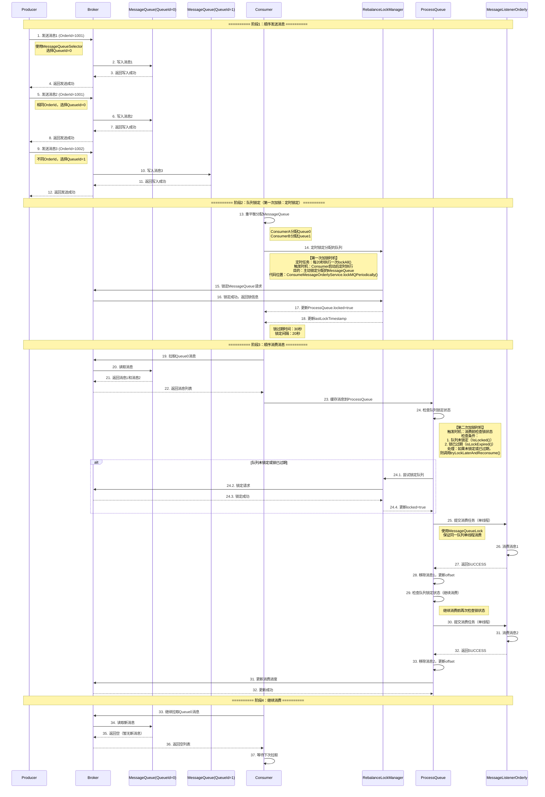
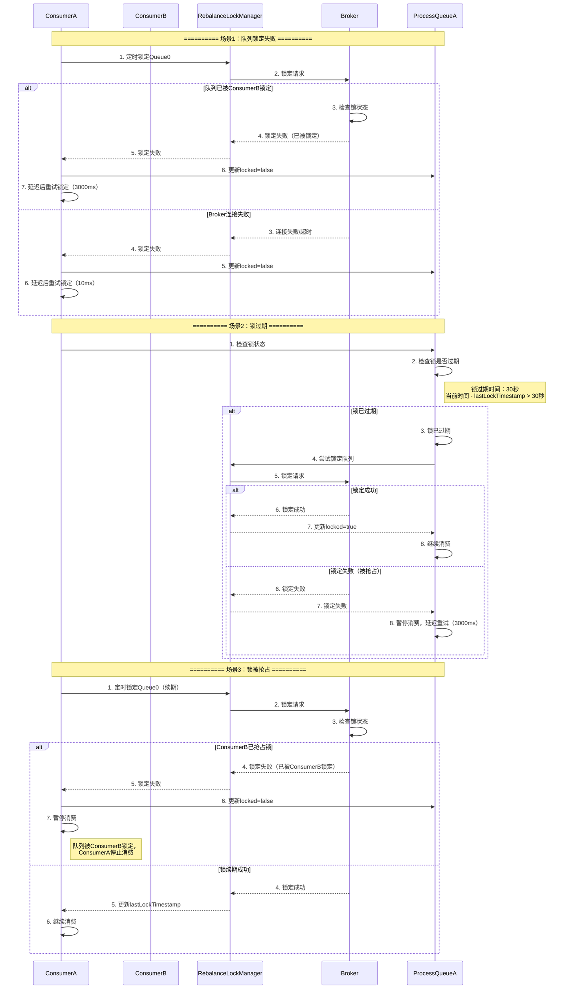
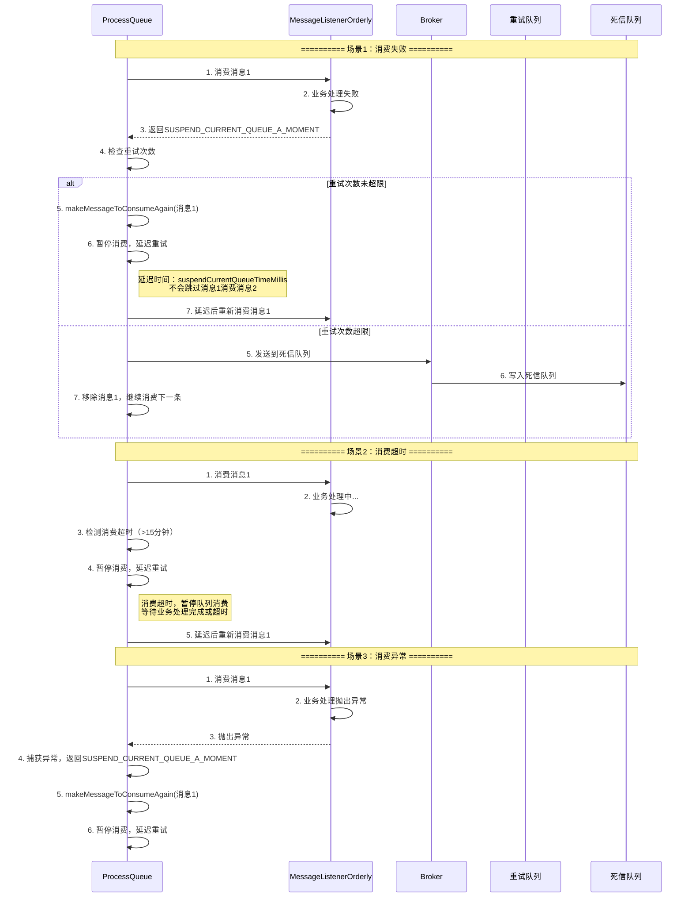
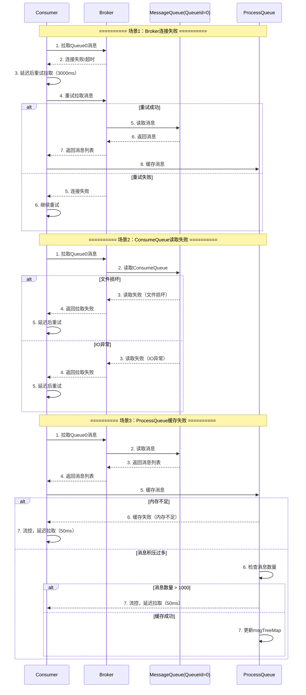

# RocketMQ顺序消息与消费流程详解

  

## 一、顺序消息整体架构

  

```

┌─────────────────────────────────────────────────────────────────────────────────────┐

│ RocketMQ顺序消息架构 │

└─────────────────────────────────────────────────────────────────────────────────────┘

  

┌─────────────────────────────────────────────────────────────────────────────────────┐

│ Producer端 │

│ ┌──────────────────────────────────────────────────────────────────────────────┐ │

│ │ DefaultMQProducer │ │

│ │ ┌────────────────────────────────────────────────────────────────────────┐ │ │

│ │ │ 顺序发送策略 │ │ │

│ │ │ - 根据MessageQueueSelector选择队列 │ │ │

│ │ │ - 相同业务ID的消息发送到同一队列 │ │ │

│ │ │ - 保证同一队列内消息有序 │ │ │

│ │ └────────────────────────────────────────────────────────────────────────┘ │ │

│ └──────────────────────────────────────────────────────────────────────────────┘ │

└─────────────────────────────────────────────────────────────────────────────────────┘

│

│ 发送消息到指定队列

▼

┌─────────────────────────────────────────────────────────────────────────────────────┐

│ Broker端 │

│ ┌──────────────────────────────────────────────────────────────────────────────┐ │

│ │ MessageQueue (QueueId=0) │ │

│ │ - 消息1 (OrderId=1001) │ │

│ │ - 消息2 (OrderId=1001) │ │

│ │ - 消息3 (OrderId=1001) │ │

│ └──────────────────────────────────────────────────────────────────────────────┘ │

│ ┌──────────────────────────────────────────────────────────────────────────────┐ │

│ │ MessageQueue (QueueId=1) │ │

│ │ - 消息4 (OrderId=1002) │ │

│ │ - 消息5 (OrderId=1002) │ │

│ └──────────────────────────────────────────────────────────────────────────────┘ │

└─────────────────────────────────────────────────────────────────────────────────────┘

│

│ 消费者拉取消息

▼

┌─────────────────────────────────────────────────────────────────────────────────────┐

│ Consumer端 │

│ ┌──────────────────────────────────────────────────────────────────────────────┐ │

│ │ ConsumeMessageOrderlyService │ │

│ │ ┌────────────────────────────────────────────────────────────────────────┐ │ │

│ │ │ 队列锁定机制 │ │ │

│ │ │ - 定时锁定分配的MessageQueue │ │ │

│ │ │ - 锁过期时间：30秒 │ │ │

│ │ │ - 锁定间隔：20秒 │ │ │

│ │ └────────────────────────────────────────────────────────────────────────┘ │ │

│ │ ┌────────────────────────────────────────────────────────────────────────┐ │ │

│ │ │ 顺序消费机制 │ │ │

│ │ │ - 单线程消费同一队列 │ │ │

│ │ │ - 使用MessageQueueLock保证顺序 │ │ │

│ │ │ - 消费失败时暂停队列消费 │ │ │

│ │ └────────────────────────────────────────────────────────────────────────┘ │ │

│ └──────────────────────────────────────────────────────────────────────────────┘ │

└─────────────────────────────────────────────────────────────────────────────────────┘

```

  

## 二、顺序消息完整流程时序图（正常场景）

  



  

## 三、两个消息的顺序消费完整流程时序图（包含异常场景）

```mermaid

sequenceDiagram

participant Producer as Producer

participant Broker as Broker

participant Queue0 as MessageQueue(QueueId=0)

participant ConsumerA as ConsumerA

participant ConsumerB as ConsumerB

participant LockService as RebalanceLockManager

participant ProcessQueueA as ProcessQueueA

participant ProcessQueueB as ProcessQueueB

participant ListenerA as MessageListenerOrderly(A)

participant ListenerB as MessageListenerOrderly(B)

  

Note over Producer,ListenerB: ========== 阶段1：顺序发送两个消息 ==========

Producer->>Broker: 1. 发送消息1 (OrderId=1001, Body="订单创建")

Note right of Producer: MessageQueueSelector<br/>选择QueueId=0

Broker->>Queue0: 2. 写入消息1到CommitLog

alt CommitLog写入失败

Queue0-->>Broker: 写入失败（磁盘满/IO异常）

Broker-->>Producer: 3. 返回发送失败

Producer->>Producer: 4. 重试发送（最多3次）

Producer->>Broker: 5. 重试发送消息1

else CommitLog写入成功

Queue0-->>Broker: 3. 返回写入成功

Broker-->>Producer: 4. 返回发送成功

end

Producer->>Broker: 6. 发送消息2 (OrderId=1001, Body="订单支付")

Note right of Producer: 相同OrderId，选择QueueId=0

Broker->>Queue0: 7. 写入消息2到CommitLog

alt CommitLog写入失败

Queue0-->>Broker: 写入失败

Broker-->>Producer: 8. 返回发送失败

Producer->>Producer: 9. 重试发送

else CommitLog写入成功

Queue0-->>Broker: 8. 返回写入成功

Broker-->>Producer: 9. 返回发送成功

end

Note over Producer,ListenerB: ========== 阶段2：重平衡分配队列 ==========

ConsumerA->>Broker: 10. 获取Topic路由信息

ConsumerB->>Broker: 11. 获取Topic路由信息

Broker-->>ConsumerA: 12. 返回MessageQueue列表

Broker-->>ConsumerB: 13. 返回MessageQueue列表

ConsumerA->>ConsumerA: 14. 重平衡分配MessageQueue

Note right of ConsumerA: ConsumerA分配Queue0

ConsumerB->>ConsumerB: 15. 重平衡分配MessageQueue

Note right of ConsumerB: ConsumerB分配Queue1（空队列）

ConsumerA->>ProcessQueueA: 16. 为Queue0创建ProcessQueue

ConsumerB->>ProcessQueueB: 17. 为Queue1创建ProcessQueue

Note over Producer,ListenerB: ========== 阶段3：队列锁定（第一次加锁：定时锁定） ==========

ConsumerA->>LockService: 18. 定时锁定Queue0

Note right of ConsumerA: 【第一次加锁时机】<br/>定时任务：每20秒执行一次lockAll()<br/>触发时机：Consumer启动后定时执行<br/>目的：主动锁定分配的MessageQueue<br/>代码位置：ConsumeMessageOrderlyService.lockMQPeriodically()

LockService->>Broker: 19. 锁定MessageQueue请求

alt Broker连接失败

Broker-->>LockService: 连接失败/超时

LockService-->>ConsumerA: 20. 锁定失败

ConsumerA->>ConsumerA: 21. ProcessQueue.locked=false

ConsumerA->>ConsumerA: 22. 延迟后重试锁定（10ms）

else Broker正常

Broker->>Broker: 20. 检查队列是否被其他Consumer锁定

alt 队列已被ConsumerB锁定

Broker-->>LockService: 21. 锁定失败（已被锁定）

LockService-->>ConsumerA: 22. 锁定失败

ConsumerA->>ConsumerA: 23. ProcessQueue.locked=false

ConsumerA->>ConsumerA: 24. 延迟后重试锁定（3000ms）

else 队列未被锁定或锁已过期

Broker->>Broker: 21. 锁定成功，记录锁信息

Broker-->>LockService: 22. 返回锁定成功

LockService-->>ConsumerA: 23. 更新ProcessQueue.locked=true

LockService-->>ConsumerA: 24. 更新lastLockTimestamp

end

end

Note over Producer,ListenerB: ========== 阶段4：ConsumerA拉取消息1 ==========

ConsumerA->>Broker: 25. 拉取Queue0消息

alt Broker连接失败

Broker-->>ConsumerA: 连接失败/超时

ConsumerA->>ConsumerA: 26. 延迟后重试拉取（3000ms）

else Broker正常

Broker->>Queue0: 27. 读取消息1

alt ConsumeQueue读取失败

Queue0-->>Broker: 读取失败

Broker-->>ConsumerA: 28. 返回拉取失败

ConsumerA->>ConsumerA: 29. 延迟后重试

else ConsumeQueue读取成功

Queue0-->>Broker: 28. 返回消息1

Broker-->>ConsumerA: 29. 返回消息列表[消息1]

ConsumerA->>ProcessQueueA: 30. 缓存消息1

alt ProcessQueue缓存失败

ProcessQueueA-->>ConsumerA: 缓存失败（内存不足）

ConsumerA->>ConsumerA: 31. 流控，延迟拉取（50ms）

else ProcessQueue缓存成功

ProcessQueueA->>ProcessQueueA: 31. 更新msgTreeMap

ProcessQueueA-->>ConsumerA: dispatchToConsume=true

end

end

end

Note over Producer,ListenerB: ========== 阶段5：ConsumerA消费消息1（第二次加锁：消费前检查） ==========

ProcessQueueA->>ProcessQueueA: 32. 检查队列锁定状态

Note right of ProcessQueueA: 【第二次加锁时机】<br/>触发时机：消费前检查锁状态<br/>检查位置：ConsumeRequest.run()<br/>检查条件：<br/>1. 队列未锁定（!isLocked()）<br/>2. 锁已过期（isLockExpired()）<br/>处理：如果未锁定或已过期，<br/>则调用tryLockLaterAndReconsume()

alt 队列未锁定

ProcessQueueA->>ProcessQueueA: 33. 队列未锁定，延迟消费（10ms）

ProcessQueueA->>LockService: 34. 尝试锁定队列

Note right of ProcessQueueA: 调用lockOneMQ()锁定队列

LockService->>Broker: 35. 锁定请求

Broker-->>LockService: 36. 锁定成功

LockService-->>ProcessQueueA: 37. 更新locked=true

LockService-->>ProcessQueueA: 37.1. 更新lastLockTimestamp

else 队列锁定已过期

ProcessQueueA->>ProcessQueueA: 33. 锁已过期，延迟消费（10ms）

Note right of ProcessQueueA: 【第三次加锁时机】<br/>触发时机：检测到锁过期<br/>检查条件：isLockExpired()<br/>过期判断：当前时间 - lastLockTimestamp > 30秒<br/>处理：立即尝试重新锁定

ProcessQueueA->>LockService: 34. 尝试锁定队列

LockService->>Broker: 35. 锁定请求

alt 锁定成功

Broker-->>LockService: 36. 锁定成功

LockService-->>ProcessQueueA: 37. 更新locked=true

LockService-->>ProcessQueueA: 37.1. 更新lastLockTimestamp

else 锁定失败（被抢占）

Broker-->>LockService: 36. 锁定失败

LockService-->>ProcessQueueA: 37. 锁定失败

ProcessQueueA->>ProcessQueueA: 37.1. 暂停消费，延迟重试（3000ms）

end

else 队列已锁定且未过期

ProcessQueueA->>ListenerA: 35. 提交消费任务（单线程）

Note right of ProcessQueueA: 使用MessageQueueLock<br/>保证同一队列单线程消费

ListenerA->>ListenerA: 36. 消费消息1（订单创建）

alt 消费超时

ListenerA->>ListenerA: 37. 业务处理超时（>15分钟）

ProcessQueueA->>ProcessQueueA: 38. 检测到超时

ProcessQueueA->>ProcessQueueA: 39. 暂停消费，延迟重试

Note right of ProcessQueueA: 延迟时间：suspendCurrentQueueTimeMillis

else 消费异常

ListenerA->>ListenerA: 37. 业务处理抛出异常

ListenerA-->>ProcessQueueA: 38. 返回SUSPEND_CURRENT_QUEUE_A_MOMENT

ProcessQueueA->>ProcessQueueA: 39. 检查重试次数

alt 重试次数未超限

ProcessQueueA->>ProcessQueueA: 40. makeMessageToConsumeAgain(消息1)

ProcessQueueA->>ProcessQueueA: 41. 暂停消费，延迟重试

Note right of ProcessQueueA: 延迟时间：suspendCurrentQueueTimeMillis

else 重试次数超限

ProcessQueueA->>Broker: 40. 发送到死信队列

Broker->>Broker: 41. 写入死信队列

ProcessQueueA->>ProcessQueueA: 42. 移除消息1，继续消费下一条

end

else 消费成功

ListenerA->>ListenerA: 37. 业务处理成功

ListenerA-->>ProcessQueueA: 38. 返回SUCCESS

ProcessQueueA->>ProcessQueueA: 39. 移除消息1，更新offset

ProcessQueueA->>Broker: 40. 更新消费进度

Broker-->>ProcessQueueA: 41. 更新成功

end

end

Note over Producer,ListenerB: ========== 阶段6：ConsumerA拉取消息2 ==========

ConsumerA->>Broker: 42. 继续拉取Queue0消息

Broker->>Queue0: 43. 读取消息2

Queue0-->>Broker: 44. 返回消息2

Broker-->>ConsumerA: 45. 返回消息列表[消息2]

ConsumerA->>ProcessQueueA: 46. 缓存消息2

ProcessQueueA->>ProcessQueueA: 47. 更新msgTreeMap

Note right of ProcessQueueA: 消息2在消息1之后，<br/>保证顺序

Note over Producer,ListenerB: ========== 阶段7：ConsumerA消费消息2（第二次加锁：消费前检查） ==========

ProcessQueueA->>ProcessQueueA: 48. 检查队列锁定状态

Note right of ProcessQueueA: 【第二次加锁时机】<br/>触发时机：消费消息2前检查锁状态<br/>检查位置：ConsumeRequest.run()<br/>检查条件：<br/>1. 队列未锁定（!isLocked()）<br/>2. 锁已过期（isLockExpired()）

alt 队列锁定已过期

ProcessQueueA->>ProcessQueueA: 49. 锁已过期，延迟消费（10ms）

Note right of ProcessQueueA: 【第三次加锁时机】<br/>触发时机：检测到锁过期<br/>检查条件：isLockExpired()<br/>过期判断：当前时间 - lastLockTimestamp > 30秒<br/>处理：立即尝试重新锁定

ProcessQueueA->>LockService: 50. 尝试锁定队列

LockService->>Broker: 51. 锁定请求

alt 锁定失败（被ConsumerB抢占）

Broker-->>LockService: 52. 锁定失败

LockService-->>ProcessQueueA: 53. 锁定失败

ProcessQueueA->>ProcessQueueA: 54. 暂停消费，延迟重试（3000ms）

Note right of ProcessQueueA: 队列被其他Consumer锁定，<br/>等待锁释放

else 锁定成功

Broker-->>LockService: 52. 锁定成功

LockService-->>ProcessQueueA: 53. 更新locked=true

LockService-->>ProcessQueueA: 53.1. 更新lastLockTimestamp

ProcessQueueA->>ListenerA: 54. 提交消费任务

end

else 队列已锁定且未过期

ProcessQueueA->>ListenerA: 49. 提交消费任务（单线程）

Note right of ProcessQueueA: 保证消息1和消息2<br/>顺序消费

ListenerA->>ListenerA: 50. 消费消息2（订单支付）

alt 消费失败

ListenerA->>ListenerA: 51. 业务处理失败

ListenerA-->>ProcessQueueA: 52. 返回SUSPEND_CURRENT_QUEUE_A_MOMENT

ProcessQueueA->>ProcessQueueA: 53. makeMessageToConsumeAgain(消息2)

ProcessQueueA->>ProcessQueueA: 54. 暂停消费，延迟重试

Note right of ProcessQueueA: 消息2消费失败，<br/>不会跳过消息2消费消息3

else 消费成功

ListenerA->>ListenerA: 51. 业务处理成功

ListenerA-->>ProcessQueueA: 52. 返回SUCCESS

ProcessQueueA->>ProcessQueueA: 53. 移除消息2，更新offset

ProcessQueueA->>Broker: 54. 更新消费进度

Broker-->>ProcessQueueA: 55. 更新成功

Note right of ProcessQueueA: 消息1和消息2<br/>已按顺序消费完成

end

end

Note over Producer,ListenerB: ========== 阶段8：锁续期（第一次加锁：定时续期） ==========

ConsumerA->>LockService: 56. 定时锁定Queue0（续期）

Note right of ConsumerA: 【第一次加锁时机】<br/>定时任务：每20秒执行一次lockAll()<br/>触发时机：定时任务触发<br/>目的：续期锁，防止锁过期<br/>代码位置：ConsumeMessageOrderlyService.lockMQPeriodically()<br/>续期逻辑：更新lastLockTimestamp

LockService->>Broker: 57. 锁定请求

alt Broker连接失败

Broker-->>LockService: 连接失败

LockService-->>ConsumerA: 58. 锁定失败

ConsumerA->>ConsumerA: 59. ProcessQueue.locked=false

ConsumerA->>ConsumerA: 60. 下次定时任务重试

else Broker正常

Broker->>Broker: 58. 检查锁状态

alt 锁已被ConsumerB抢占

Broker-->>LockService: 59. 锁定失败

LockService-->>ConsumerA: 60. 锁定失败

ConsumerA->>ConsumerA: 61. ProcessQueue.locked=false

ConsumerA->>ConsumerA: 62. 暂停消费，等待锁释放

else 锁续期成功

Broker->>Broker: 59. 更新锁时间戳

Broker-->>LockService: 60. 返回锁定成功

LockService-->>ConsumerA: 61. 更新lastLockTimestamp

Note right of ConsumerA: 锁续期成功，<br/>继续消费

end

end

```

  



  

## 四、顺序消息异常场景详细处理

  

### 4.1 队列锁定异常

  



  

### 4.2 顺序消费异常

  



  

### 4.3 消息拉取异常

  



  

## 五、顺序消息关键机制

  

### 5.1 队列锁定机制

  

**三次加锁时机：**

  

1. **第一次加锁：定时锁定（主动加锁）**

- **触发时机**：Consumer启动后，定时任务每20秒执行一次`lockAll()`

- **代码位置**：`ConsumeMessageOrderlyService.lockMQPeriodically()`

- **目的**：主动锁定分配的MessageQueue，防止锁过期

- **锁定间隔**：20秒（`REBALANCE_LOCK_INTERVAL`）

- **锁过期时间**：30秒（`REBALANCE_LOCK_MAX_LIVE_TIME`）

  

2. **第二次加锁：消费前检查（被动加锁）**

- **触发时机**：消费消息前，检查队列锁定状态

- **代码位置**：`ConsumeRequest.run()`中的锁状态检查

- **检查条件**：

- 队列未锁定（`!processQueue.isLocked()`）

- 锁已过期（`processQueue.isLockExpired()`）

- **处理逻辑**：如果未锁定或已过期，调用`tryLockLaterAndReconsume()`尝试锁定

- **延迟时间**：10ms后重试锁定

  

3. **第三次加锁：锁过期后重新锁定（被动加锁）**

- **触发时机**：检测到锁过期时（`isLockExpired()`返回true）

- **代码位置**：`ConsumeRequest.run()`中的锁过期检查

- **过期判断**：当前时间 - `lastLockTimestamp` > 30秒

- **处理逻辑**：立即尝试重新锁定，调用`tryLockLaterAndReconsume()`

- **延迟时间**：10ms后重试锁定

  

**锁定失败处理：**

- 锁定失败：延迟10ms后重试

- 锁被抢占：延迟3000ms后重试

- 锁过期：立即尝试重新锁定（第三次加锁）

  

### 5.2 顺序消费机制

  

**单线程消费：**

1. 使用`MessageQueueLock`保证同一MessageQueue单线程消费

2. 每个MessageQueue有独立的锁对象

3. 消费任务提交到线程池，但通过锁保证顺序

  

**消费失败处理：**

- `SUCCESS`：消费成功，移除消息，更新offset

- `SUSPEND_CURRENT_QUEUE_A_MOMENT`：消费失败，暂停队列消费，延迟重试

- `ROLLBACK`：回滚消息，暂停队列消费

- `COMMIT`：提交消息，移除消息，更新offset

  

### 5.3 消息顺序保证

  

**发送顺序：**

- 相同业务ID（如OrderId）的消息发送到同一MessageQueue

- 使用`MessageQueueSelector`选择队列

- 保证同一队列内消息有序

  

**消费顺序：**

- 同一MessageQueue单线程消费

- 消费失败时暂停队列，不会跳过消息

- 保证消息按顺序消费

  

## 六、关键配置参数

  

### 6.1 顺序消息相关配置

  

| 配置项 | 默认值 | 说明 |

|-------|--------|------|

| `REBALANCE_LOCK_INTERVAL` | 20秒 | 队列锁定间隔 |

| `REBALANCE_LOCK_MAX_LIVE_TIME` | 30秒 | 锁过期时间 |

| `suspendCurrentQueueTimeMillis` | 1000ms | 消费失败时暂停队列时间 |

| `consumeMessageBatchMaxSize` | 1 | 批量消费大小（顺序消息建议为1） |

| `consumeTimeout` | 15分钟 | 消费超时时间 |

  

### 6.2 流控相关配置

  

| 配置项 | 默认值 | 说明 |

|-------|--------|------|

| `pullThresholdForQueue` | 1000 | ProcessQueue消息数量阈值 |

| `pullThresholdSizeForQueue` | 100MB | ProcessQueue消息大小阈值 |

| `consumeConcurrentlyMaxSpan` | 2000 | 并发消费最大跨度（顺序消息不适用） |

  

## 七、顺序消息最佳实践

  

### 7.1 使用建议

  

1. **合理选择队列**：相同业务ID的消息发送到同一队列

2. **保证幂等性**：消费逻辑要幂等，避免重复消费问题

3. **快速处理**：消费逻辑要快速处理，避免阻塞其他消息

4. **错误处理**：合理处理消费失败，避免消息积压

  

### 7.2 异常处理建议

  

1. **锁定失败**：监控锁定失败情况，及时处理

2. **消费超时**：合理设置消费超时时间

3. **消费失败**：实现重试机制，避免消息丢失

4. **锁过期**：监控锁过期情况，及时续期

  

### 7.3 性能优化建议

  

1. **批量消费**：顺序消息建议批量大小为1，保证顺序

2. **线程池配置**：合理设置消费线程数

3. **锁续期**：确保定时锁定任务正常运行

4. **监控告警**：监控消费延迟和失败率

  

## 八、顺序消息与并发消息对比

  

| 特性 | 顺序消息 | 并发消息 |

|-----|---------|---------|

| **消费模式** | 单线程消费同一队列 | 多线程并发消费 |

| **队列锁定** | 需要锁定队列 | 不需要锁定 |

| **顺序保证** | 保证消息顺序 | 不保证消息顺序 |

| **性能** | 较低（单线程） | 较高（多线程） |

| **使用场景** | 需要保证顺序的场景 | 不需要保证顺序的场景 |

| **消费失败** | 暂停队列消费 | 发送到重试队列 |

  

## 九、总结

  

### 9.1 顺序消息核心机制

  

1. **队列锁定**：定时锁定分配的MessageQueue，保证同一队列只被一个Consumer消费

2. **单线程消费**：使用MessageQueueLock保证同一队列单线程消费

3. **顺序保证**：相同业务ID的消息发送到同一队列，保证顺序

  

### 9.2 异常处理策略

  

1. **锁定失败**：延迟重试，避免频繁请求

2. **消费失败**：暂停队列消费，延迟重试，不会跳过消息

3. **锁过期**：立即尝试重新锁定，保证消费连续性

  

### 9.3 关键要点

  

1. **必须实现队列锁定**：集群模式下必须定时锁定队列

2. **保证消费顺序**：消费失败时暂停队列，不会跳过消息

3. **合理处理异常**：实现重试机制，避免消息丢失

4. **监控告警**：监控锁定状态和消费延迟，及时处理异常